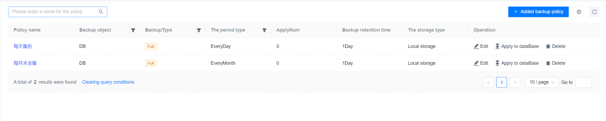
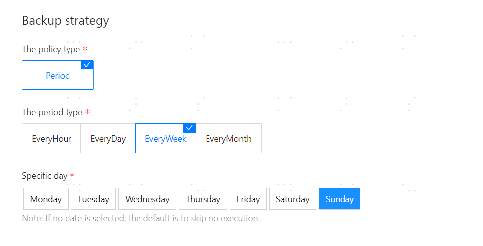
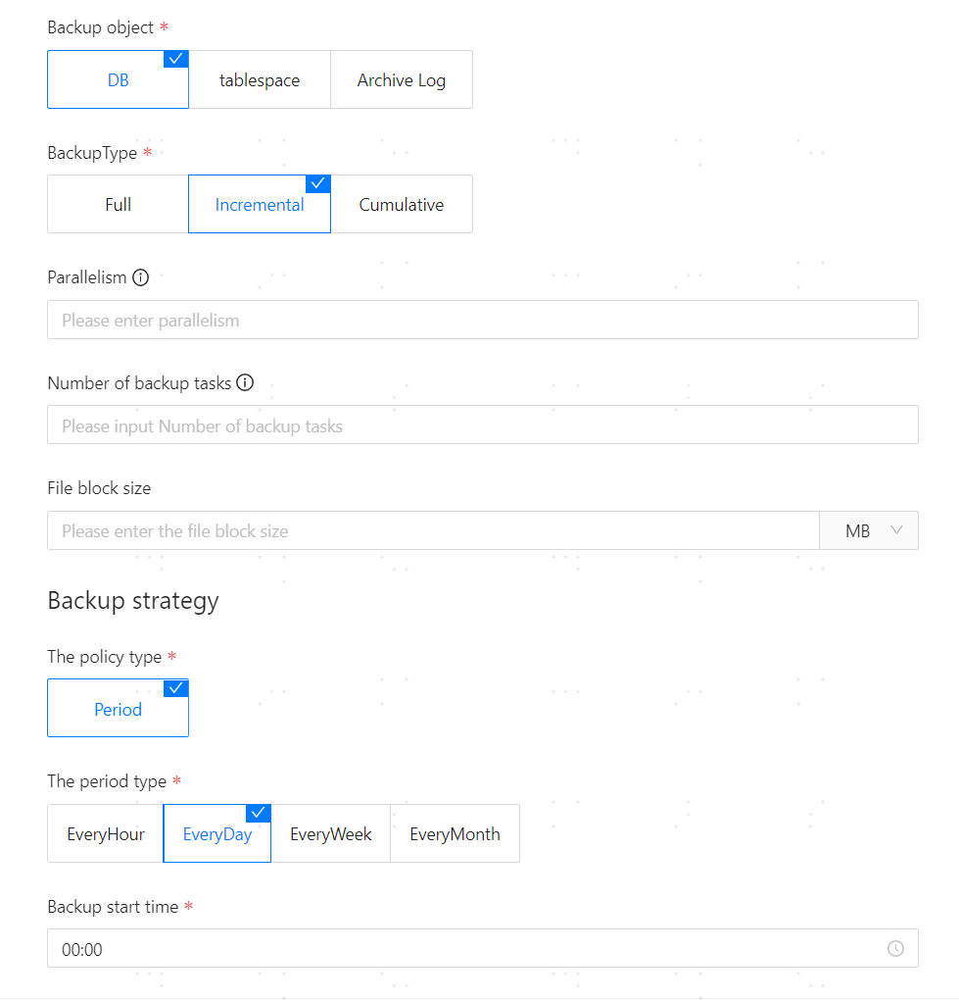
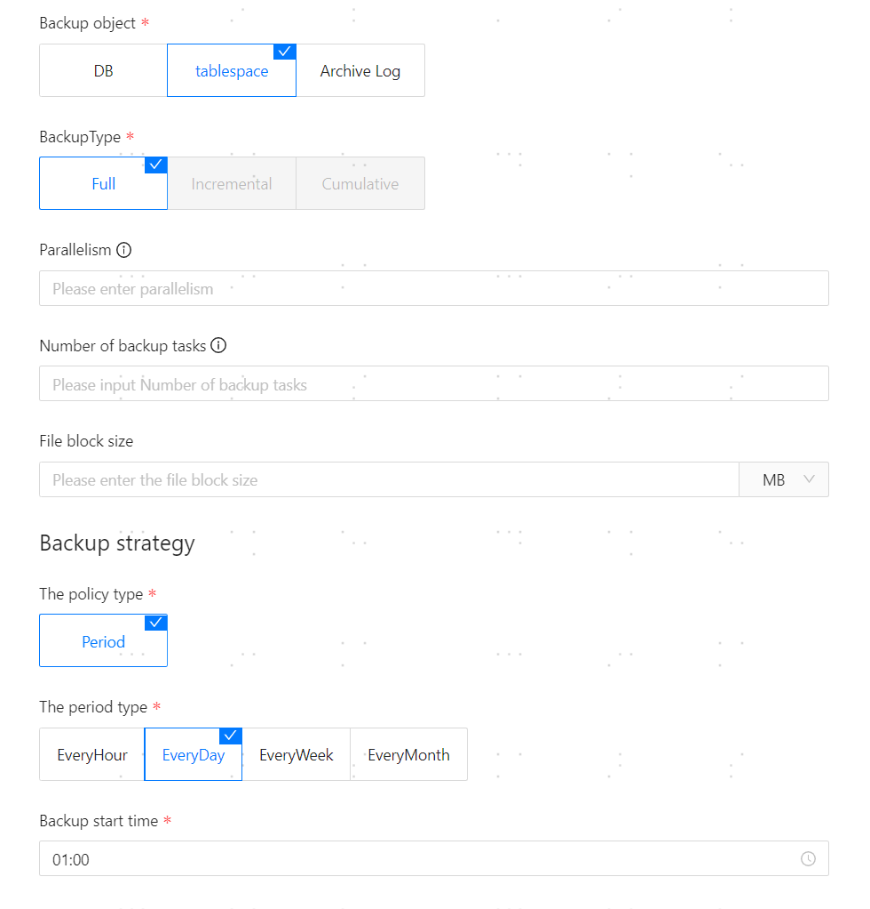
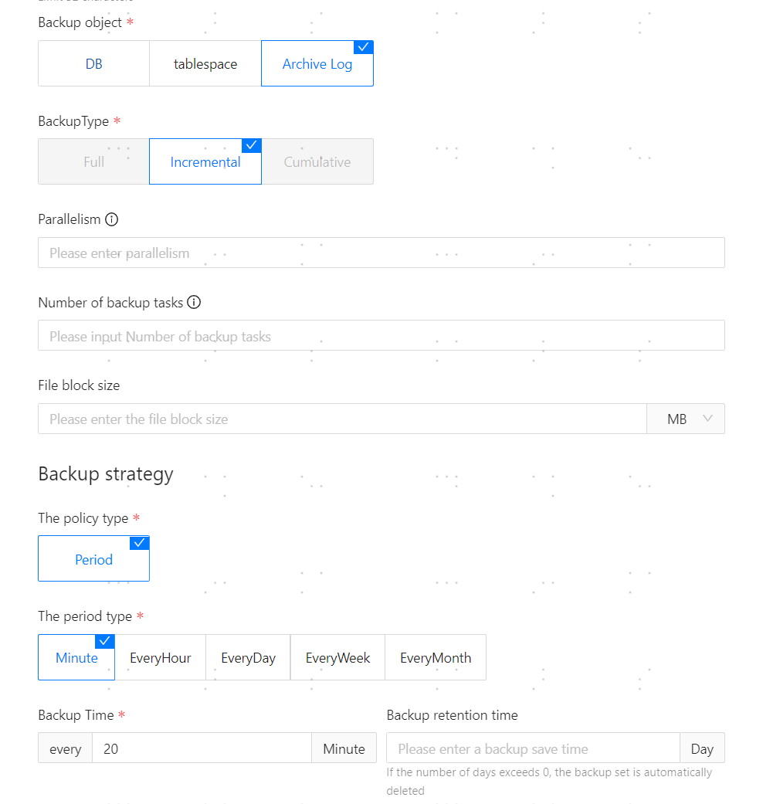
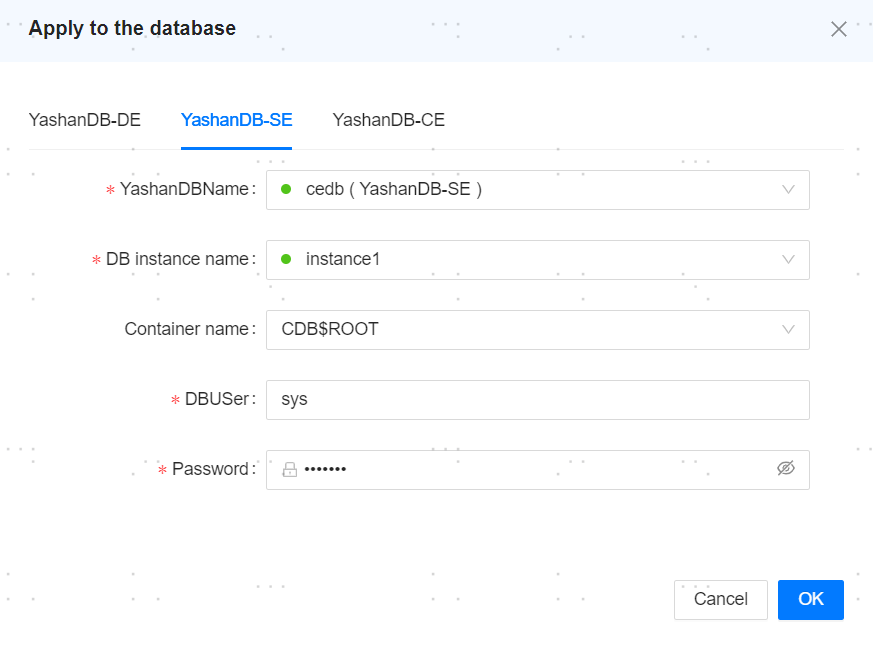

**Web Path**: **[ Backup strategy ]**



## Add Backup Policy

**Web Path**: **[ Add Backup Strategy ]**

**Functionality Introduction**

Database backup policy is an important measure to ensure data security, integrity, and recoverability. The purpose of formulating a backup policy is to address various potential risks of data loss and to timely create backups for YashanDB, enabling swift and effective restoration of the database to its normal state.

**Main Content Explanation**

**[ Strategy Name ]**: Required parameter, length should not exceed 32 characters.

**[ Backup object ]**: Required parameter, Backup object includes database, tablespace, and Archive Log Files.

**[ BackupType ]**: Required parameter, full/incremental/cumulative incremental.

**[ Parallelism ]**: Optional parameter, number of threads set for a single backup task.

**[ Backup Task Count ]**: Optional parameter, the maximum number of simultaneous backup tasks allowed under this backup policy.

**[ File Chunk Size ]**: Optional parameter, the file size of each block that the backup task will be divided into.

**[ Strategy Type ]**: Required parameter, default is cyclical type.

**[ Period Type ]**: Required parameter, hourly/daily/weekly/monthly/minutely. The minute period only supports Archive Log Files backup.

**[ Backup Time ]**: This parameter is required for minute period, representing the minute interval time between two consecutive backups.

**[ Specific Day(s) ]**: Required parameter, for weekly or monthly period types, a specific day must be selected.

**[ Backup start time ]**: Required parameter, the time that triggers the backup operation after the specified backup date is reached.

**[ Backup Retention Period ]**: Optional parameter, the time after which the backup triggers a deletion operation.

**[ Maximum Backup Count ]**: Optional parameter, the Maximum number of backups allowed for a single database. When the number of backups reaches this value, the oldest backup set is deleted by default.

**[ Storage Type ]**: Required parameter, provides two different backup storage methods: local storage and other host storage, **it must ensure that the management platform installation user has access Privilege to this path**.

**[ Storage path ]**: Required parameter, the path where backup files are stored on the local or remote host.

**[ Backup compression algorithm ]**: Supports ZSTD and LZ4 compression algorithms. ZSTD can provide a higher compression ratio, reducing the backup file size. LZ4 can provide a higher compression speed, decreasing compression time.

**[ Backup compression level ]**: Both ZSTD and LZ4 compression algorithms provide low, medium, and high compression levels, used for a flexible balance between compression speed and compression ratio. The higher the compression level, the more memory and space are required during compression. Low level is recommended.

**[ File tar packaging ]**: Supports three methods: no packaging, packaging only, and packaging and compressing, with the default being packaging only. The standalone and YAC of version 22.2, as well as all versions of distributed, only support packaging only and packaging and compressing.

**[ Switch logfile before backup ]**: Indicates whether to execute the `ALTER SYSTEM SWITCH LOGFILE;` statement for online log switching before Archive Log Files backup.

> **Note**:
>
> - When backing up, the ycm-agent on the server where the database resides needs read and write privilege for the storage path provided by the user; otherwise, the backup will fail.
> - The CPU architecture of the host storing the backup set must be the same as the server hosting the database.
> - Tablespace backup policy applies to the tablespace specified in **[ Apply to dataBase ]**. Each tablespace will generate a separate backup and count toward the backup quantity; please specify the maximum backup quantity reasonably.
> - Tablespace backup policy only supports standalone databases version 23.4 and later.
> - Archive log files backup only supports incremental backups. After the backup policy is applied to the node, the first full backup is performed; subsequent backups start from the maximum SCN of the backup set generated by this backup policy, with the endpoint SCN being the last log in the currently existing archive file of the database, leading to incremental backups.
> - Tablespace backup policy only supports standalone databases version 23.4 and later.
> - Archive log files backup policy only supports standalone and YAC deployment version 23.2 and later.

## Backup Policy Example
### Full Backup of the Database on Sunday


### Incremental Backup of the Database Daily


### Full Backup of the Tablespace Daily


### Incremental Backup of Archive Log Files at Minute Intervals


## Apply to Database

**Web Path**: **[ Apply to dataBase ]**

**Functionality Introduction**

Apply the backup policy to a specific database. After successful application, a periodic backup job will be added in job management, and the database will perform periodic backups according to the policy.

**Main Content Explanation**

**Apply to dataBase**: The backup policy can be applied to the YashanDB database. After application is completed, a new periodic backup job will be added, which can be viewed in [Job Management](../../Platform Management/Platform Operation/Scheduling Management/Job Management).

> **Note**:
>
> The database user must have the following roles and permissions simultaneously.
>
>    ```sql
>    -- Taking the user USER_XXX as an example
>    SQL> GRANT CONNECT TO USER_XXX;
>    GRANT SELECT ON SYS.DBA_ROLE_PRIVS TO USER_XXX;
>    GRANT SELECT_CATALOG_ROLE TO USER_XXX;
>    GRANT SYSBACKUP TO USER_XXX;
>    ```



**[ Unbind ]**: Cancels the application of the policy on a specific database, while also invalidating the corresponding periodic backup job related to that database.