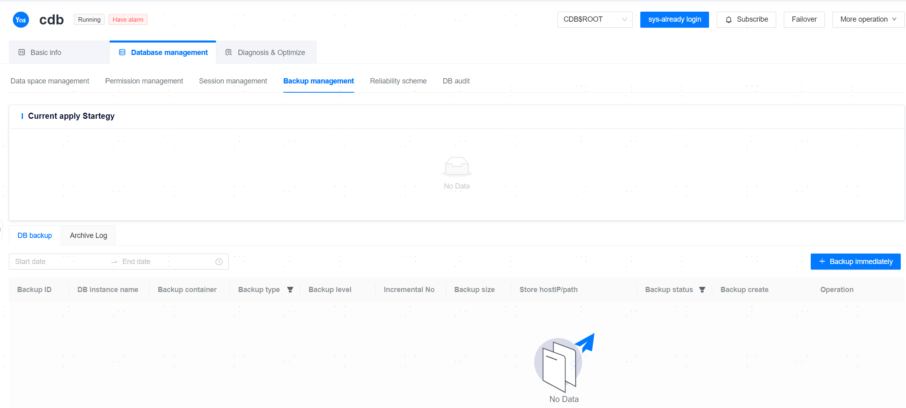

**Web Path**: **[ YashanDB ]**>**[ YashanDB List ]**>**[ DB Name ]**>**[ Database management ]**>**[ Backup Management ]**

## Immediate Backup

**Web Path**: **[ Immediate Backup ]**

**Functionality Introduction**

The management platform provides functionality for immediate backups of databases, tablespaces, and archive log files. Supports database backup, tablespace backup, and archive log backup for both tenant and non-tenant modes, where tablespace backup is supported only at the PDB level. To use this functionality, please ensure:

- During backup, the ycm-agent on the database server must have read and write privileges to the storage path specified by the user; otherwise, the backup will fail.
- The CPU architecture of the database server must be the same as that of the server storing the backup set.

**Main Content Explanation**

**Backup Object**: Backup objects are categorized into databases, tablespaces, and Archive Log Files.

**Backup Type**: Different backup objects support the following BackupTypes:

**DB Backup Type**: Database backup type are divided into full DB backup and incremental DB backup, where incremental backup are further divided into normal incremental backup and cumulative incremental backup.

- Full backups are all LEVEL 0 backups.
- Incremental backups have two levels: LEVEL 0 and LEVEL 1:
  - LEVEL 0 incremental backups serve as the baseline for all subsequent LEVEL 1 incremental backups. A LEVEL 0 incremental backup is essentially a full backup, but with a physical identifier in the backup summary file to distinguish it from full backups.
  - LEVEL 1 incremental backups only back up the incremental data generated since the last incremental backup. Compared to full backups, the volume of incremental backup data is smaller, saving disk space and reducing recovery time. The corresponding LEVEL 0 incremental backup for LEVEL 1 normal or cumulative incremental backups can be either a normal or a cumulative incremental backup.
- YashanDB supports 1000 consecutive LEVEL 1 incremental backups, but for maintainability and resource usage, frequent consecutive LEVEL 1 incremental backups are not recommended.

**Tablespace Backup Type**: Tablespace backup type only support full backups.

**Archivelog Backup Type**: Archivelog backup type support full backups, backups based on specified SCN ranges of Archive Log Files, and backups based on specified time ranges of Archive Log Files.

**[ Start Time ]**: Immediate backup offers functionality for issuing single backup tasks, which can be either executed immediately or scheduled for a later time. Scheduled backup tasks will add a pending single backup job in [Job Management](../../Platform Management/Platform Operation/Scheduling Management/Job Management), which will become permanently inactive once the job is completed.

> **Note**:
>
> If backup files are saved to the managed host, which is multi-user, ensure that the `ycm-agent` installation user has read and write privileges to the backup storage path.
>
> Tablespace backups are only supported in standalone databases of version 23.4 and later.
>
> If the logged-in user is a PDB, only the backup policies and backup sets of the current PDB are visible.

> **Warn**:
>
> Do not uninstall the database during the backup process, or you may encounter the following issues.
>
> For standalone databases after version 23.2, issues such as network problems or accidental deletion of yasrman may lead to failures in obtaining yasrman during the backup process. Error messages may include: `bin/yasrman: No such file or directory`. If this error occurs, to avoid impacting subsequent backups, please clean the yasrman directory in the corresponding path.
>
> If local storage was selected during the backup, delete the `yasrman/database_version` directory under the management platform installation directory.
> If other hosts were selected for backup, delete the `yasrman/database_version` directory under the `ycm-agent` installation directory.
> After deletion, backup this database again to ensure that the machine correctly obtains the complete yasrman and lib libraries.

## Restore

**Web Path**: **[ Restore ]**

**Functionality Introduction**

Backup management provides the ability to restore the current database and tablespaces.

Only for **standalone databases**, it supports restoring using backups from other standalone databases. After a successful restoration, the database configuration needs to be modified according to actual circumstances, and the old backup of this database will not be usable for recovery.

> **Warn**：
>
> Executing a restore on the database is a high-risk operation that, besides impacting the database itself, will interrupt other ongoing tasks in the management platform. Please consider carefully whether to restore the database.

**Main Content Explanation**

**[ Start Time ]**: Single restore tasks can be executed immediately or scheduled for a later time. Scheduled restore tasks will create a new single restore job in [Job Management](../../Platform Management/Platform Operation/Scheduling Management/Job Management), which will become permanently inactive once executed.

> **Note**:
>
> YashanDB does not support cross-version backup restoration. If cross-version restoration is required, please first restore to the same version database and then upgrade the database.
>
> Before restoration, the management platform will estimate the required disk space and determine if the current space is sufficient. The estimated space is only for reference; if it indicates insufficient space, the operator must evaluate and confirm whether to continue with the restoration.

**[ Data Recovery Path ]**: After version 23.4, certain deployment forms support specifying recovery paths. Note that CTRL files and Archive Log Files will be restored to the default data path.

For standalone cascade backup databases, due to asymmetrical data replication links, some nodes may be shaded from the selectable list when chosen as recovery instances to prevent others from being restored to normal states.

|Database Deployment Form |Supported Specified Path Granularity |
| ------------ | ------------|
| Standalone | YASDB_DATA (all data recovery paths), REDO, specific tablespace paths |
| Distributed | YASDB_DATA (all data recovery paths) |
| YAC | In YFS, all data recovery paths, REDO, specific tablespace paths |

> **Warn**：
>
> Currently, path-specific recovery scenarios do not provide disk space checks; please verify yourself.
>
> Databases recovered with specified paths will fail expansion and produce remnants; do not attempt to expand after recovery.
>
> After recovery with specified paths, unmounting will not clean up files outside the default data path.

**Database Recovery Related Options**

**[ Restore To ]**: In Standalone Deployment mode, users can specify the recovery instance; in Distributed Deployment mode, all instances are restored by default; in YAC Deployment mode, instances will be automatically selected for restoration.

- Restoring to LEVEL 0 backups (full backups, normal incremental backups, cumulative incremental backups) only requires the current backup file set.

- Restoring to LEVEL 1 cumulative incremental backups requires the current cumulative incremental backup set and its corresponding LEVEL 0 incremental backup set. The LEVEL 0 incremental backup set can be either a normal incremental backup or a cumulative incremental backup.

- Restoring to LEVEL 1 normal incremental backups requires a set of incremental backup files, recovering sequentially starting from LEVEL 0 incremental backups. This set of incremental backups can include both normal and cumulative incremental backups.

> **Note**:
>
> Restoring to LEVEL 1 incremental backups requires first restoring to their baseline backup. The baseline backup for LEVEL 1 normal incremental backups is the last incremental backup (normal or cumulative), while the baseline backup for LEVEL 1 cumulative incremental backups is the last LEVEL 0 incremental backup.
>
> Before restoration, the management platform will estimate the required disk space and determine if the current space is sufficient. The estimated space is only for reference; if it indicates insufficient space, the operator must evaluate and confirm whether to continue with the restoration.
>
> Performing multiple restorations on the same backup set may render archive files unavailable, resulting in the error "cannot recover to a consistent status." In this case, manually remove the archive recovery through the command line on the database server.

**[ Recovery Method ]**: The following three Recovery Modes are available:

- Complete recovery: Before recovery, delete the archive log files of the target database, restoring to the database's backup timestamp, which is considered a full recovery.
- Archive recovery: Retain the archive log files of the target database; during recovery, it will apply the archive log files whenever possible, restoring to the current timestamp, which is considered a full recovery.
- PITR (Point In Time Recovery): This method also retains the archive log files of the target database and restores to a specified point in time, which is considered an incomplete recovery. PITR is unavailable for distributed deployments.