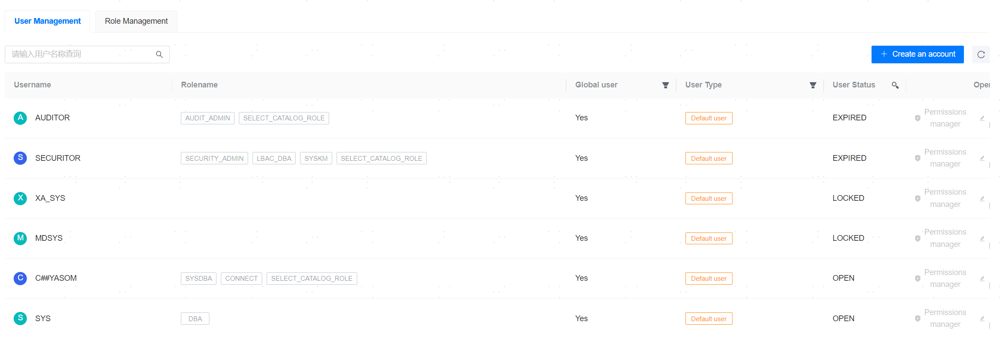
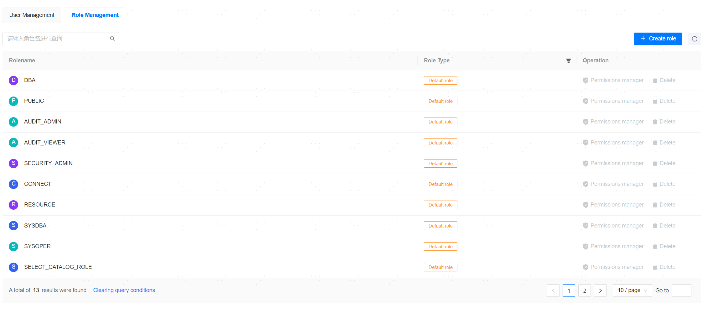

**Web Path**: **[ YashanDB ]**>**[ YashanDB List ]**>**[ DB Name ]**>**[ Database management ]**>**[ Permissions ]**

## User Management

**Web Path**: **[ User Management ]**

**Functionality Introduction**

In User Management, you can perform operations such as creating database users, managing authorizations, and modifying passwords.

Authorization management allows you to modify the roles and privileges of users. The final privilege is a combination of role privileges and the user's own privileges.

**Main Content Explanation**

**[ User ]**: Required parameter, supports letters, numbers, and underscores; must start with a letter; value range is [1,64]. This behavior is consistent with YashanDB's Account creation, shown as:

- If the username input is a lowercase "aa", it will be created successfully as AA.
- If the username input is "aa", it will be created successfully as aa.

**[ Password ]**: Required parameter, value range is [1,64].

## Role Management

**Web Path**: **[ Role Management ]**

**Functionality Introduction**

In Role Management, you can perform operations such as creating database roles and managing authorizations.

Authorization management allows you to modify the privileges contained in the role.

**Main Content Explanation**

**[ Role Name ]**: Required parameter, value range is [1,64]. This behavior is consistent with YashanDB's role creation, shown as:

- If the input is a lowercase "aa", it will be created successfully as AA.
- If the input is "aa", it will be created successfully as aa.

**[ Assign Privileges ]**: Optional parameter, allows you to grant system-level or object-level privileges to the role.