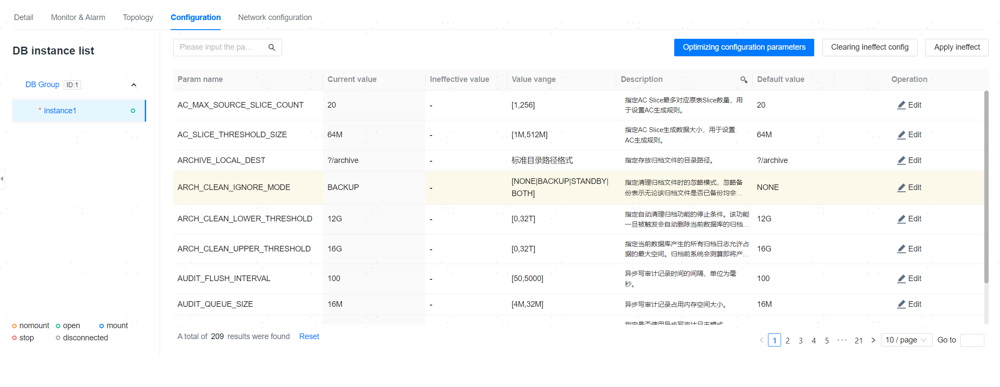

**Web Path**: **[ YashanDB ]**>**[ YashanDB List ]**>**[ DB Name ]**>**[ Basic Information ]**>**[ Configuration ]**

## Edit Configuration Items

**Web Path**: **[ Edit ]**

**Functionality Introduction**

Clicking on the configuration item list **[ Edit ]** allows you to modify the current database configuration item information. The management platform divides the modification of configuration item information into two types:

- Save only: Save the modifications to the configuration item, which can be later applied to the database by clicking **[ Apply Pending Activation Configurations ]**.
- Save and apply: Immediately apply the modification information of the configuration item to the database.

Both types of modifications can choose different synchronization methods to apply the changes of this instance's configuration items to other instances. The main synchronization methods are as follows:

- Apply only to this instance
- Synchronize to all DB instances

## Optimize Configuration Parameters

**Web Path**: **[ Optimize Configuration Parameters ]**

**Functionality Introduction**

The database can generate configuration parameters that are suitable for the business type and system resource conditions based on the incoming variables, i.e., recommended parameters.

It supports generating, displaying, filtering, and applying these recommended parameters.

Users must log in to the database with ALTER SYSTEM privilege.

## Clear Pending Activation Configurations

**Web Path**: **[ Clear Pending Activation Configurations ]**

**Functionality Introduction**

Clicking **[ Clear Pending Activation Configurations ]** can clear all ineffective configuration items at once.

## Apply Pending Activation Configurations

**Web Path**: **[ Apply Pending Activation Configurations ]**

**Functionality Introduction**

Clicking **[ Apply Pending Activation Configurations ]** can apply all ineffective configuration items to the database at once.

> **Note**：
>
> When configuring multiple parameters simultaneously, if there are value dependencies between the parameters, it may cause modification failures. Please configure the parameter values reasonably according to the error messages or modify them in batches.