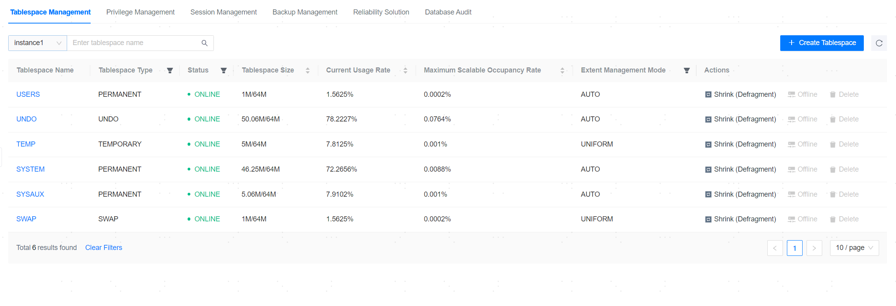
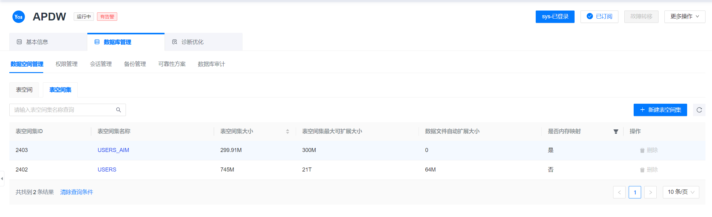

**Web Path**: **[ YashanDB ]**>**[ YashanDB List ]**>**[ DB name ]**>**[ Database management ]**>**[ Tablespace Management ]**

## Tablespace Management

**Functionality Introduction**

The management platform provides functionality for quick management of tablespaces, including creating new tablespaces, defragmentation, and offline operations.

Data bucket management does not support **22.2 version Standalone Deployment** databases.

Defragmentation can reduce the physical storage space occupied by the tablespace, thereby freeing unused space or optimizing storage layout. It supports specifying the target size for defragmentation.

Offline operation can set the specified tablespace to offline status. Once the tablespace is offline, the tables and indexes within it will no longer be available until the tablespace is restored to online status. Offline operations cannot be performed on the default tablespace.

**Main Content Explanation**

**[ Tablespace Name ]**: Click to view basic information about the tablespace, the Data File list, and the Data Bucket list. It supports modifying the read/write mode of the Data Bucket.

**[ Extent Management Mode ]**: AUTO (the database automatically determines the size of each extent) and UNIFORM (the administrator must explicitly specify the size of each extent).

## Tablespace Set Management

**Functionality Introduction**

Tablespace sets exist only in **Distributed Deployment**.

The management platform provides functionality for quick management of tablespace sets, including creating new tablespace sets and adding data buckets.

**Main Content Explanation**

**[ Tablespace Set Name ]**: Click to view basic information about the tablespace set and the Data Bucket list.
