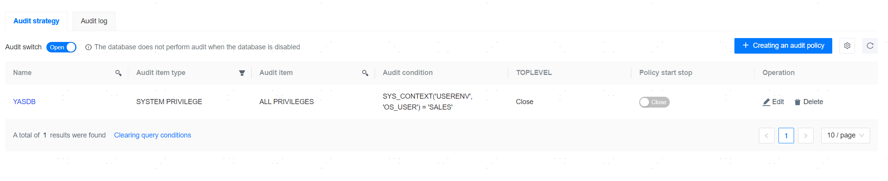
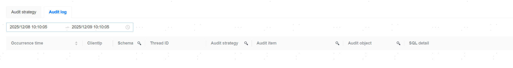

**Web Path**: **[ YashanDB ]**>**[ YashanDB List ]**>**[ DB name ]**>**[ Database Management ]**>**[ Database Audit ]**

## Audit Strategy

**Web Path**: **[ Audit Policy ]**



**Functionality Introduction**

The management platform supports the creation of audit strategies to audit database behaviors.

The prerequisites for database auditing are: the audit strategy is enabled, and the audit switch is turned on.

**Main Content Explanation**

**[ Audit policy name ]**: Required parameter, supports English, numbers, and underscores, must start with a letter or underscore, 1-20 characters.

**[ Audit rule ]**: Required parameter, supports the creation of Privilege auditing, Behavior auditing, and Role Audit rules.

**[ Audit condition ]**: Optional parameter; this expression is used to define the judgment condition for executing the audit strategy. If the condition result is true, the audit strategy will be executed; otherwise, it will not be executed.

> **Note**：
>
> The audit condition is the part after the 'WHEN' keyword in the CREATE AUDIT POLICY SQL, no single quotes are needed on both sides when input on the page, single quotes can be used directly within the statement.

```sql
# sql statement
CREATE AUDIT POLICY up_SYS_CONTEXT
  ACTIONS SELECT ON sales.area
  WHEN 'SYS_CONTEXT(''USERENV'', ''OS_USER'') = ''SALES'''
  EVALUATE PER SESSION;

# The corresponding audit condition entered on the page is
SYS_CONTEXT('USERENV', 'OS_USER') = 'SALES'
```

**[ Audit Condition Evaluation Frequency ]**: Optional parameter; frequency of executing the audit condition judgment: STATEMENT, SESSION, INSTANCE.

- STATEMENT: Focuses on the execution of each SQL statement; the frequency of audit condition judgment is consistent with the execution frequency of SQL statements.
- SESSION: Focuses on operations during the session; the frequency of audit condition judgment depends on the execution frequency of SQL statements in the session but may be recorded in a summarized or simplified manner.
- INSTANCE: Focuses on the overall status of the database instance; the frequency of audit condition judgment may be lower and rely on specific time intervals or triggering events.

**[ TOPLEVEL ]**: Optional parameter; whether to audit internal statements.

## Audit Log

**Web Path**: **[ Audit log ]**



**Functionality Introduction**

The management platform supports viewing audit logs generated based on audit strategies.

Audit items do not support Chinese searches.

Audit objects do not support schema searches.