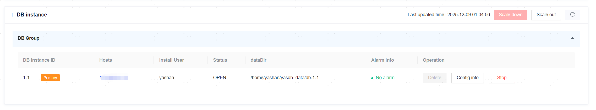
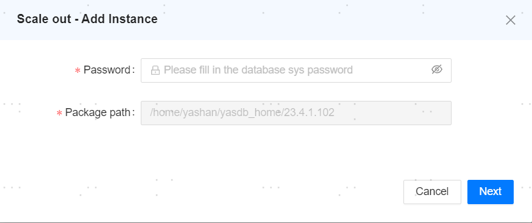
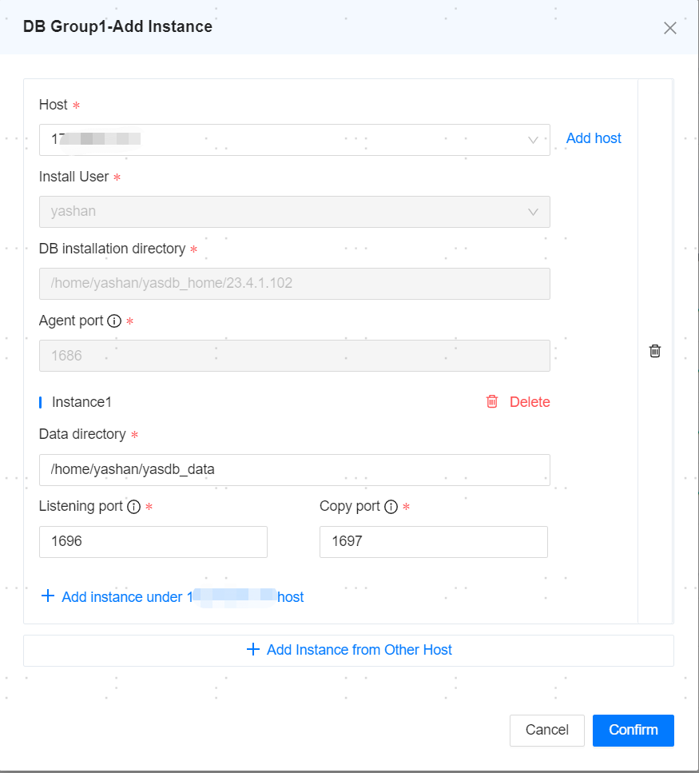
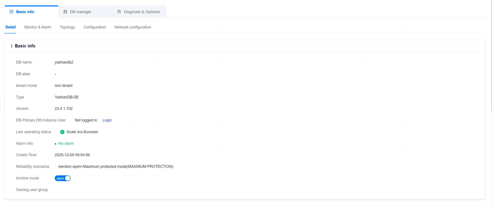
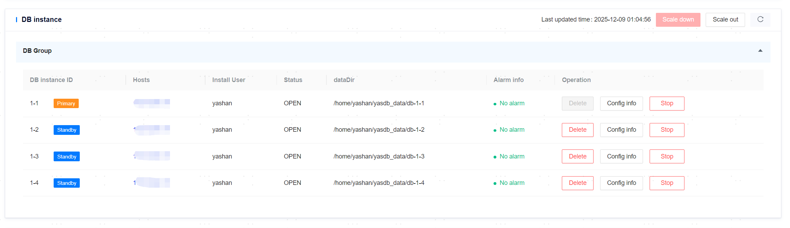
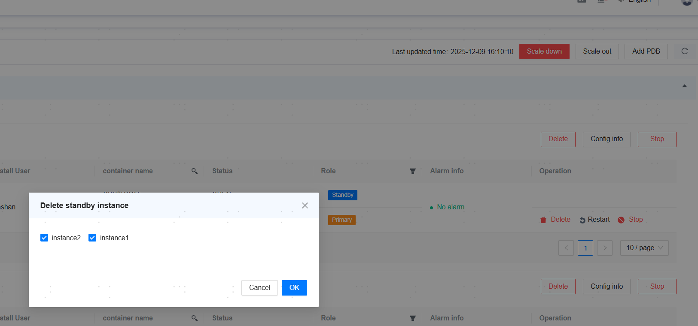

**Web Path**: **[ YashanDB ]**>**[ YashanDB List ]**>**[ DB name ]**>**[ Basic Information ]**>**[ Detail ]**

**Functionality Introduction**

The management platform supports viewing the server configuration of instances, updating database instance information, starting and stopping instances, scaling up and down, and other functionalities.

## Scaling Up

**Functionality Introduction**

This functionality is only supported for version 23.2.4.100 and subsequent **Standalone Deployment** databases, as well as version 23.4 and later **YAC Deployment** databases.

For Standalone Deployment databases, it is possible to add standby nodes to the database; for YAC Deployment databases, it is possible to add instance nodes to the main group. If the host where the scaling node is located is a new host without any database nodes or yasagent processes, different host users can be selected to install the new node.

> **Note**：
>
> Adding standby nodes is not supported for standalone databases with cascade standby nodes.
>
> When adding a standby node to a single node database, the database must be configured with the primary/standby message link listening address parameter `REPLICATION_ADDR`.
>
> Adding a new standby node from a remote host is not supported.
>
> Adding remote database standby nodes is not supported.
>
> If primary/standby arbitration is enabled, it must be disabled before adding standby nodes.
>
> YAC currently do not support scaling down; if scaling up fails, it is not supported to delete the failed scaling node, as the residual scaling data may cause subsequent scaling failures.

## Steps: Add Node

1. In the database instance area, click on scale up and enter the sys user password. After confirming that the information is correct, click **[Next]**.

2. Select the node where you want to add the host and click **[Confirm]**.

   - Add nodes to the same host.

   - Add nodes to other hosts.

3. The host is added successfully, and a success message is displayed.

## Scaling Down

**Functionality Introduction**

This functionality is only supported for version 23.2 and subsequent **Standalone Deployment** databases.

When the database is in maximize protection mode, if you need to delete all standby nodes of the database, you must switch the database to maximize availability mode in **[ Database management > Reliability Solution ]**.

> **Note**：
>
> For standalone databases after version 23.4, if standby nodes are deleted and there are no nodes and yasom processes on the original standby node's host, the management platform will call yasboot to remove this host from OM.
>
> Deleting standby nodes is not supported for standalone databases with cascade standby nodes.
>
> Deleting remote database standby nodes is not supported.
>
> If primary/standby arbitration is enabled, it must be disabled before deleting standby nodes.

## Steps: Delete Node

1. In the database instance area, click **[Scale Down]**.

   - Select the nodes you want to delete and check the checkbox.

   - For individual nodes, you can also directly click **[Delete]**.

## Distributed Database Switch Self-Election

**Functionality Introduction**

This functionality is only supported for version 23.2 and subsequent **Distributed Deployment** databases.

In Distributed Deployment databases, if the MN or DN group has at least one primary and two standby nodes, and the primary database is available, it supports self-election within the switch group.

## Server Configuration

**Functionality Introduction**

Click **[Server configuration]** to view the server network configuration, file paths, and other information.

The management platform provides IP access control functionality, allowing users to configure whitelists to enhance database access security. This functionality is disabled by default and can be enabled by the user when needed.