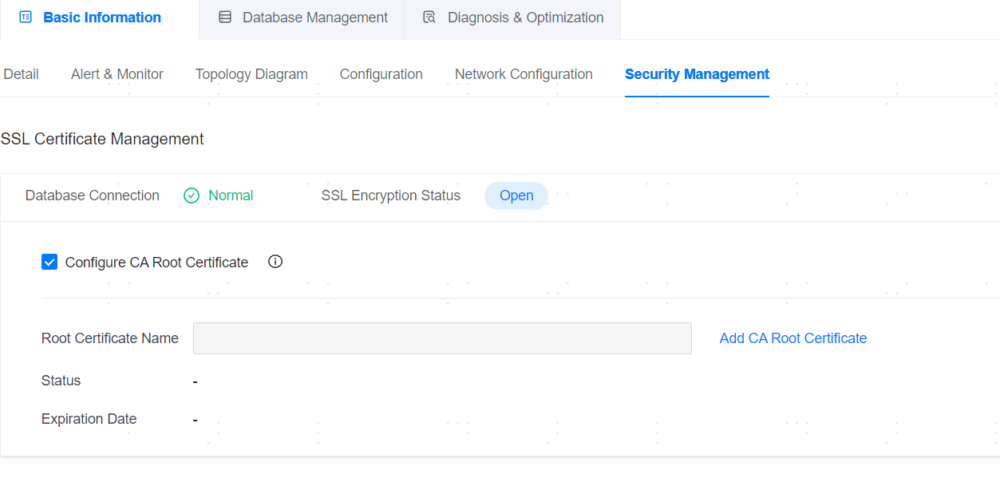

**Web Path**: **[ YashanDB ]**>**[ YashanDB List ]**>**[ DB Name ]**>**[ Basic Information ]**>**[ Security Management ]**

## Enable Security Management

**Web Path**: **[ YashanDB ]**>**[ YashanDB List ]**>**[ DB Name ]**>**[ Basic Information ]**>**[ Configuration ]**

**Functionality Introduction**

Supports configuring SSL certificates in management platform to access YashanDB. Clicking on the configuration item list **[ Edit ]** and search SSL_ENABLE, update SSL_ENABLE to ON, then click **[ Save and Activate ]**. 
