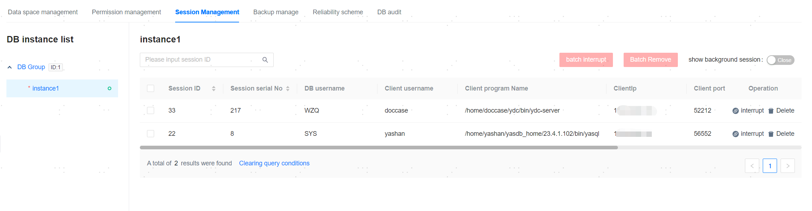

**Web Path**: **[ YashanDB ]**>**[ YashanDB List ]**>**[ DB name ]**>**[ Database management ]**>**[ Session Management ]**

**Functionality Introduction**

Session management provides information about currently connected sessions of the instance and functionalities for user session deletion and interruption.

Users can switch between different database instances to view session information and choose whether to display background sessions.

> **Note**:
>
> Database session management has the following limitations in Distributed Deployment mode:
> - Only supports deletion and interruption of sessions connected to distributed database CN instances.
> - Only supports querying of its own connected sessions, and no deletion or interruption operations can be performed.

**Main Content Explanation**

**[ interrupt ]**: Sends the command `alter system cancel session ?` to the database (where ? represents the bound session ID parameter), interrupting the currently executing SQL statement of the session.

**[ Delete ]**: Sends the command `alter system Kill session ?` to the database (where ? represents the bound session ID parameter), forcibly stopping the specified session connection.
