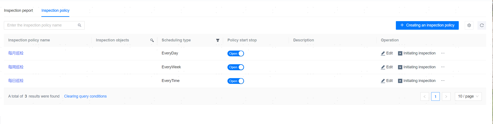
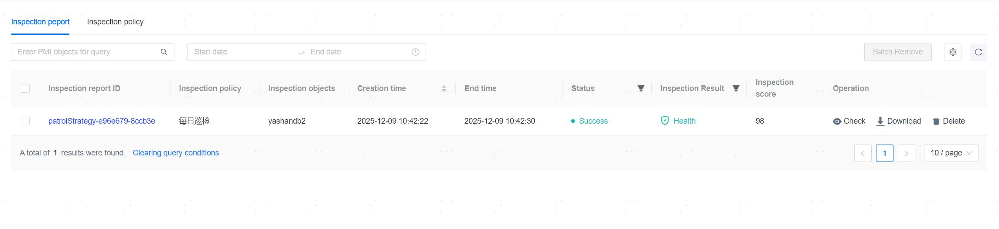

**Web Path**: **[ Inspection ]**

## Inspection Policy

**Web Path**: **[ Inspection Strategy ]**

**Functionality Description**

The management platform supports the configuration of inspection policies, enabling or disabling policies, and periodically initiating inspections of the database as needed. It diagnoses issues within the database, replacing manual daily inspections and reducing the workload of operations and maintenance personnel.

**Main Content Explanation**

**[ Strategy Name ]**: Required parameter, up to 60 characters.

**[ Strategy Remarks ]**: Optional parameter, up to 200 characters.

**[ Inspection Object ]**: Required parameter, managed databases. If multiple databases are selected, the chosen databases must share the same database user and password.

**[ Username ]**: Required parameter, database Username.

**[ Password ]**: Required parameter, database Username Password.

**[ Period Type ]**: Required parameter, single/ daily/ weekly/ monthly.

**[ Start time ]**: Required parameter, Inspection Start time.

**[ Anomaly Event Matching Time ]**: Optional parameter, the matching time for checking error logs and abnormal events, default 30 days.

**[ Notification Object ]**: Optional parameter, you can go to [System Contacts](../../Platform Management/Platform Setting/Platform Information Settings/System Contacts) to add Notification recipients. If email service is not enabled, the selected Notification recipients will not receive email notifications; you can go to [Notification Service Setting](../../Platform Management/Platform Setting/Platform Information Settings/Notification Service Setting) for configuration.

> **Note**:
>
> If multiple inspection objects are selected, but their usernames and passwords are inconsistent, creating the inspection policy will fail.

## Inspection Report

**Web Path**: **[ Inspection Report ]**

**Functionality Description**

The inspection checks and evaluates the health status of the database from five modules: security, stability, availability, performance analysis, and capacity analysis. It summarizes existing risks and generates a detailed inspection report. The inspection report shows resource usage for each PDB. The inspection report supports online viewing and downloading.

Inspection information and reports can be pushed promptly to DBAs and other operations staff via email.

**Main Content Explanation**

**[ Report ID ]**: Click to view the detailed inspection report. The detailed content of the inspection report is as follows:

- Basic Information: Displays fundamental information such as database name, type, and status.
- Health Inspection Results:
  - Database Health Overview: Healthy `[95,100)`, Subhealthy `[80,95)`, Warning `[60,80)`, Severe `[0,60)`.
  - Health Risk Model: Conducts risk analysis on security, stability, availability, performance, and capacity.
  - Risk Summary: Displays health level, category, and inspection risk indicators.
  - Detailed Situation: Shows detailed information regarding security, stability, high availability, performance analysis, capacity analysis, ADR report, etc.