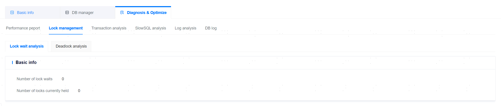
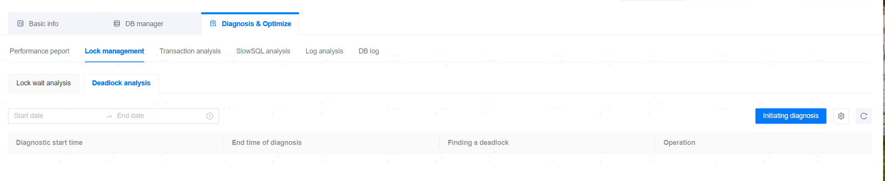

**Web Path**: **[ YashanDB ]**>**[ YashanDB List ]**>**[ DB name ]**>**[ Diagnosis & Optimization ]**>**[ Lock management ]**

## Lock Wait Analysis

**Web Path**: **[ Lock wait analysis ]**

**Functionality Description**

The lock wait analysis displays the number of current lock waits and the number of currently held locks for all sessions in the database.

**Main Content Explanation**

**[ Lock Wait Count ]**: The number of transactions in the system that are in a state of waiting for lock resources.

**[ Current Held Lock Count ]**: The number of locks currently held in the system.

**[ Lock type ]**: TS (Shared table lock), TX (Exclusive table lock), ROW (Row lock), KEY (Key lock), SLICE_S (LSC table slice shared lock), SLICE_X (LSC table slice exclusive lock)

## Deadlock Analysis

**Web Path**: **[ Deadlock analysis ]**

**Functionality Description**

Deadlock analysis can diagnose whether deadlocks have occurred in YashanDB over a period of time.

### Initiating Diagnosis

**Web Path**: **[ Deadlock analysis ]**>**[ Initiate Diagnosis ]**

**Functionality Description**

After the user clicks **[ Initiate Diagnosis ]**, the management platform will verify the diagnosis parameters, then traverse the filenames to query the log files (including archived files), and upon successfully reading the files, it will create diagnosis data to be stored in the database.

**Main Content Explanation**

**[ Deadlock Detected ]**: Whether a deadlock occurred during the diagnosis period.