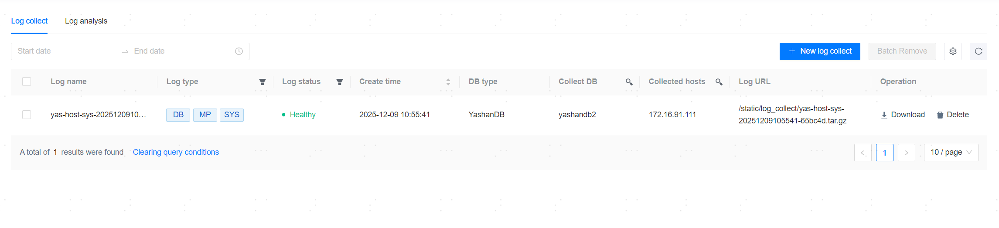
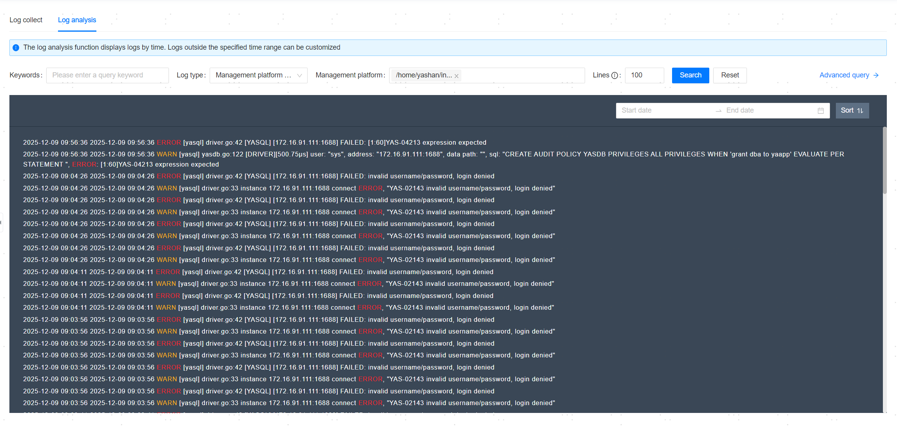
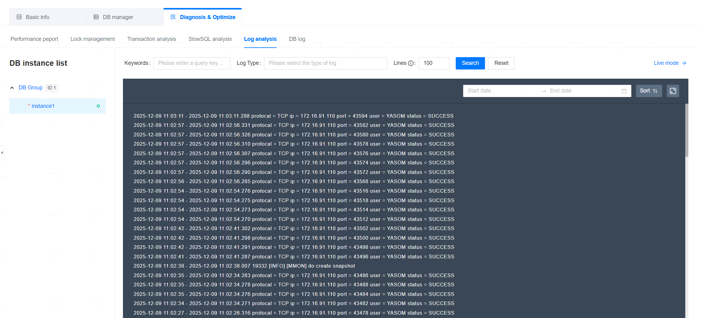
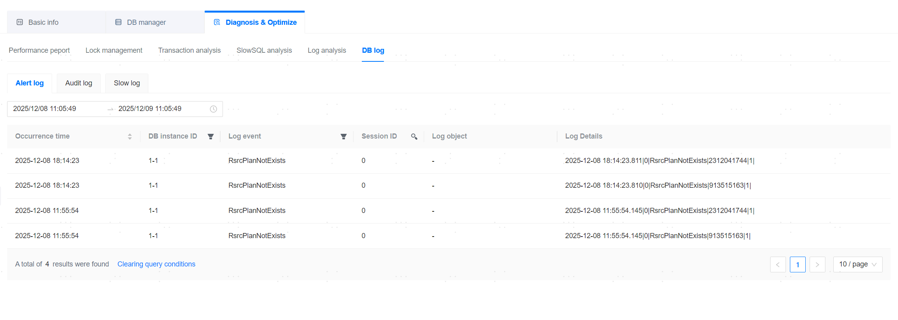
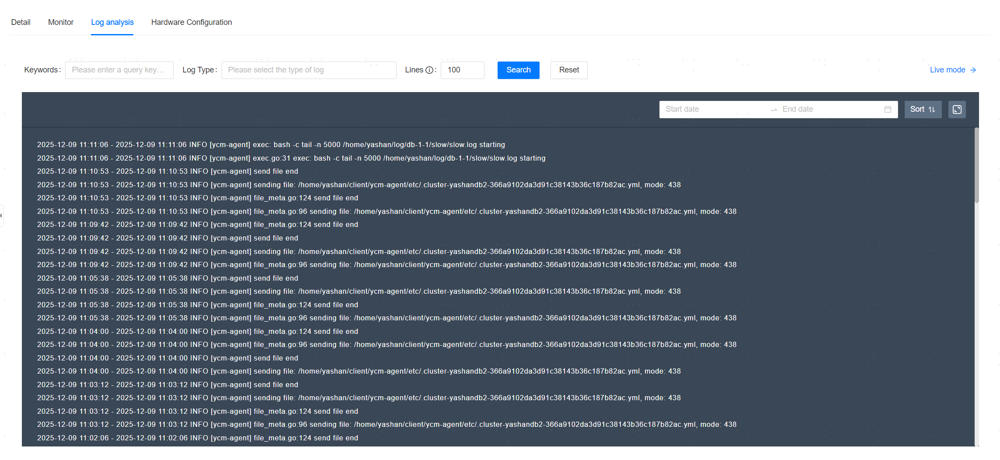

**Web Path 1**: **[ Log management ]**

**Web Path 2**: **[ YashanDB ]**>**[ YashanDB List ]**>**[ DB name ]**>**[ Diagnosis & Optimization ]**

**Web Path 3**: **[ Host Management ]**>**[ Host list ]**

## Log Collection

**Web Path 1**: **[ Log Collection ]**

**Functionality Introduction**

The management platform supports the collection of the following types of logs:

- Database Logs (DB): Collect database logs at both the CDB and PDB levels. When you choose to collect database logs, the hosts where the databases are deployed will be automatically selected for log collection.
- Host Control Logs (Management Platform): Collect the agent.log logs generated by the management platform for controlled Agent hosts.
- Host System Logs (SYS): Collect system logs of the Agent host. This operation requires root user privileges.

## Log Analysis

**Web Path 1**: **[ Log analysis ]**

**Functionality Introduction**

The management platform supports the analysis of logs including management platform logs, YashanDB logs, and host logs. And YashanDB logs support log analysis at both the CDB and PDB levels.

Log analysis requires that the system time of the management platform server and the added Agent hosts be roughly synchronized. A significant time difference may lead to log collection failure. You can perform [Agent host time synchronization configuration](../../Platform Management/Platform Setting/Resource Information Settings/Time Synchronization Settings).

**Main Content Explanation**

**[ LogQL Statement ]**: A language specifically designed for querying log entries in Loki. For more details, see [LogQL Syntax](../../Reference/LogQL).

### Database

#### Log Analysis

**Web Path 2**: **[ YashanDB ]**>**[ YashanDB List ]**>**[ DB name ]**>**[ Diagnosis & Optimization ]**>**[ Log analysis ]**

**Functionality Introduction**

Supports displaying logs of all instances of the database, with static display, real-time display, and retrieval capabilities.

The live mode log query functionality allows you to refresh and view the latest logs in real-time. Enter the query parameters and click **[ Live mode ]**.

**Main Content Explanation**

**[ Log Type ]**: The collected Log Types include:

- run.log: Database operation logs
- alert.log: Alert logs
- slow.log: Slow logs

#### Database Logs

**Web Path 2**: **[ YashanDB ]**>**[ YashanDB List ]**>**[ DB name ]**>**[ Diagnosis & Optimization ]**>**[ Database Logs ]**

**Functionality Introduction**

Supports viewing alert logs, audit logs, and slow logs.

The slow logs are off by default. You can change the ENABLE_SLOW_LOG parameter to TRUE in the [Configuration Parameters](../Basic O&M Management/Configuration Parameters) to enable slow log recording.

### Host

#### Log Analysis

**Web Path 3**: **[ Host list ]**>**[ HostName ]**>**[ Log analysis ]**

**Functionality Introduction**

Supports displaying server logs with static display, real-time display, and retrieval capabilities.

The live mode log query functionality allows you to refresh and view the latest logs in real-time. Enter the query parameters and click **[ Live mode ]**.

**Main Content Explanation**

**[ Log Type ]**: The collected Log Types include:

- install_sh.log: Host installation logs
- node_exporter.log: Logs from the node_exporter metric collection component
- promtail.log: Logs from the promtail collection component
- ycm-agent.log: Logs from ycm-agent
- ycm-agent-start.log: Standard output logs from ycm-agent