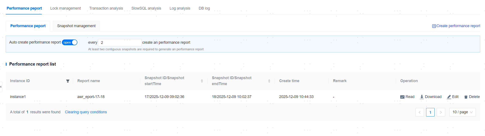
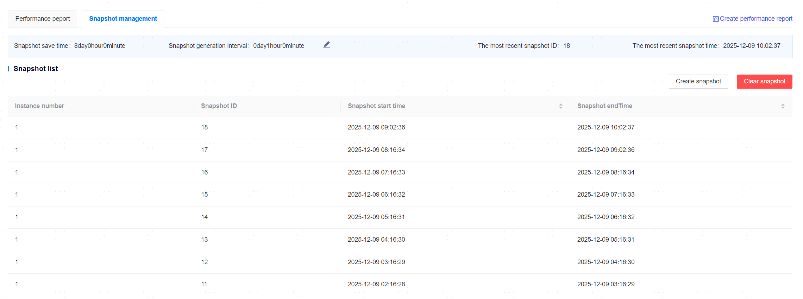

**Web Path**: **[ YashanDB ]**>**[ YashanDB List ]**>**[ DB Name ]**>**[ Diagnosis & Optimization ]**>**[ Performance Report ]**

## Performance Report

**Web Path**: **[ Performance Report ]**

**Functionality Introduction**

The performance report is used to collect statistics about YashanDB operations and other statistics. The management platform provides functionalities for automatically generating performance reports and generating performance reports instantly.

**Main Content Explanation**

**[ Auto-generate Performance Report ]**: Modify the snapshot interval for automatic report generation (must be >=2), and click **[ Auto Create Performance Report ]** to enable the Auto Create Performance Report functionality.

**[ Generate Performance Report Immediately ]**: After selecting the starting ID and ending ID of the snapshot, click **[ Confirm ]** to create a performance report.

> **Note**:
>
> To ensure the accuracy of the performance report, YashanDB requires that **there can be no restarts, stops,** or other operations between the starting ID and ending ID of the snapshot. Such operations will cause the performance report generation task to fail.
>
> Each cycle polling for snapshots will generate a maximum number of performance reports corresponding to the parallelism. Reference configuration can be found in [Performance Report Configuration](../../Platform Management/Platform Setting/Resource Information Settings/Platform Configuration Parameter Management).

## Snapshot Management

**Web Path**: **[ Snapshot Management ]**

**Functionality Introduction**

The management platform offers expedited snapshot generation functionality, capturing important statistics and load information for YashanDB at a specific point in time, as well as modifying snapshot save time, snapshot generation interval, clearing snapshots, and viewing all snapshots.

Snapshots are used by YashanDB to store the state of CPU usage, memory usage, I/O read/write, etc., of the database at a certain moment. YashanDB generates a snapshot every hour.

**Main Content Explanation**

**[ Snapshot Retention Period ]**: The default value is 8 days, with a range of [1, 36500] days.

**[ Snapshot Generation Interval ]**: The default value is 60 minutes, with a range of [10, 52560000] minutes.

**[ Create Snapshot ]**: Click to create a snapshot.

**[ Clear Snapshots ]**: Clear all snapshots at once.