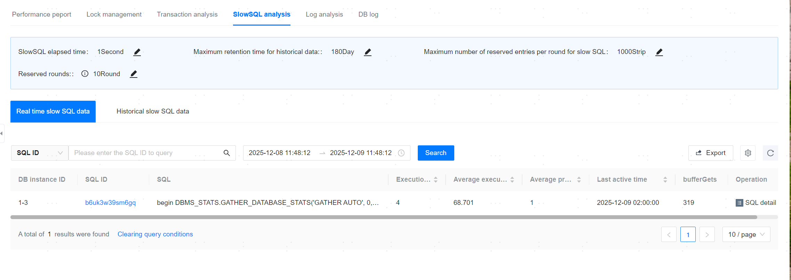
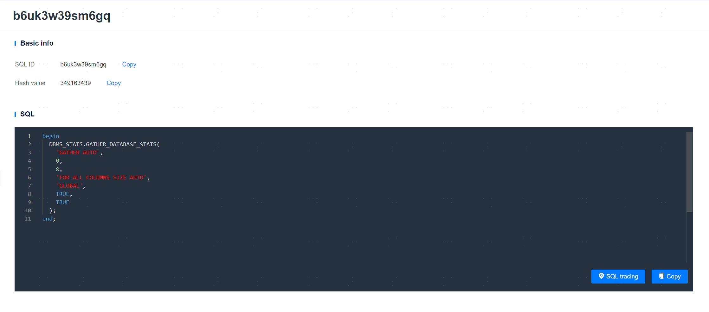
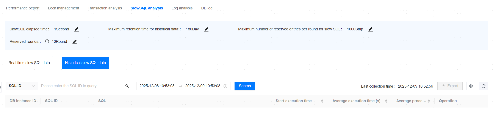

**Web Path**: **[ YashanDB ]**>**[ YashanDB List ]**>**[ DB name ]**>**[ Diagnosis & Optimization ]**>**[ Slow SQL Analysis ]**

## Real-time Slow SQL Data

**Web Path**: **[ Real-time Slow SQL Data ]**

**Functionality Description**

Real-time slow SQL data refers to SQL statements that are currently executing for too long in database queries. The management platform provides SQL analysis and SQL tracking for such SQL, along with functionality to export to a CSV file with one click.

Distributed systems also support viewing the execution status of this SQL statement on the DN.

### Real-time Slow SQL Details

**Web Path**: **[ Real-time Slow SQL Data ]**>**[ View SQL Details ]**

**Functionality Description**

Viewing SQL details displays basic information, slow SQL statements, SQL cursor information, and SQL execution plans. Users can perform copy or SQL tracking operations, where SQL tracking re-executes the SQL and shows the AUTORACE execution results and prints the execution plan.

**Main Content Explanation**

**[ Basic Information ]**: Contains SQL ID and hash value.

**[ SQL ]**: Displays SQL text information.

**[ SQL tracing ]**: SQL tracking re-executes the SQL and shows the AUTORACE execution results and prints the execution plan.

**[ SQL cursor information ]**: Displays the sub-cursor information for this SQL.

**[ SQL Execute the plan ]**: Displays the execution plan information for this SQL.

**[ Outline Management ]**: Displays the outline-related information for this SQL and supports toggling the outline, creating, editing, deleting, binding, unbinding, and viewing binding records from the past 30 days.

**[ SQL Optimization Suggestion ]**: Displays a list of optimization suggestions for this SQL. Currently, it only supports index recommendation types.

> **Note**:
>
> Outline management only supports binding SQL_ID type outlines and is only supported in versions yashandb-23.2.9.100 and above.
>
> The index recommendation in SQL optimization suggestions does not currently support SQL of the table join type, but supports recommendations for ordinary indexes and composite indexes.

## Historical Slow SQL Data

**Web Path**: **[ Historical Slow SQL Data ]**

**Functionality Description**

Historical slow SQL data refers to the historical slow SQL statements collected periodically by the management platform. The management platform provides functionality to view SQL details and export to a CSV file with one click.

## Slow SQL Configuration

**Functionality Description**

Slow SQL configuration displays database-related configurations for slow SQL, allowing users to modify the display and saving strategies for the database's slow SQL.

**Main Content Explanation**

**[ Slow SQL Threshold ]**: Displays the minimum execution time for the SQL list, with a default value of 1 second.

**[ Maximum Retention Duration of Historical Data ]**: The retention duration for slow SQL data, with a default value of 180 days.

**[ Maximum Retention Rows per Round of Slow SQL ]**: The maximum number of entries retained for slow SQL per round, with a default of 1000 entries.

**[ Retention Rounds ]**: The number of rounds for which slow SQL is retained, with each restart of the database instance counted as one round, and a default of 10 rounds.