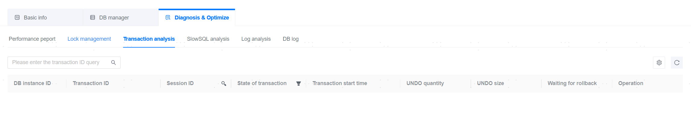

**Web Path**: **[ YashanDB ]**>**[ YashanDB List ]**>**[ DB Name ]**>**[ Diagnosis & Optimization ]**>**[ Transaction Analysis ]**

**Functionality Introduction**

Transaction analysis allows viewing and rolling back currently uncommitted transactions in the database.

Distributed databases also display information related to all instances' pending transactions and their statuses, but do not support rollback operations.

**Main Content Explanation**

**[ Transaction Status ]**: The state of the transaction includes IDLE, OPEN, PHASE1, END.

**[ UNDO Block Count ]**: The number of undo blocks used by the transaction.

**[ UNDO Block Size ]**: The size of the undo blocks used by the transaction.

Distributed Database:

**[ Transaction Status ]**: IDLE, OPEN, PREPARED, COMMIT, ROLLING BACK, ROLLED BACK, COMMIT FORCE, ROLLBACK FORCE.

**[ Pending Duration ]**: The time at which the transaction entered the pending state; this field becomes invalid if the database restarts.

**[ Retry Duration ]**: The time when XA transactions in phase1 re-enter the pending state after the database restart.