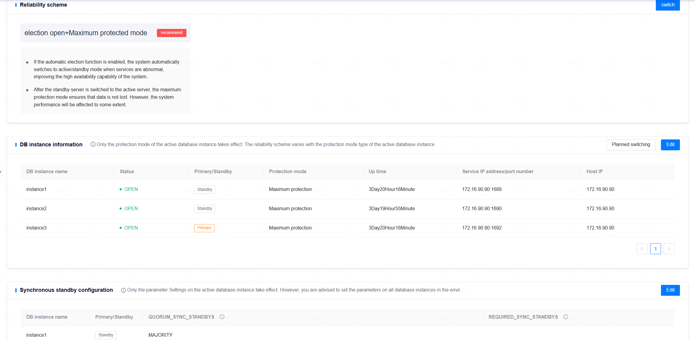

**Web Path**: **[ YashanDB ]**>**[ YashanDB List ]**>**[ DB Name ]**>**[ Database management ]**>**[ Reliability Solution ]**

## Standalone Deployment Database

**Functionality Introduction**

Based on the optional election enable/disable and different protection modes, six reliability scenarios are formed. This supports modifying the overall reliability scenario of the database and the protection mode of individual instances. Associated functionality also includes switchover, failover, and synchronized backup configuration.

### Switch Reliability Scenario

**Web Path**: **[ Switch ]**

> **Note**：
>
> Only when the archiving mode is enabled, a YashanDB standalone database with at least one primary and one standby supports reliability scenario settings.

**Functionality Introduction**

#### One-Primary/One-Standby Database

In the reliability scenario card area, click **[ Switch ]** to enter the reliability scenario selection page, which offers six combinations of reliability scenarios:

- Arbitration enabled + Zero loss mode + Maximize protection mode
- Arbitration enabled + Normal mode + Maximize availability mode
- Arbitration enabled + Normal mode + Maximize performance mode
- Arbitration disabled + Maximize performance mode
- Arbitration disabled + Maximize availability mode
- Arbitration disabled + Maximize protection mode

> **Note**:
>
> The granularity of reliability scenario configuration is at the database level, meaning that when configuring a specific database, all its instances are uniformly affected.
>
> This mechanism is based on Yasom executing arbitration for the database, which automatically switches when a failure occurs at the primary node. Arbitration only takes effect when both Yasom and the standby node's Yasagent process are online.

The zero-loss mode ensures that no data is lost during arbitration, while the normal loss mode may lose data.

If the standby node and Yasom are deployed on the same server, it is not recommended to use election. If it must be used, normal mode is recommended. Because in zero-loss mode, if both Yasom and the standby node fail simultaneously, it can cause the primary node to experience business blocking.

If Yasom is unavailable, even if it is in election and zero-loss mode, the protection mode of the database may be unable to change (for example, if the standby node is down, the primary node's protection mode cannot change from maximize protection to maximize availability), which can also cause business blocking at the primary node.

After enabling arbitration, manual failover or switching protection modes cannot be performed.

#### One-Primary/Multi-Standby Database

In the reliability scenario card area, click **[ Switch ]** to enter the reliability scenario selection page, which offers six combinations of reliability scenarios:

- Self-election enabled + Maximize protection mode
- Self-election enabled + Maximize availability mode
- Self-election enabled + Maximize performance mode
- Self-election disabled + Maximize performance mode
- Self-election disabled + Maximize availability mode
- Self-election disabled + Maximize protection mode

> **Note**：
>
> The granularity of reliability scenario configuration is at the database level, meaning that when configuring a specific database, all its instances are uniformly affected.
>
> This mechanism is based on the Raft cluster architecture's leader election. The deployment mode is recommended to default to \<self-election disabled + maximize performance mode>, while the opposite is recommended to be \<self-election enabled + maximize protection mode>.
>
> Exercise **caution** when enabling maximize protection mode for databases with cascade standby nodes.

For multiple groups of standalone databases:
- Under normal circumstances, the reliability scenario is only switched for the group where the primary node is located.
- If all nodes in the old primary node's group fail, click failover to promote a standby node from the standby node group to primary. After recovery, the old primary node should be demoted to standby, and self-election for that group should be disabled.

### Switchover

**Web Path**: **[ Planned Switchover ]**

**Functionality Introduction**

The database instance information card area provides YashanDB's Switchover (Planned switching). Clicking **[ Planned Switchover ]** will list all standby database information, allowing the user to select a database instance for primary/standby switching.

During the switchover process, all sessions connected to the primary database will be disconnected, and new connection sessions cannot be established until the switchover is completed or fails.

After the switchover is completed, the primary standby database will reconnect, resulting in a brief network disconnection.

### Synchronous Backup Configuration

**Web Path**: **[ Edit ]**

**Functionality Introduction**

Synchronous backup configuration means that when a transaction is committed, the redo log of the primary database must synchronize to at least a certain number of standby databases before committing.

The QUORUM_SYNC_STANDBYS and REQUIRED_SYNC_STANDBYS parameters are only effective in maximize protection mode.

Once the leader election functionality is enabled, it is not allowed to specify standby database names for the QUORUM_SYNC_STANDBYS and REQUIRED_SYNC_STANDBYS parameters.

**Main Content Explanation**

**QUORUM_SYNC_STANDBYS**: ANY1(*) means that any one transaction must be synchronized to any of the standby databases to commit.

**REQUIRED_SYNC_STANDBYS**: instance2 means that the transaction must be synchronized to the instance named instance2 to commit.

## Distributed Deployment Database

Distributed Deployment databases require a high availability deployment environment.

Currently, Distributed Deployment databases do not support switching reliability scenarios or synchronous backup configurations.

### Switchover

**Web Path**: **[ Planned Switchover ]**

**Functionality Introduction**

The database instance information card area provides YashanDB's Switchover (Planned switching). Clicking **[ Planned Switchover ]** will list all MN and DN's switchable standby database information, and only one database instance in a group can be switched at a time. The user can select one for primary/standby switching.

During the switchover process, all sessions connected to the primary database will be disconnected, and new connection sessions cannot be established until the switchover is completed or fails.

After the switchover is completed, the primary standby database will reconnect, resulting in a brief network disconnection.

> **Caution**：
>
> Only the protection mode of the primary database will take effect, and the reliability scenario will change with the protection mode of the primary database.
>
> In a Distributed Deployment scale, it is not recommended to modify the protection mode; please exercise caution.