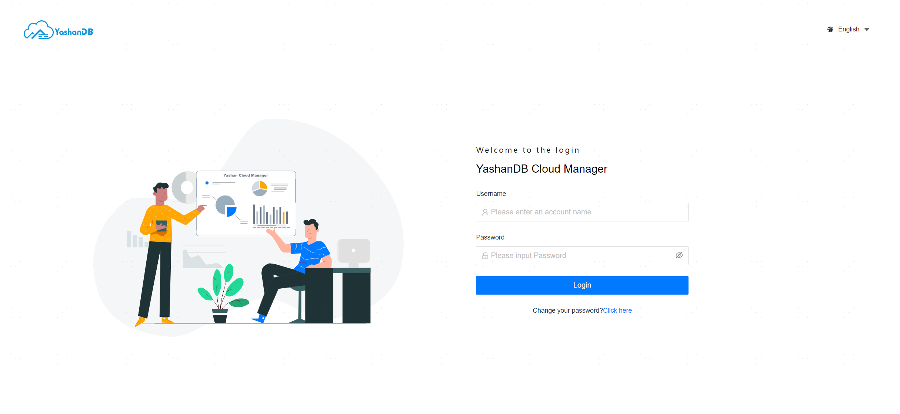
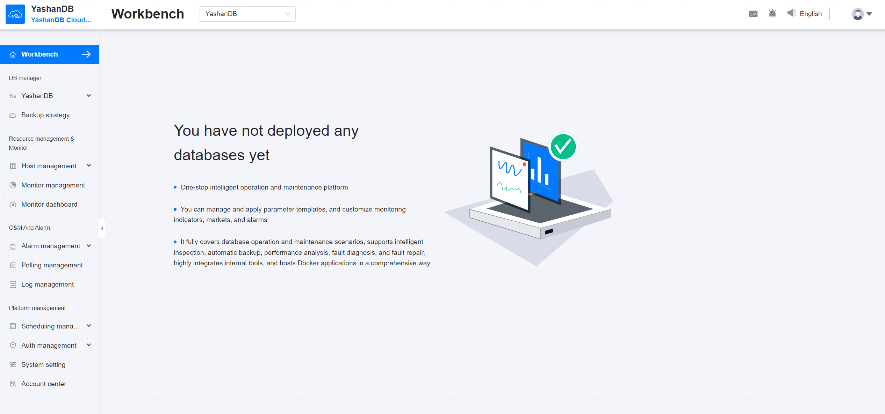

## Login Management Platform

The platform provides an initial administrator account for logging into the system, with the username as admin and the initial password as admin. To ensure information security, the password must be changed during the first login.

Password restrictions are as follows:

- The password length must be between 8 to 30 characters.
- The password must contain numbers, letters, and special characters `~!{'@'}#{'$'}%^&*()_-+={'{'}{'['}{']'}{'}'}\\{'|'}:;\"'<,>.?
- The password cannot contain the username.
- The same character cannot be repeated more than three times.
- Consecutive numbers or letters cannot reach three or more, such as abc, 123, and the reverse is also not allowed.

Once the password has been successfully changed, the user can access the management platform.

## Platform Layout Description

**Top Navigation Bar**

Located at the top of the page, it provides the global navigation functionality of the system. The navigation bar includes the logo of the management platform,  links to main functionality modules, language switch, user information, and more.

**Sidebar**

Divided by functionality modules, it helps users quickly locate the required functionality page.

**Main Content Area**

Located at the center of the page, it is the primary area for users to perform business operations. The main content area will load the corresponding page or data based on the user's selection from the sidebar menu items.

## Platform Configuration Management

The system administrator needs to perform some initial settings, such as creating users for the management platform and configuring notification emails. Please refer to [Platform Management](../../Platform Management/Platform Setting/00Platform Setting) for information on the provided configuration functionality.

## Resource Configuration Management

The system administrator needs to include servers, YashanDB, and other resources within the scope of platform management and monitoring, and delete these resources when no longer being managed. Please refer to [Resource Management](../../Platform Management/Resource Management/00Resource Management) for operation instructions.

After completing the above configurations, various operation and monitoring tasks can be initiated for YashanDB.