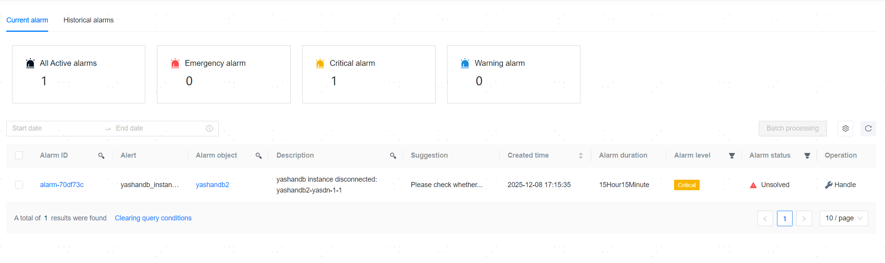

**Web Path 1**: **[ Alert Management ]**>**[ Alert List ]**

**Web Path 2**: **[ Workbench ]**>**[ Recent Alerts ]**>**[ View all alerts ]**

**Web Path 3**: **[ YashanDB ]**>**[ YashanDB List ]**>**[ DB name ]**>**[ Basic Information ]**>**[ Alert Monitoring ]**>**[ More Alert ]**

**Web Path 4**: **[ Host Management ]**>**[ Host list ]**>**[ HostName ]**>**[ Monitor ]**>**[ More Alert ]**

## Alarming

**Web Path 1**: **[ Alarming ]**

**Functionality Introduction**

When an application target of the [Alert Strategy](Alert Strategy) triggers a certain alarm item rule in this strategy, it generates a corresponding alarm notification. Currently alarming indicates unresolved alarms, while historical alarms indicate resolved/cleared alarms.

**Main Content Explanation**

**Alarm Statistics**: It counts the total number of currently alarming items and the total number of alarms at each level.

**Alarm List**: The alarming list records all triggered but unresolved alarm information.

**[ Alert Status ]**: The current status of the alarm, which may be unresolved, resolving, or suspended.

**[ Alert Level ]**: Alarm levels can be categorized into urgent, serious, and warning, configured through the [Alarm item](Alert Strategy.html#alarmitems) **[ Evaluation Rule ]**.

**[ Alert Target / Alert Content ]**: The alarm object represents the resource object (a certain server or database) that triggered the current alarm. The alarm content indicates the specific alarm item matched and the detailed description of the triggering alarm (for example, unable to connect to a specific database instance, configured through the alarm item's **[ Description ]**).

**[ Suggestion ]**: The current alarm resolution recommendations, configured through the alarm item's **[ Suggestion ]**.

**[ Alert Item ]**: The alert that is currently matched by the alarm.

### View Alarm Details

**Web Path 1**: **[ Alert ID ]**

**Functionality Introduction**

On the alarm details page, you can view the basic information, historical data, alarm item rules, and alarm timeline of the specified alarm, providing a data foundation for fully understanding and analyzing alarm issues.

**Main Content Explanation**

**[ Basic Information ]**: You can view the basic info of the alarm, including alarm ID, alarm object, occurrence time, clearing time, and clearing method.

**[ Historical Data ]**: You can view the value records of the corresponding alarm item expression at different times.

**[ Alert Item Rules ]**: You can view the specific alarm rules corresponding to this alarm item.

**[ Alert Timeline ]**: You can view the alteration information of this alarm, alarm handler, and alarm notification recipients.

### Shield the Alarm

**Web Path 1**: **[ Alert ID ]**>**[ Shield Alert ]**

For details, please refer to the [shielding rules](Alert Strategy.html#suppress).

### Handle the Alarm

**Web Path 2**: **[ Process ]**

**Functionality Introduction**

For alarms in "unresolved" status, you can select **[ Set to Suspended ]**, **[ Set to Resolving ]**, or **[ Manually Close ]** as needed.

After setting to hang or resolving, the alarm status will change to "suspended" or "resolving." During the expiration time of the status, the same alarm item of the object triggering this alarm will not generate new alarms; if the alarm recovers to normal or is manually cleared, the alarm status will change to resolved.

> **Note**:
> 
> **[ Set to Suspended ]**: If the alarming situation is expected, you can choose to temporarily suspend the alarm.
>
> **[ Set to Resolving ]**: If the alarming situation is unexpected, you can set the alarm to resolving while attempting to address it.

After manual closure, the alarm will be cleared, with the clearing method being manual closure, and its status will change to "resolved," moving to the **[ Historical Alerts ]** list.

**Main Content Explanation**

**[ Status Expiry Time ]**: When setting to hang or resolving, you need to configure the expiration limit for the "suspended" or "resolving" status, which can be set to 1 hour, 3 hours, 6 hours, 12 hours, or custom end time.

**Closure Reason**: When manually closing an alarm, you need to select a reason, which can be false alarm, alarm issue resolved, alarm issue ignored, or other reasons.

## Historical Alarms

**Web Path 1**: **[ Historical Alerts ]**

**Functionality Introduction**

Alarms that have a status of "resolved" after being resolved/cleared are called Historical alarms. You can view alarm records and corresponding alarm details in the **[ Historical Alerts ]** list.

**Main Content Explanation**

**[ Resolution Mode ]**: The current method of resolving the alarm, categorized into fault recovery, alarm invalidation, and manual closure.

## Remote Alarm

**Web Path 1**: **[ Remote Alert ]**

**Functionality Introduction**

After associating with a remote YCM, when important alarms occur on the remote YCM or when these alarms are resolved, alarm information will be synchronized to the local YCM from the remote YCM.

Important alarms include:
1. Unable to connect to the YashanDB instance.
2. Synchronization delay between YashanDB primary database and standby database is too high.
3. Anomalies in remote YCM services.

