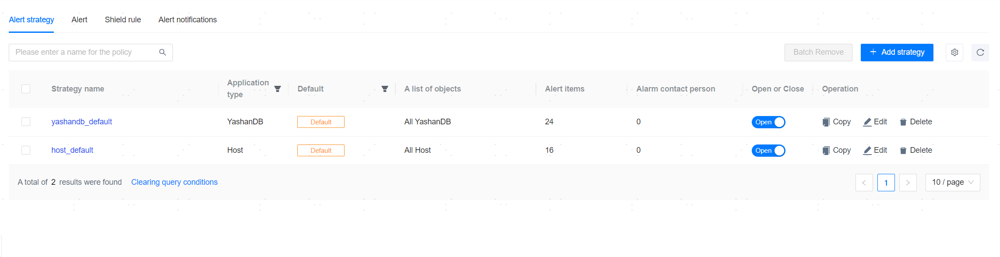

**Web Path**: **[ Alert Management ]**>**[ Alert Strategy ]**

## Alert Strategy

### Create New Alert Strategy

**Web Path**: **[ Create Strategy ]**

**Functionality Introduction**

The system has 2 pre-configured general alert strategies, and you can also customize and create new alert strategies. When an alert strategy is applied to a resource object, if the value of the specified monitoring metrics matches the calculation rules, an alert of the corresponding level will be generated and notify the relevant [contacts](../../Platform Management/Platform Setting/Platform Information Settings/System Contacts) provided that the [Notification service settings](../../Platform Management/Platform Setting/Platform Information Settings/Notification Service Setting) have been completed.

Alerts strategies can only be configured for existing [alert items](#alarmitems) based on already [managed resources](../../Platform Management/Resource Management/00Resource Management).

**Main Content Explanation**

**[ Strategy Name ]**: The name of the alert strategy, a required parameter, with a length range of [1,60] characters, and no uniqueness restriction on the name.

**[ Strategy Remarks ]**: Additional description of the alert strategy, an optional parameter, with a length range of [0,200] characters.

**[ Application type ]**: The type of resource object for which the alert strategy will be effective, categorized as database and host, a required parameter.

**[ Application Scope ]**: The resource objects on which the alert strategy will be effective, must check the currently managed databases or servers based on application type. Only the default alert strategies support specifying all objects, and exclusions can be specified if all objects are designated.

**[ Monitored Item ]**: The specific alert items that the alert strategy will monitor, must add corresponding alert items based on application type, a required parameter.

**[ Notification Object ]**: Select contacts to be notified via email/SMS after an alert is triggered, up to 100 alert contacts can be bound, an optional parameter. Supports configuring alert levels. Defaults to all levels: Critical, Severe, Warning.

### Enable/Disable Alert Strategy

**Web Path**: **[ Strategy Status ]**

**Functionality Introduction**

The pre-defined and newly customized alert strategies are enabled by default. You can temporarily disable a strategy based on business needs. Once disabled, the strategy will no longer generate alerts, and any already generated alerts will become invalid, and the strategy will no longer send alert notifications.

### Copy Alert Strategy

**Web Path**: **[ Copy ]**

**Functionality Introduction**

Through the strategy copying functionality, you can easily clone and modify personalized strategies based on a comprehensive foundation of an alert strategy, retaining the original strategy while simplifying the parameter configuration operations of the new strategy.

### Edit Alert Strategy

**Web Path**: **[ Edit ]**

**Functionality Introduction**

For any existing alert strategy, you can modify its related configurations as needed to adapt to the latest alert/monitoring requirements.

### Delete Alert Strategy

**Web Path**: **[ Delete ]**

**Functionality Introduction**

You can delete any existing alert strategy as needed. Once deleted, all alert-related behaviors based on that strategy will immediately invalidate, and the strategy cannot be directly restored. If restoration is needed, the same alert strategy must be recreated.

## Alert Items

### Management Group

**Web Path**: **[ Alert Item ]**>**[ Group Management ]**

**Web Path**: **[ Alert Item ]**>**[ Add Alert Item ]**>**[ Owner Group Management ]**

**Functionality Introduction**

Each alert item must and can only belong to one alert item group. The system has pre-configured corresponding groups based on the application type of alert items/alert strategies, and you can add/delete custom groups as needed.

When deleting a custom group, only empty groups are allowed to be deleted. If there are associated alert items, they must first be edited and moved to other groups.

### Add Alert Item

**Web Path**: **[ Alert Item ]**>**[ Add Alert Item ]**

**Functionality Introduction**

Alert items consist of [monitoring metrics](../Monitoring definition and display/Monitoring Indicators) and operation rules. When the value of the monitoring metric matches the **[ Evaluation Rule ]** and the duration meets the **[ Duration ]** settings, an alert will be reported.

The system has pre-configured common alert items, and you can also customize and add alert items.

**Main Content Explanation**

**[ Monitoring Metric ]**: The monitor rule associated with the alert item, a required parameter, which determines whether to alert based on the value of this metric and calculation rules.

**[ Group ]**: Group information of the alert item, a required parameter.

**[ Alert name ]**: The name of the alert item, a required parameter, with a length range of [1,60] characters, and the name must be unique.

**[ Description ]**: Additional description of the alert item, an optional parameter, with a length range of [0,200] characters.

**[ Suggestion ]**: Suggested plans to resolve this alert, an optional parameter, with a length range of [0,200] characters.

**[ Event type ]**: The event type corresponding to this alert, categorized as important events and abnormal events, which can serve as a reference for the operations team in formulating response/processing requirements for this alert.

**[ Evaluation Rule ]**: The operation rules that the value of the monitoring metric must match, a required parameter. The rules consist of value range intervals of the monitoring metric and alert levels (urgent/severe/warning). Alerts can only be reported if they match the corresponding rules. Up to 3 operation rules can exist under the same alert item, and the alert levels corresponding to different operation rules must not be the same. For value types, the value range intervals cannot overlap, and for text types, the matched texts cannot be the same.

**[ Duration ]**: The duration that the value of the monitoring metric must continuously match an operation rule before an alert is reported, a required parameter. Setting it to 0 means that the alert is reported immediately when the monitoring metric matches an operation rule.

**[ Last Match Time ]**: A parameter unique to special monitoring metrics (such as audit logs), indicating the time period of the last matching alert rule; records beyond this period will not produce alerts.

### Edit Alert Item

**Web Path**: **[ Alert Item ]**>**[ Edit ]**

**Functionality Introduction**

For any existing alert item, you can modify its related configurations as needed to adapt to the latest alert/monitoring requirements.

### Delete Alert Item

**Web Path**: **[ Alert Item ]**>**[ Delete ]**

**Functionality Introduction**

You can delete alert items that are not associated with alert strategies as needed. Once deleted, the alert item cannot be directly restored. If recovery is needed, the same alert item must be recreated.

>**Note**:
>
> If the interface for adding, editing, and deleting alert items takes longer than 10 seconds, check if there are unreachable addresses in the DNS resolution service addresses in /etc/resolve.conf, and it is recommended to delete those unreachable addresses.

## Suppression Rules

**Web Path**: **[ Shield Rule ]**

**Web Path**: **[ Alert Management ]**>**[ Alert List ]**>**[ Alert ID ]**>**[ Shield Alert ]**

**Functionality Introduction**

Suppression rules take effect based on their application scope (the resource objects to which the rule applies, such as a specific database or server), monitoring metrics (the specific metrics that the rule suppresses), and suppression periods. You can configure to monitor specific metrics of specific resources during certain time periods based on actual needs to reduce non-critical data generation. Alerts that have been suppressed will not send alert notifications.

Suppression rules can only be configured for existing [monitoring metrics](../Monitoring definition and display/Monitoring Indicators) of already [managed resources](../../Platform Management/Resource Management/00Resource Management).

**Main Content Explanation**

**[ Name ]**: The name of the suppression rule, a required parameter, with a length range of [1,24] characters, and the name must be unique.

**[ Application type ]**: The type of resource object for which the suppression rule will be effective, categorized as database and host, a required parameter.

**[ Shield object ]**: The resource objects on which the suppression rule will be effective. Based on the application type, you must select from the currently managed databases or servers, with support for multiple selections, a required parameter.

**[ Shield metrics ]**: The monitoring metrics that the suppression rule will suppress, with support for multiple selections, an optional parameter. If left blank, all metrics of the selected objects will be suppressed.

**[ Shield Period ]**: The period during which the suppression rule will take effect, supporting permanent suppression and specifying time ranges by absolute time or daily cycles, a required parameter.

Slow SQL alerts support the suppression of specific slow SQLs. When the suppressed metric is slow SQL or stored procedure slow SQL, additional suppression rule configurations can be supported.

**[ Slow SQL Match Rule ]**: The rule for matching suppressed slow SQL, supporting "case insensitive," "case sensitive," "exact match," and "regular expression."

**[ SQL to Match ]**: An optional item that does not affect rule creation, used only for verifying the matching of SQL against the matching rules.

**[ Match Result ]**: A non-filling item that does not affect rule creation, displays the results of SQL matching against the matching rules.

## Alert Notification

**Web Path**: **[ Alert Notification ]**

**Functionality Introduction**

After completing the [notification service settings](../../Platform Management/Platform Setting/Platform Information Settings/Notification Service Setting), [system contacts](../../Platform Management/Platform Setting/Platform Information Settings/System Contacts), and having configured notification objects for [alert strategies](#alarmstrategy), the management platform can push alert information in real-time to specified personnel. You can customize the notification alias and configure different notification push strategies based on different alert levels.

**Main Content Explanation**

**[ Alert Method ]**: The method for pushing alert information, supporting email, SMS, and custom scripts.

**[ Master Switch ]**: Whether to enable notification push.

**[ Alert Period ]**: The interval period for notification push, with a minimum interval not less than 1 minute.