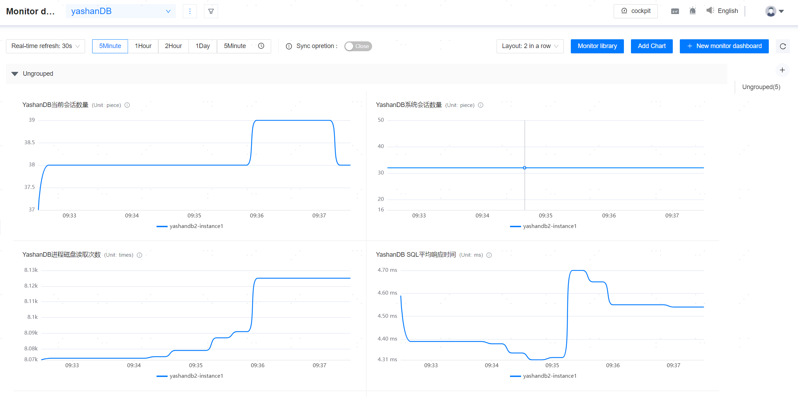
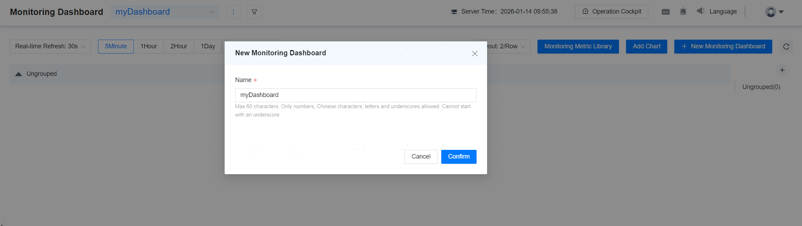
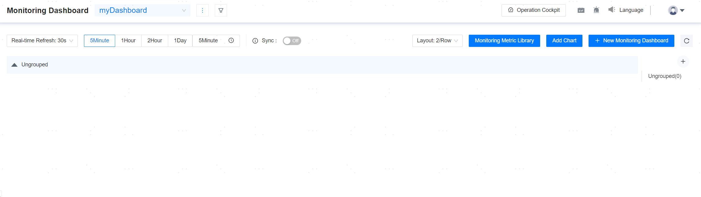
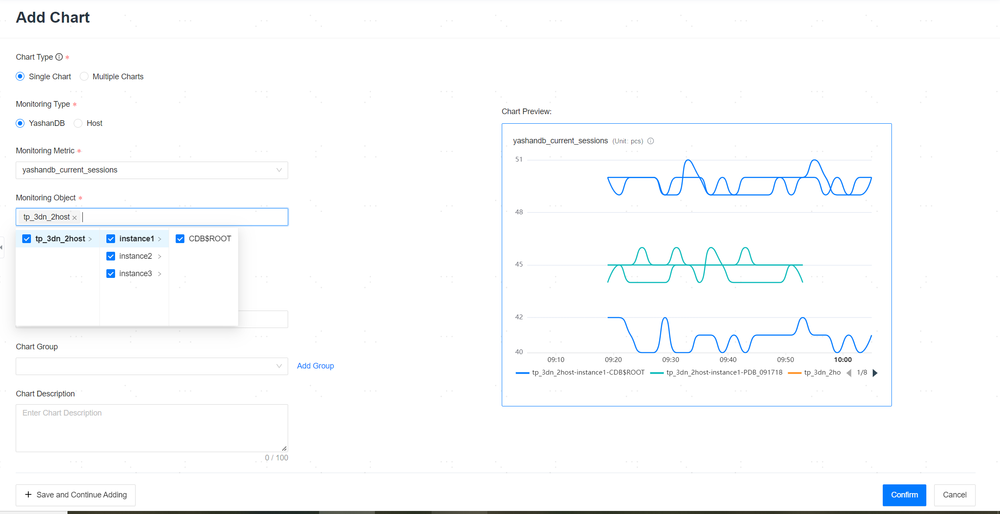

**Web Path**: **[ Monitoring Dashboard ]**

**Functionality Introduction**

The monitoring dashboard can be configured with multiple monitoring charts, each chart supports configuring different monitoring metrics and monitoring objects (databases and hosts) , Databases support CDB and PDB-level monitoring to meet users' custom monitoring needs.

The monitoring charts in the dashboard also support start-stop synchronization operations, real-time refresh, and setting the time range for displaying chart data.

## Monitoring Dashboard

The monitoring dashboard is used to define monitoring charts that need to be viewed simultaneously on the same page, containing multiple monitoring charts and chart groups.

### Create a Monitoring Dashboard

**Web Path**: **[ New monitoring dashboard ]**

**Functionality Introduction**

Users can create custom dashboards that meet actual needs as required.

**Main Content Explanation**

**[ Dashboard Name ]**: The name of the monitoring dashboard, a required parameter, can consist of numbers, Chinese characters, letters, or underscores, cannot start with _, and must be between [1,60] characters in length. The name must be unique.

1. Click **New Monitorning Dashboard**, enter the dashboard name.

2. Click **New Monitorning Dashboard**.

3. Select Monitoring Metric, Monitoring Object. After enter the chart name, click **Confirm**.

### Rename Monitoring Dashboard

**Web Path**: **[ Rename ]**

**Functionality Introduction**

Users can modify the name of the monitoring dashboard as needed.

### Delete Dashboard

**Web Path**: **[ Delete Dashboard ]**

**Functionality Introduction**

Users can delete custom dashboards as required. All monitoring charts and groups within the group will be deleted together; once deleted, they cannot be directly restored. If restoration is needed, they must be created again.

## Monitoring Chart

After creating a dashboard, users can add monitoring charts that they want to focus on.

### Create Monitoring Chart

**Web Path**: **[ Add Chart ]**

**Functionality Introduction**

Users can create monitoring charts in the monitoring dashboard as needed.

**Main Content Explanation**

**[ Chart Category ]**: Select the display type of the chart, supporting both single and multiple charts, required parameter.

**[ Monitoring Type ]**: Supports configuring two different types: YashanDB and host, required parameter.

**[ Monitoring Metric ]**: Configure the Monitor rule for the chart, required parameter.

**[ Monitoring Object ]**: Supports configuring multiple different Monitoring Objects, required parameter, for example, multiple database objects or multiple host objects.

**[ Chart Name ]**: Monitoring Chart Name, required parameter, length range [1,100] characters, all Chart Names within the same dashboard must be unique.

**[ Chart Group ]**: Supports configuring the group where the chart is located.

**[ Chart Description ]**: Add notes or explanations for the chart.

> **Note**：
>
> A maximum of 100 database instances or 100 hosts are allowed to be configured within the same monitoring chart.
>
> A maximum of 500 charts are allowed to be configured within the same monitoring dashboard.

### Edit Monitoring Chart

**Web Path**: **[ Edit ]**

**Functionality Introduction**

Users can modify all configurable parameters within the monitoring chart as needed.

### Delete Monitoring Chart

**Web Path**: **[ Delete ]**

**Functionality Introduction**

Users can delete charts in the monitoring dashboard as needed. Once deleted, they cannot be directly restored; if restoration is needed, they must be created again.

## Chart Group

**Functionality Introduction**

Grouping is used to simplify the classification of each monitoring chart. Users can place related metrics in the same group for unified management, facilitating better monitoring and analysis of the database situation.

Users can create, edit, and delete chart groups in the monitoring dashboard as needed. It is important to note that deleting a group in the monitoring dashboard will result in the deletion of all monitoring charts within that group. Once deleted, they cannot be directly restored; if restoration is needed, they must be created again.