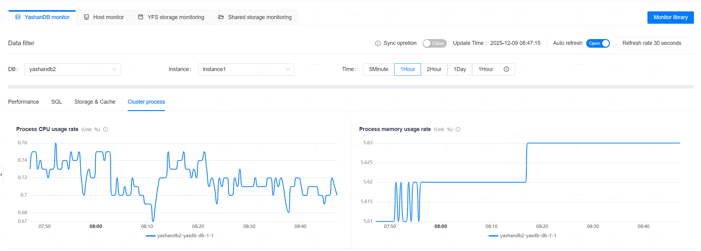
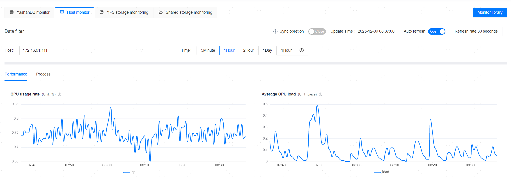
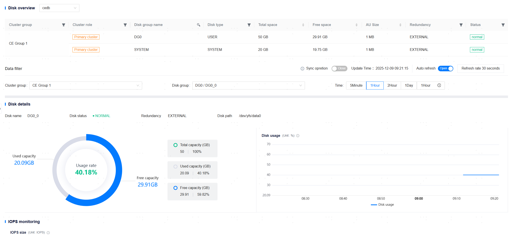
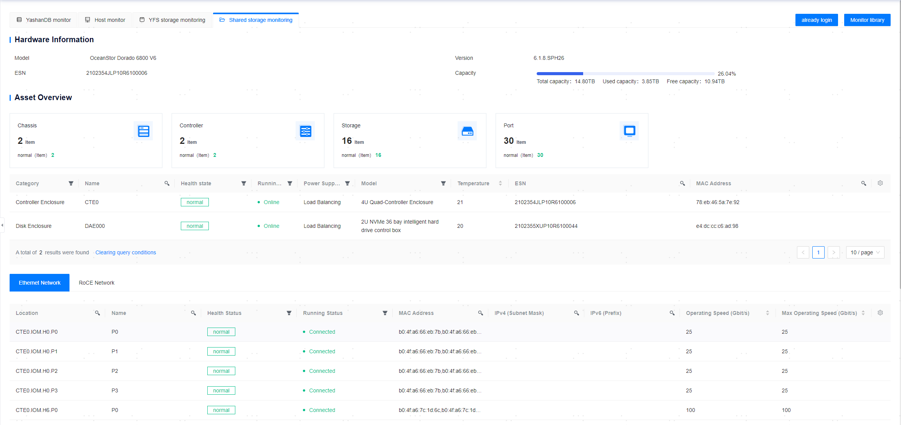

**Web Path 1**: **[ Resource Monitoring ]**

**Web Path 2**: **[ Workbench ]**

**Web Path 3**: **[ YashanDB ]**>**[ YashanDB List ]**

**Web Path 4**: **[ Host Management ]**>**[ Host List ]**

**Web Path 5**: **[ Monitoring Dashboard ]**

## Introduction to Monitoring Graphs

### Database Monitoring Graph

**Web Path 1**: **[ YashanDBs monitor ]**

**Web Path 2**: **[ YashanDB ]**>**[ My Collection ]**

**Web Path 3**: **[ DB name ]**>**[ Basic Information ]**>**[ Alert Monitoring ]** ( > **[ More Monitoring ]** )

**Functionality Introduction**

The monitoring graph is based on the relationship or trend between data points of monitoring indicators across dimensions such as time, quantity, and ratio. In theory, each monitoring indicator corresponds to a monitoring chart, but some monitoring indicators are not suitable for chart presentation and therefore do not generate monitoring graphs, such as YashanDB customizable switch configurations.

The monitoring graph supports operations such as selecting time periods, enlarging single charts, refreshing single charts, auto-refreshing, and synchronization.

Database monitoring is divided into four dimensions based on performance, SQL storage and buffer, and database processes. The specific monitoring indicators are as follows:

Performance:

  - QPS
  - TPS
  - Database operations per second
  - Database connection count
  - Number of wait events
  - Synchronization delay between primary database and standby database
  - Long transactions
  - Spinlock wait count
  - Increment of spinlock wait count
  - Average SQL response time
  - YAC
    - GC CR BLOCK RECEIVE TIME
    - GC CR BLOCK RECEIVED
    - GC CR BLOCK RETRIES
    - GC CR BLOCK SERVED
    - GC REMOTE CR GRANT TIME
    - GC REMOTE CR GRANTS
 
> **Note**：
>
> 1. `Number of wait events` has been optimized since version `23.4.4.2`, supporting the viewing of the count for each wait event; historical data of `Number of wait events` collected before the upgrade to `23.4.4.2` or later can be configured for view via the monitoring dashboard, and this page only displays the optimized data.
>
> 2. `Synchronization delay between primary database and standby database` is only supported for standby instances.
>
> 3. The monitoring graphs under `YAC` are unique to shared cluster databases.

SQL Storage and Buffer:

  - High-frequency SQL
  - TOP 10 Slow SQL Details
  - TOP SQL Details

> **Note**：
>
> `TOP SQL Details` is primarily used to help operations and management teams quickly view TOP SQL information across database dimensions, including Elapsed Time, CPU Time, User I/O Wait Time, Gets, Reads, Executions, Parse Calls, Sharable Memory TOP SQL, and is consistent with SQL statistics in the performance report. Supports selecting different snapshot intervals to generate and view corresponding TOP SQL information.
>
> `TOP SQL Details` is only supported for standalone or YAC primary instance. For version 22.2 databases, privilege of the DBA role is required to obtain detailed information, as the default privilege granted to operations users during managed database provisioning does not include this role, thus users need to manually grant the DBA role to the database backend operation user `YASOM`.

Storage and Buffer:

  - Tablespace usage
  - System tablespace usage rate
  - User tablespace usage rate
  - Disk read count
  - Disk read duration
  - Buffer hit rate
  - Memory read count
  - Archive file size

Database Processes:
  - Process CPU usage rate
  - Process memory usage rate
  - Process uptime status
  - Number of process file descriptors
  - Number of user session connection types
  - Number of process threads

> **Note**：
>
> `Number of user session connection types` is only supported for database versions `23.2` and above.

### Host Monitoring Graph

**Web Path 1**: **[ Hosts monitor ]**

**Web Path 2**: **[ Host ]**>**[ My Collection ]**

**Web Path 3**: **[ Monitor ]**

**Web Path 4**: **[ HostName ]**>**[ Monitor ]**

**Functionality Introduction**

The monitoring graph is based on the relationship or trend between data points of monitoring indicators across dimensions such as time, quantity, and ratio. In theory, each monitoring indicator corresponds to a monitoring chart; however, some monitoring indicators are not suitable for chart presentation and do not generate monitoring graphs, such as process user detection and process state.

Host monitoring supports operations such as selecting time periods, enlarging single charts, refreshing single charts, auto-refreshing, and synchronization.

Host monitoring is divided into two dimensions based on performance and processes. The specific monitoring indicators are as follows:

Performance:

 - CPU usage rate
 - Average CPU load
 - CPU I/O wait
 - Memory usage rate
 - Swap space usage rate
 - Disk usage rate
 - Disk IOPS (All: Displays the IOPS curves for all disks. Cumulative Sum: Displays the sum of IOPS for all disks.)
 - Network throughput

Processes:

 - Process CPU usage rate
 - Process memory usage rate
 - Process uptime status
 - Number of process file descriptors
 - Number of process threads

## Synchronization Operation

**Web Path 1**: **[ YashanDBs monitor ]**>**[ Sync Opretion ]**

**Web Path 1**: **[ Hosts monitor ]**>**[ Sync Opretion ]**

**Web Path 1**: **[ Monitoring Dashboard ]**>**[ Sync Opretion ]**

**Functionality Introduction**

The synchronization operation refers to simultaneously viewing and obtaining data from all monitoring graphs at a specified moment or time period. When the synchronization operation is enabled, auto-refresh is automatically turned off.

When this functionality is enabled, clicking on any monitoring graph to select a moment will cause all monitoring graphs to synchronize and display detailed data for that moment, generating statistics.

## Auto Refresh

**Web Path 1**: **[ YashanDBs monitor ]**>**[ Auto refresh ]**

**Web Path 1**: **[ Hosts monitor ]**>**[ Auto refresh ]**

**Functionality Introduction**

The monitoring graph data is set to automatically refresh by default, with a fixed refresh interval of 30 seconds; it can be turned off as needed.

### YFS Storage Monitoring Graph

**Web Path 1**: **[ YFS Storage ]**

**Functionality Introduction**

The monitoring graph is based on the relationship or trend between data points of monitoring indicators across dimensions such as time, quantity, and ratio. In theory, each monitoring indicator corresponds to a monitoring chart.

YFS monitoring supports operations such as selecting time periods, enlarging single charts, refreshing single charts, auto-refreshing, and synchronization.

YFS monitoring allows for viewing basic information on YFS disk groups and disks of YAC. The monitoring indicators are as follows:

- Disk usage rate
- IOPS size

## Synchronization Operation

**Web Path 1**: **[ YFS Storage ]**>**[ Sync Opretion ]**

**Functionality Introduction**

The synchronization operation refers to simultaneously viewing and obtaining data from all monitoring graphs at a specified moment or time period. When the synchronization operation is enabled, auto-refresh is automatically turned off.

When this functionality is enabled, clicking on any monitoring graph to select a moment will cause all monitoring graphs to synchronize and display detailed data for that moment, generating statistics.

## Auto Refresh

**Web Path 1**: **[ YFS Storage ]**>**[ Auto refresh ]**

**Functionality Introduction**

The monitoring graph data is set to automatically refresh by default, with a fixed refresh interval of 30 seconds; it can be turned off as needed.

### Shared Storage Monitoring Chart

**Web Path 1**: **[ Shared Storage ]**

**Functionality Introduction**

Shared storage monitoring is based on the devicemanager interface and supports displaying Dorado hardware monitoring information and asset overview.
