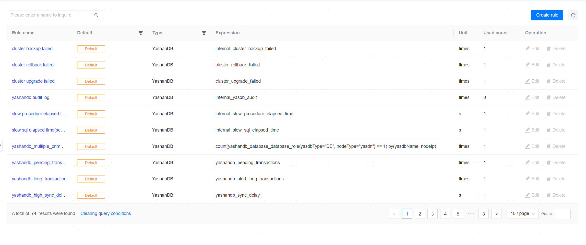

**Web Path 1**: **[ Resource Monitoring ]** > **[ Monitoring Metric Library ]**

**Web Path 2**: **[ Monitoring Dashboard ]** > **[ Monitoring Metric Library ]**

**Functionality Introduction**

The management platform provides a rich monitoring metric library that covers most key metrics for databases, operating systems, and servers. It helps you understand the operation status, performance, resource usage, and load of the target objects in real time. At the same time, it provides a rich data basis for daily operation and maintenance, performance tuning, etc., assisting in timely prevention, detection, and resolution of issues, thereby avoiding the escalation of issues that could impact business.

## Default Monitoring Metrics

The system provides a variety of default monitoring metrics, which cannot be edited or deleted. The default monitoring metrics provided by the system are as follows:

|Metric Name |Metric Type |Expression |
| --------------------------------------------------- | -------- | ------------------------------------------------------------------------------------------------------------------------------------------------------------------------------------------------------------------------------------------------------------------------------------- |
| YashanDB High Frequency SQL Count                      | YashanDB    | count(increase(yashandb_high_frequencies_sql[1h])>10000)by(yasdbName,nodeId)                                                                                                                                                                                                          |
| YashanDB Lock Wait Count                               | YashanDB    | yashandb_lock_waits                                                                                                                                                                                                                                                                       |
| YashanDB Transactions Per Second                       | YashanDB    | irate(yashandb_transactions[1m])                                                                                                                                                                                                                                                          |
| YashanDB Queries Per Second                            | YashanDB    | irate(yashandb_querys[1m])                                                                                                                                                                                                                                                                |
| YashanDB Operations Per Second                         | YashanDB    | irate(yashandb_operations[1m])                                                                                                                                                                                                                                                            |
| YashanDB Open Files Count                              | YashanDB    | node_monit_file_open                                                                                                                                                                                                                                                                      |
| YashanDB Total Memory Usage                            | YashanDB    | node_monit_mem_total                                                                                                                                                                                                                                                                      |
| YashanDB Memory Utilization Rate                       | YashanDB    | node_monit_mem_uasge                                                                                                                                                                                                                                                                      |
| YashanDB CPU Utilization Rate                          | YashanDB    | node_monit_cpu_uasge                                                                                                                                                                                                                                                                      |
| YashanDB Current Wait Events Count                     | YashanDB    | yashandb_current_waits                                                                                                                                                                                                                                                                   |
| YashanDB Memory Reads Count                            | YashanDB    | yashandb_buffer_gets                                                                                                                                                                                                                                                                      |
| YashanDB Disk Read Time                                | YashanDB    | yashandb_disk_read_time                                                                                                                                                                                                                                                                   |
| YashanDB Inactive User Sessions Count                  | YashanDB    | yashandb_user_inactive_sessions                                                                                                                                                                                                                                                           |
| YashanDB Active User Sessions Count                    | YashanDB    | yashandb_user_active_sessions                                                                                                                                                                                                                                                             |
| YashanDB System Sessions Count                          | YashanDB    | yashandb_system_sessions                                                                                                                                                                                                                                                                  |
| YashanDB Maximum Sessions Count                         | YashanDB    | yashandb_max_sessions                                                                                                                                                                                                                                                                     |
| YashanDB Current Sessions Count                         | YashanDB    | yashandb_current_sessions                                                                                                                                                                                                                                                                 |
| YashanDB Session Utilization Rate                      | YashanDB    | yashandb_current_sessions/yashandb_max_sessions*100                                                                                                                                                                                                                                     |
| YashanDB User Session Connection Type Count            | YashanDB    | yashandb_user_session_driver_count                                                                                                                                                                                                                                                        |
| YashanDB Archived File Size                            | YashanDB    | yashandb_archived_log_size                                                                                                                                                                                                                                                                 |
| YashanDB Tablespace Utilization Rate                   | YashanDB    | yashandb_tablespace_used_percentage                                                                                                                                                                                                                                                      |
| YashanDB SWAP Tablespace Used Percentage                      | YashanDB    | 100 - yashandb_swap_free_percentage                                                                                                                                                                                                          |
| YashanDB SWAP Tablespace Expandable Space Usage Rate                     | YashanDB    | max(100 - yashandb_swap_extend_free_percentage) by (yasdbName)                                                                                                                                                                                                         |
| YashanDB Version Detection                              | YashanDB    | yashandb_instance_version                                                                                                                                                                                                                                                                 |
| YashanDB Database Status                                | YashanDB    | yashandb_database_status                                                                                                                                                                                                                                                                  |
| YashanDB Instance Connection Status                     | YashanDB    | yashandb_instance_disconnected                                                                                                                                                                                                                                                            |
| YashanDB Primary Database Count Statistics              | YashanDB    | count(yashandb_database_database_role{nodeType!="yascn"} == 1) by(yasdbName, nodeType, nodeGroup)                                                                                                                                                                                     |
| Yasdn Process Startup User Detection                    | YashanDB    | node_monit_check_user{nodeType="yasdn"}                                                                                                                                                                                                                                                   |
| Yascn Process Startup User Detection                    | YashanDB    | node_monit_check_user{nodeType="yascn"}                                                                                                                                                                                                                                                   |
| Yasmn Process Startup User Detection                    | YashanDB    | node_monit_check_user{nodeType="yasmn"}                                                                                                                                                                                                                                                   |
| YashanDB Instance Process Status                        | YashanDB    | node_monit_check_status{type="mix", processType="yasdb"}                                                                                                                                                                                                                                |
| YashanDB Long Transactions Exist                        | YashanDB    | yashandb_alert_long_transactions                                                                                                                                                                                                                                                          |
| YashanDB Primary Database and Standby Database Sync Delay Too High | YashanDB    | yashandb_sync_delay                                                                                                                                                                                                                                                                       |
| YashanDB DN's max_workers Less Than All CN's max_workers Sum | YashanDB    | yashandb_max_workers{nodeType="yasdn"} - on(yasdbName) group_left sum(yashandb_max_workers{nodeType="yascn"}) by (yasdbName)                                                                                                                                                          |
| YashanDB Self-election Heartbeat Interval Configuration | YashanDB    | min(yashandb_ha_heartable_interval) by (yasdbName, nodeGroup, nodeType) - max(yashandb_ha_heartable_interval) by (yasdbName, nodeGroup, nodeType)                                                                                                                                     |
| YashanDB Self-election Heartbeat Timeout Configuration  | YashanDB    | min(yashandb_ha_election_timeout) by (yasdbName, nodeGroup, nodeType) - max(yashandb_ha_election_timeout) by (yasdbName, nodeGroup, nodeType)                                                                                                                                         |
| YashanDB Self-election Switch Configuration             | YashanDB    | min(yashandb_ha_election_enabled) by (yasdbName, nodeGroup, nodeType) - max(yashandb_ha_election_enabled) by (yasdbName, nodeGroup, nodeType)                                                                                                                                         |
| YashanDB Default Table Type                             | YashanDB    | min(yashandb_default_table_type) by (yasdbName) - max(yashandb_default_table_type) by (yasdbName)                                                                                                                                                                                     |
| YashanDB Tablespace (UNDO) Utilization Rate           | YashanDB    | ((yashandb_dba_tablespace_total_bytes - (yashandb_dba_tablespace_user_bytes+yashandb_dba_tablespace_block_size*(yashandb_undo_segments_ublk_count_total+yashandb_undo_segments_ufb_count_total)))/yashandb_dba_tablespace_max_size{name="UNDO"})*100                                  |
| YashanDB Tablespace Occupied Size                      | YashanDB    | yashandb_sum_tablespaces                                                                                                                                                                                                                                                                |
| YashanDB Instance Type Minimum                          | YashanDB    | min(yashandb_database_database_role{nodeType!="yascn", yasdbType!="CE"}) by(yasdbName, nodeType, nodeGroup)                                                                                                                                                                           |
| YashanDB Transactions Exceeding Three Minutes          | YashanDB    | yashandb_long_transactions                                                                                                                                                                                                                                                                 |
| YashahDB Primary Database and Standby Database Delay    | YashanDB    | yashandb_sync_delay                                                                                                                                                                                                                                                                       |
| YashanDB SQL Average Response Time                      | YashanDB    | yashandb_avg_elapsed_time_sec                                                                                                                                                                                                                                                             |
| YashanDB Process Buffer Hit Ratio                       | YashanDB    | yashandb_cache_hit_ratio                                                                                                                                                                                                                                                                  |
| YashanDB Process Disk Reads Count                       | YashanDB    | yashandb_disk_reads                                                                                                                                                                                                                                                                       |
| YashanDB Audit Log                                      | YashanDB    | internal_yasdb_audit                                                                                                                                                                                                                                                                      |
| Slow SQL Execution Time (Seconds)                       | YashanDB    | internal_slow_sql_elapsed_time                                                                                                                                                                                                                                                            |
| Stored Procedure Slow SQL Execution Time (Seconds)     | YashanDB    | internal_slow_procedure_elapsed_time                                                                                                                                                                                                                                                      |
| Database Upgrade Failed                                  | YashanDB    | cluster_upgrade_failed                                                                                                                                                                                                                                                                     |
| Database Rollback Failed                                | YashanDB    | cluster_rollback_failed                                                                                                                                                                                                                                                                    |
| Database Backup Failed                                   | YashanDB    | internal_cluster_backup_failed                                                                                                                                                                                                                                                                 |
| YashanDB VM Utilization Rate                           | YashanDB    | yashandb_vm_used_ratio                                                                                                                                                                                                                                                                     |
| Maximum User Threads Count                              | YashanDB    | yasprocess_max_user_processes                                                                                                                                                                                                                                                                 |
| Maximum Memory Size                                    | YashanDB    | yasprocess_max_memory_size/1024/1024                                                                                                                                                                                                                                                        |
| Maximum Stack Size                                     | YashanDB    | yasprocess_max_stack_size/1024/1024                                                                                                                                                                                                                                                        |
| YFS Disk Usage Rate                                    | YashanDB    | yashandb_yfs_disk_usage_percent                                                                                                                                                                                                                                                                 |
| YFS Disk IOPS                                          | YashanDB    | irate(yashandb_yfs_disk_ios[1m])                                                                                                                                                                                                                                                            |
| A primary-standby switchover occurred on the YashanDB instance                | YashanDB        | max( (yashandb_database_database_role{yasdbType="SE", nodeType="yasdn"} == bool 1) * on (nodeId, yasdbName) group_left() (yashandb_database_database_role{yasdbType="SE", nodeType="yasdn"} offset 2m == bool 2) ) by (yasdbName)                                                                                                                                                                                                                         |
| Network Throughput (Transmit)                          | Host        | irate(node_network_transmit_bytes_total[5m])/128/1024                                                                                                                                                                                                                                   |
| Network Throughput (Receive)                           | Host        | irate(node_network_receive_bytes_total[5m])/128/1024                                                                                                                                                                                                                                    |
| Disk IOPS (Write)                                     | Host        | irate(node_disk_writes_completed_total[1m])                                                                                                                                                                                                                                               |
| Disk IOPS (Read)                                      | Host        | irate(node_disk_reads_completed_total[1m])                                                                                                                                                                                                                                                |
| Swap Partition Utilization Rate                         | Host        | (1-(node_memory_SwapFree_bytes)/(node_memory_SwapTotal_bytes>0)) * 100                                                                                                                                                                                                                |
| CPU Average Load                                       | Host        | node_load1                                                                                                                                                                                                                                                                                 |
| Network Availability Check                               | Host        | node_network_unavailable                                                                                                                                                                                                                                                                  |
| Network Latency                                        | Host        | node_network_rtt                                                                                                                                                                                                                                                                          |
| Network Packet Loss Rate                                | Host        | node_network_packet_loss                                                                                                                                                                                                                                                                  |
| IP Address Check                                       | Host        | node_network_ip_exists                                                                                                                                                                                                                                                                    |
| Disk Usage Rate                                        | Host        | max((node_filesystem_size_bytes{fstype=~'ext.?&#124;xfs'}-node_filesystem_free_bytes{fstype=~'ext.?&#124;xfs'})*100/(node_filesystem_avail_bytes {fstype=~'ext.?&#124;xfs'}+(node_filesystem_size_bytes{fstype=~'ext.?&#124;xfs'}-node_filesystem_free_bytes{fstype=~'ext.?&#124;xfs'})))by(instance,job) |
| Remaining Memory Capacity                                | Host        | node_memory_MemFree_bytes/1024/1024                                                                                                                                                                                                                                                       |
| Memory Utilization Rate                                 | Host        | (1-(node_memory_MemAvailable_bytes) / node_memory_MemTotal_bytes) * 100                                                                                                                                                                                                               |
| Ycm-Agent Process Startup User Check                   | Host        | node_monit_check_user{processName="ycm-agent"}                                                                                                                                                                                                                                          |
| NodeExporter Process Startup User Check                | Host        | node_monit_check_user{processName="node-exporter"}                                                                                                                                                                                                                                      |
| YashanDBExporter Service Status                         | Host        | up{job="yashandb_exporter"}                                                                                                                                                                                                                                                               |
| NodeExporter Service Status                             | Host        | up{job=~"host.*"}                                                                                                                                                                                                                                                                          |
| YCPAgent Process Status                                 | Host        | node_monit_check_status{type="mix", processName="ycm-agent"}                                                                                                                                                                                                                              |
| Monit Process Status                                    | Host        | node_monit_monit_down                                                                                                                                                                                                                                                                     |
| CPU Utilization Rate                                   | Host        | (1-(sum(increase(node_cpu_seconds_total{mode='idle'}[1m]))by(instance,job))/(sum(increase(node_cpu_seconds_total[1m]))by(instance,job)))*100                                                                                                                                          |
| CPU I/O Wait                                          | Host        | (sum(increase(node_cpu_seconds_total{mode='iowait'}[1m]))by(instance,job))/(sum(increase(node_cpu_seconds_total[1m]))by(instance,job))*100                                                                                                                                            |
| Process File Descriptor Utilization Rate                | Host        | (yasprocess_cur_open_files / yasprocess_max_open_files) * 100                                                                                                                                                                                                                          |
Monitoring metrics are mainly used for the monitoring dashboard and alert items. The default monitoring metrics will generate default alert items and be added to the default monitoring dashboard.

> **Note**：
>
> Only a portion of the default monitoring metrics that are meaningful for chart display will be added to the default monitoring dashboard, and only some default monitoring metrics will generate default alert items.

Monitoring metrics support searching for metrics by their names.

## Create Metric

**Web Path 1**: **[ Create Metric ]**

**Web Path 2**: **[ Create Metric ]**

**Functionality Introduction**

In addition to the default monitoring metrics provided by the system, you can also create custom monitoring metrics by clicking **[ Create Metric ]**, entering the metric name, type, unit, and expression.

Custom monitoring metrics support editing and deletion, but custom monitoring metrics that are associated with alerts cannot be deleted.

**Main Content Explanation**

**[ Metric Name ]**: The name of the monitoring metric, this is a required parameter with a length range of [1,24] characters, and the name must be unique.

**[ Metric Type ]**: The type of resource object that the monitoring metric belongs to, which can be either a database (YashanDB) or host, and is a required parameter.

**[ Rule Expression ]**: The syntax for the expression is [PromQL](../../Reference/Metrics Expression Monitor). Metrics can refer to the default monitoring metrics.

> **Note**：
>
> When creating custom metrics, the expression syntax must include the yasdbName tag or job tag; otherwise, it cannot be configured on the monitoring dashboard.