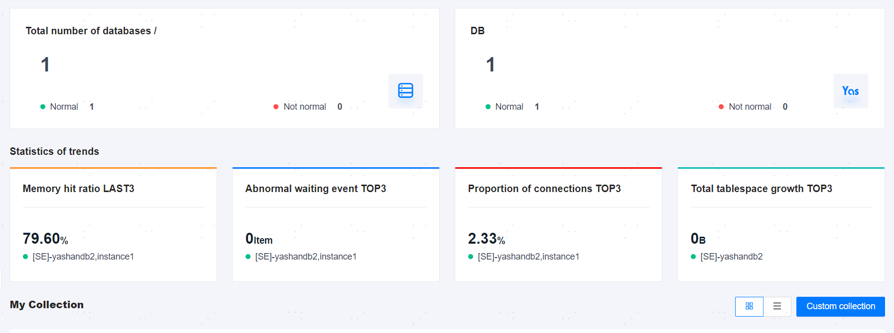

**Web Path**: **[ Workbench ]**

The Workbench allows users to view statistics of database or server information as needed. Statistics can be divided into resource information and alarm information:

- Resource Information: Displays the total number of resources hosted on the platform, trend statistics, and user-defined favorite resource information.
- Alarm Information: Displays alarm information for resources within a specified time. Alarms are categorized into three levels: emergency, serious, and warning. The time period can be specified as 24 hours (default), 1 hour, or 3 hours.

## Database Information Statistics

### Data Overview

**Functionality Introduction**

Displays the statistics related to databases hosted on the management platform so that the operations and maintenance team or managers can quickly understand the operation status of the databases.

**Main Content Explanation**

**Total number of databases**: Displays the total number of databases hosted on the management platform and the total number of YashanDB.

**Statistics of trends**:

- **Memory hit ratio LAST3**: Displays the three instances with the lowest buffer hit rates and their data information. Buffer hit rate = Number of successful accesses to the buffer / Total number of accesses to the buffer.

- **Abnormal waiting event TOP3**: Displays the three instances with the highest number of exception wait events and their data information.

- **Proportion of connections TOP3**: Displays the three instances with the highest connection ratios and their data information. Connection ratio = Current session count of the database / Maximum session count of the database.

- **Total Tablespace Growth TOP3**: Displays the three instances with the highest total tablespace usage growth in 24 hours and their data information.

### My Favorites

**Web Path**: **[ YashanDB ]**>**[ Favorites ]**

**Functionality Introduction**

The management platform supports custom favorites for databases that need to be closely monitored. Upon successful addition, the corresponding database information will be displayed on the Workbench page, and the resource will be automatically [subscribed](../Platform Management/Account Center/Resource Subscribing). Up to 5 databases can be favorited.

**Main Content Explanation**

**Statistics**: Supports graphical presentation (default) and list presentation. Main statistics include database operation status, deployment form, instance information, alarm statistics, and connection count.

**[ View Details ]**: In graphical presentation mode, clicking on the upper right corner of the database information block **[ Check details ]** allows entry to the [Database Detail Page](../Database O&M Guide/Basic O&M Management/00Basic O&M Management).

## Server Information Statistics

**Web Path**: Top Navigation Bar **[ YashanDB ]**>**[ Host ]**

### Data Overview

**Functionality Introduction**

Displays statistics related to servers hosted on the management platform so that the operations and maintenance team or managers can quickly understand the operation and usage status of the servers.

**Main Content Explanation**

**[ Total Hosts ]**: Displays the total number of servers hosted on the management platform, the number of servers operating normally, and the number of abnormal servers.

**[ Trend Statistics ]**:

- **[ TOP3 CPU Usage ]**: Displays the IPs and data information of the top three servers with the highest CPU usage.

- **[ TOP3 Memory Usage ]**: Displays the IPs and data information of the top three servers with the highest memory usage.

- **[ TOP3 Network Throughput ]**: Displays the IPs and data information of the top three servers with the highest network throughput. Network throughput can be toggled to view output (default) or input traffic.

- **[ TOP3 Total File System Space Usage ]**: Displays the IPs and data information of the top three servers with the highest overall filesystem space usage.

### My Favorites

**Web Path**: **[ Favorites ]**

**Functionality Introduction**

The management platform supports custom favorites for servers that need to be closely monitored. Upon successful addition, the corresponding server information will be displayed on the Workbench page, and the resource will be automatically [subscribed](../Platform Management/Account Center/Resource Subscribing). Up to 5 servers can be favorited.

**Main Content Explanation**

**Statistics**: Supports graphical presentation (default) and list presentation. Main statistics include server IP addresses, CPU usage, memory usage, filesystem space usage, network traffic statistics, and last boot time.

**[ View Details ]**: In graphical presentation mode, clicking on the upper right corner of the server information block **[ Check details ]** allows entry to the server detail page.

## Recent Alarms

**Functionality Introduction**

Displays alarm information for all resources hosted on the management platform within a specified time period, which can be set to 24 hours (default), 1 hour, or 3 hours.

Alarms are classified into three levels: emergency, serious, and warning. Clicking on the alarm level module shows the records currently alarming under that level.

Clicking **[ View all alerts ]** allows entry to the [Alarm List](Alert definition and display/Alarm List) Viewing all alarms information.
