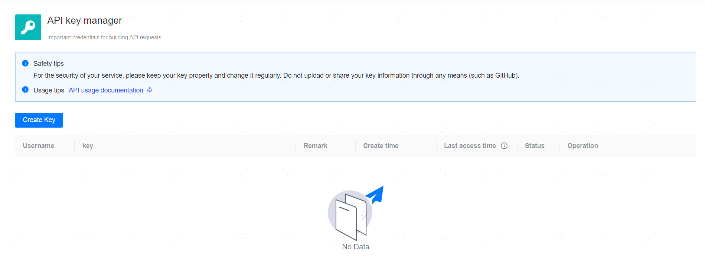

**Web Path**: **[ User Center ]**>**[ API Key Management ]**



**Functionality Introduction**

The management platform supports creating API keys for authentication and authorization. Users can use the `AK(Access Key Id)/SK(Secret Access Key)` signing authentication method to call the platform's open APIs.

When using the API key management functionality, please note the following:

- Each user can create up to 2 access keys, and the API privileges of the keys are consistent with those of the creating user.
- Users can only view and edit the keys they have created.
- Keys are enabled by default, and only keys in the disabled state can be deleted.
- The remark information for keys has a limit of 100 characters.
- The access records of keys will not save GET request methods.
- The interface for local upload installation packages `/api/pkg/version/local [POST]` is not supported.

**Main Content Explanation**

**[ Last access time ]**: The most recent time the platform was accessed using the key.

**[ Disable key ]**: Stops using the key. After disabling the key, the management platform will reject all requests for this key.

**[ Delete key ]**: Deletes the key. The key cannot be restored after deletion, and the management platform will permanently reject all requests for this key.

**[ More Access Records ]**: View the record of key accesses to the platform.

**Client Signing Call Example**: The following shows examples of generating signatures using AK/SK in both Go and Python, and calling the platform API.

**Go Example**

```go
package main

import (
	"bytes"
	"crypto/hmac"
	"crypto/sha256"
	"crypto/tls"
	"encoding/base64"
	"fmt"
	"io"
	"log"
	"net/http"
	"net/url"
	"strconv"
	"time"
)

// Configure AK and SK
const (
	AccessKey   = "72bd7009********"                 // Replace with the actual AK
	SecretKey   = "53c2d2dade1a4545bb63afb9********" // Replace with the actual SK
	ContentType = "application/json"
)

// Generate signature
func genSignature(method, path, queryString, body, timestamp string) string {
	// Create the string to be signed
	signingString := fmt.Sprintf("%s\n%s\n%s\n%s\n%s\n%s\n%s", method, path, queryString, body, timestamp, AccessKey, ContentType)

	// Generate signature using SK (HMAC-SHA256)
	hmacSigner := hmac.New(sha256.New, []byte(SecretKey))
	hmacSigner.Write([]byte(signingString))

	// Get the signature and perform Base64 encoding
	signature := base64.StdEncoding.EncodeToString(hmacSigner.Sum(nil))
	return signature
}

// Generate SCN 
func genTimestamp() string {
	return strconv.FormatInt(time.Now().Unix(), 10)
}

// Create and send request, GET method
func sendGETRequest() {
	// Get current SCN (seconds)
	timestamp := genTimestamp()

	// Set query parameters for the request
	queryParams := url.Values{}
	queryParams.Add("pageNo", "1")
	queryParams.Add("pageSize", "10")
	queryParams.Add("filter", `{"cloudPlatformFirm":"selfAdd"}`)
	queryParams.Add("search", `{"hostName":"AchorBase"}`)

	// Request body
	body := "" // Empty JSON object, fill in as appropriate

	// Server API address
	apiUrl := "http://localhost:9060/api/hosts"

	// Request method
	method := http.MethodGet

	// Build request URL
	fullURL := fmt.Sprintf("%s?%s", apiUrl, queryParams.Encode())

	// Create HTTP request
	req, err := http.NewRequest(method, fullURL, bytes.NewBuffer([]byte(body)))
	if err != nil {
		log.Fatal(err)
	}

	// Generate signature
	signature := genSignature(method, req.URL.Path, queryParams.Encode(), body, timestamp)

	// Set request headers
	req.Header.Set("X-Access-Key", AccessKey)
	req.Header.Set("X-Signature", signature)
	req.Header.Set("X-Timestamp", timestamp)
	req.Header.Set("Content-Type", ContentType)

	// Send request and get response
	tr := &http.Transport{
		TLSClientConfig:   &tls.Config{InsecureSkipVerify: true},
		DisableKeepAlives: true,
	}
	client := &http.Client{Transport: tr}
	resp, err := client.Do(req)
	if err != nil {
		log.Fatal(err)
	}
	defer resp.Body.Close()

	// Read response data
	bodyBytes, err := io.ReadAll(resp.Body)
	if err != nil {
		log.Fatal(err)
	}

	// Print response status and content
	fmt.Printf("Response Status: %s\n", resp.Status)
	fmt.Printf("Response Body: %s\n", string(bodyBytes))
}

// Create and send request, POST method
func sendPOSTRequest() {
	// Get current SCN (seconds)
	timestamp := genTimestamp()

	// Request body
	body := `{"name": "Department_A","description": "Department_A","clusterIds": [],"roleIds": [1]}`

	// Server API address
	apiUrl := "http://localhost:9060/api/groups"

	// Request method
	method := http.MethodPost

	// Build request URL
	fullURL := apiUrl

	// Create HTTP request
	req, err := http.NewRequest(method, fullURL, bytes.NewBuffer([]byte(body)))
	if err != nil {
		log.Fatal(err)
	}

	// Generate signature
	signature := genSignature(method, req.URL.Path, "", body, timestamp)

	// Set request headers
	req.Header.Set("X-Access-Key", AccessKey)
	req.Header.Set("X-Signature", signature)
	req.Header.Set("X-Timestamp", timestamp)
	req.Header.Set("Content-Type", ContentType)

	// Send request and get response
	tr := &http.Transport{
		TLSClientConfig:   &tls.Config{InsecureSkipVerify: true},
		DisableKeepAlives: true,
	}
	client := &http.Client{Transport: tr}
	resp, err := client.Do(req)
	if err != nil {
		log.Fatal(err)
	}
	defer resp.Body.Close()

	// Read response data
	bodyBytes, err := io.ReadAll(resp.Body)
	if err != nil {
		log.Fatal(err)
	}

	// Print response status and content
	fmt.Printf("Response Status: %s\n", resp.Status)
	fmt.Printf("Response Body: %s\n", string(bodyBytes))
}

func main() {
	sendGETRequest()
	sendPOSTRequest()
}

```

**Python Example**

```python
import urllib.request
import urllib.parse
import urllib.error
import hashlib
import hmac
import time
import base64
import json

# Configure AK and SK
AccessKey = "72bd7009********"                 # Replace with the actual AK
SecretKey = "53c2d2dade1a4545bb63afb9********" # Replace with the actual SK
ContentType = "application/json"

# Function to generate signature
def genSignature(method, path, queryString, body,  timestamp):
    # Concatenate the signing string
    signingString = f"{method}\n{path}\n{queryString}\n{body}\n{timestamp}\n{AccessKey}\n{ContentType}"
    
    # Generate signature using HMAC-SHA256
    signature = hmac.new(SecretKey.encode('utf-8'), signingString.encode('utf-8'), hashlib.sha256).digest()
    
    # Return Base64 encoded signature
    return base64.b64encode(signature).decode('utf-8')

def sendGETRequest():
    # Server API address
    url = "http://localhost:9060/api/hosts"  

    # Request method and relative path
    method = "GET"
    path = "/api/hosts"
   
    # Get current SCN (for signing)
    timestamp = str(int(time.time()))  # UNIX SCN 

    # Request query parameters
    params = {"pageNo": "1","pageSize":"10","filter":'{"cloudPlatformFirm":"selfAdd"}',"search":'{"hostName":"AchorBase"}'}
    sorted_params = sorted(params.items())
    query_string = urllib.parse.urlencode(sorted_params)

    # Generate signature
    signature = genSignature(method,path,query_string,"",timestamp)

    # Create request headers
    headers = {
        "X-Access-Key": AccessKey,
        "X-Signature": signature, 
        "X-Timestamp": timestamp,
        "Content-Type": ContentType,
    }

    # Create request object
    request = urllib.request.Request(f"{url}?{query_string}", headers=headers, method=method)

    # Send request and get response
    try:
        with urllib.request.urlopen(request) as response:
            response_data = response.read()
            print("Response Code:", response.getcode())  # Print response status code
            print("Response Body:", response_data.decode('utf-8'))  # Print response content
    except urllib.error.HTTPError as e:
        print("HTTP Error:", e.code)
        print("Error Details:", e.read().decode())
    except urllib.error.URLError as e:
        print("URL Error:", e.reason)

def sendPOSTRequest():
    # Server API address
    url = "http://localhost:9060/api/groups" 

    # Request method and relative path
    method = "POST"
    path = "/api/groups"
   
    # Get current SCN (for signing)
    timestamp = str(int(time.time()))  # UNIX SCN 

    # Request body
    body = '{"name": "Department_A","description": "Department_A","clusterIds": [],"roleIds": [1]}'
    data=body.encode('utf-8')

    # Generate signature
    signature = genSignature(method,path,"",body,timestamp)

    # Create request headers
    headers = {
        "X-Access-Key": AccessKey,
        "X-Signature": signature, 
        "X-Timestamp": timestamp,
        "Content-Type": ContentType,
    }

    # Create request object
    request = urllib.request.Request(url,data=data, headers=headers, method=method)

    # Send request and get response
    try:
        with urllib.request.urlopen(request) as response:
            response_data = response.read()
            print("Response Code:", response.getcode())  # Print response status code
            print("Response Body:", response_data.decode('utf-8'))  # Print response content
    except urllib.error.HTTPError as e:
        print("HTTP Error:", e.code)
        print("Error Details:", e.read().decode())
    except urllib.error.URLError as e:
        print("URL Error:", e.reason)

# Main function
if __name__ == "__main__":
    sendGETRequest()
    sendPOSTRequest()
```
