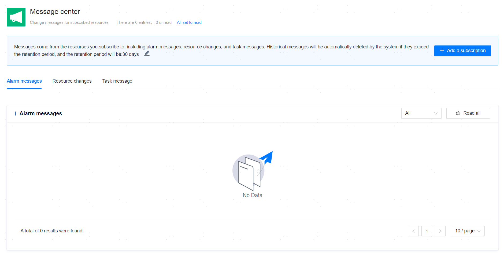

**Web Path 1**: **[ User Center ]** > **[ Message center ]**

**Web Path 2**: **[ Upper right corner personal avatar ]** > **[ Message center ]**

**Web Path 3**: **[ Upper right corner site message icon ]** > **[ See more ]** > **[ Message center ]**

**Functionality Introduction**

After users [subscribe to resources](Resource Subscribing), the corresponding resources will alert users through internal messages when alarms occur, resource changes happen, or tasks are executed. You can view all new messages and historical messages within the retention period in the message center.

**Main Content Explanation**

**[ Retention period ]**: The time limit for message retention, with a default value of 30 days. Options are 30 days, 90 days, 180 days, or 360 days. Messages will be automatically deleted after exceeding the time limit.

**[ Alert Messages ]**: After enabling the [alarm strategy](../../Monitors and Alarms/Alert definition and display/Alert Strategy), when a resource object triggers a specific alarm item, the management platform will send an alarm notification and alert users who have subscribed to that resource.

**[ Resource changes ]**: After a resource is removed from hosting, the management platform will notify users who have subscribed to that resource.

**[ Task Messages ]**: After executing a resource-related [task](../Platform Operation/Scheduling Management/Task Management), the management platform will notify users who have subscribed to that resource.