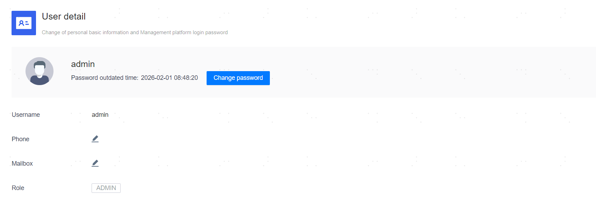

**Web Path**: **[ User Center ]** > **[ Personal Information ]**

**Functionality Introduction**

The personal information page displays relevant information about the platform user, including username, phone (mobile number), email, and role. You can modify the mobile number and email as needed.

**Main Content Explanation**

**[ Password Expiration Time ]**: The expiration time of the current user's login password, valid for 60 days. If the password expires and is not updated in time, the user must update the password upon first login after expiration to access the management platform.

**[ View 2FA Code ]**: This operation is available only when [TOTP password authentication](../Platform Setting/Platform Information Settings/Platform Secure Login Configuration.html#TOTP) is enabled. Clicking **[ View dynamic password ]** allows you to view the user's dynamic password QR code.

**[ Change password ]**: Modify the current user's login password.

**[ Phone ]**: Optional parameter; there is no need to fill in the country code (e.g., 86, +86); simply enter the 11-digit number directly.

**[ Email ]**: Optional parameter; only validates the mailbox format, not the authenticity of the mailbox.