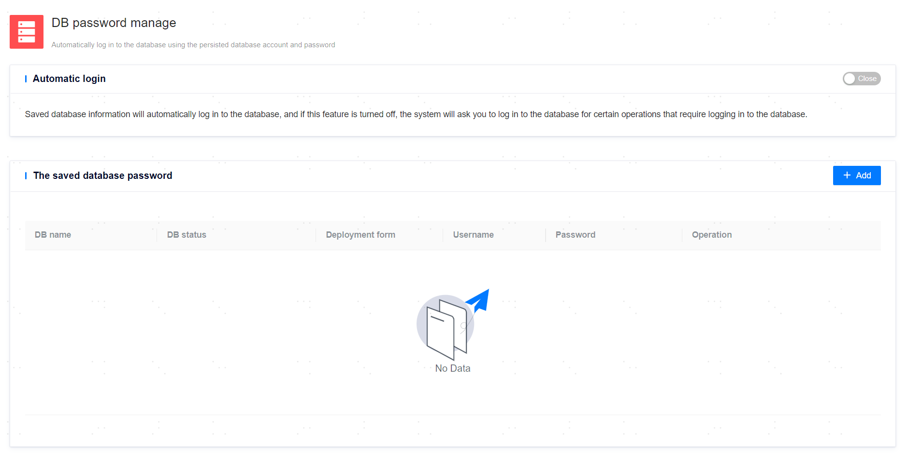

**Page Path 1**: **[ User Center ]** > **[ Database Password Management ]**

**Page Path 2**: **[ Personal Avatar in the Upper Right Corner ]** > **[ Database Password Management ]**

**Functionality Introduction**

The platform supports saving database usernames and passwords, and enables automatic login to the database based on saved passwords.

If automatic login is configured, the process will be smoother when performing certain operations that require database login; otherwise, the system will require the user to log in manually to the database before proceeding with subsequent operations.

Saving database user passwords requires the user to have the privilege to create sessions.

**Main Content Explanation**

**[ Saved Database Passwords ]**: The database password list allows users to query all added databases and their user information, as well as modify or remove saved information as needed.

**[ Remember Me ]**: After enabling Auto Login, users will not perceive the login process.