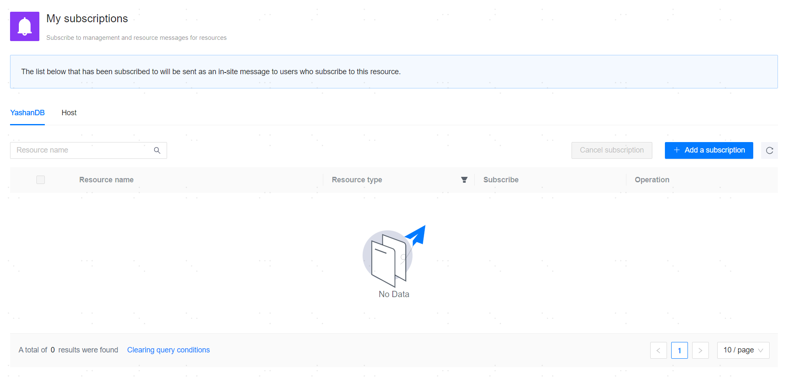

**Web Path 1**: **[ User Center ]**>**[ Subscriptions ]**

**Web Path 2**: **[ User Center ]**>**[ Message center ]**>**[ Add Subscription ]**

**Web Path 3**: **[ Upper right corner personal avatar ]**>**[ Subscriptions ]**

**Web Path 4**: **[ Workbench ]**>**[ Favorites ]**

**Functionality Introduction**

After completing [Resource Hosting](../Resource Management/00Resource Management), you can subscribe to the databases or servers that require your focus.

Once you add a subscription, alert messages related to the target resources, resource changes, and task messages will be notified to you in the form of [in-site messages](Message Center).

When you collect the corresponding database or server in **[ Workbench ]**>**[ Favorites ]**, the resource will be automatically subscribed. However, uncollecting and unsubscribing will not affect each other.