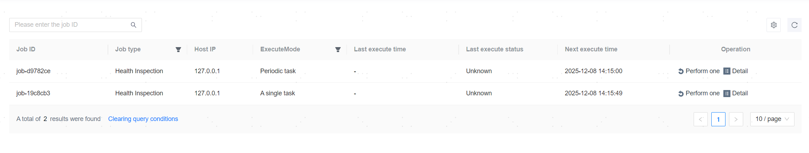

**Web Path**: **[ Scheduling ]** > **[ Job ]**

## Job List

**Functionality Introduction**

The job list records one-time scheduled database backups, periodic database backups, one-time scheduled database restores, one-time scheduled inspections, and periodic inspections of the database.

**Main Content Explanation**

**[ Job type ]**: Job types are categorized into database backup, database restore, tablespace backup, tablespace restore, Archive Log Files backup, and health inspection.

**[ Host IP ]**: The IP address of the target server where the backup files are stored in the database backup job. For health inspections, it is always 127.0.0.1.

**[ ExecuteMode ]**: The ExecuteMode of the job, which is divided into one-time tasks and periodic tasks.

## Execute Job

**Web Path**: **[ Execute Once ]**

**Functionality Introduction**

For periodic tasks, in addition to being executed automatically based on the policy, you can also manually perform a one-time execution. If the policy associated with the job has been deleted, the **[ Execute Once ]** operation cannot be carried out.

For valid jobs, in addition to automatically executing based on the job schedule, users can click **[ Execute Once ]** to perform a one-time execution.

Job invalidation scenarios explained:

1. The one-time scheduled job has completed execution, and the job is invalidated.

2. The inspection policy has been deleted or disabled, making the inspection job invalid.

3. The backup policy has been deleted, the applied backup policy has been disabled, or the applied backup policy has been canceled, resulting in an invalid backup job.

4. A scheduled restore of the database backup has been canceled, resulting in an invalid backup restore job.

## View Job Details

**Web Path**: **[ Detail ]**

**Functionality Introduction**

On the job details page, you can view the details and historical records of the specified job.

**Main Content Explanation**

**[ Associated Policy ]**: The policy associated with the health inspection job or periodic backup job. Clicking on the policy name allows you to view its details. If the policy associated with the job has been deleted, the policy name and details cannot be viewed.

**[ Execution History ]**: All historical execution records of the current job, including execution start and end times, host IP, and execution results.