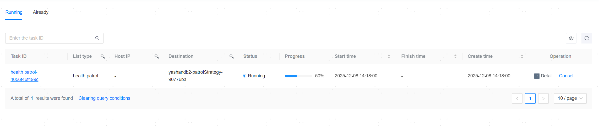

**Web Path**: **[ Scheduling ]**>**[ Task Management ]**

## Running Tasks

**Functionality Description**

The list of running tasks records the tasks that are currently in progress. You can refer to **[ Progress ]** to understand the execution phase of the tasks.

**Main Content Explanation**

**[ Task type ]**: The type of the current task, including database management (e.g., AddYasdbToYcm, StopYasdbNode), server management (e.g., HostCreate), inspection (e.g., health patrol), backup and backup policy related (e.g., BackupYasdb), tablespace (set) management (e.g., AddTablespace, AddTablespaceSet), log related (e.g., LogCollect), etc.

**[ Host IP ]**: The IP address of the target operation object executing the current task.

**[ Target ]**: The Destination operation object for the current task, which may be a server (identified by IP address), a database (identified by database name), a specific instance of a database, an inspection policy, a backup policy, or a backup file, etc.

## View Task Details

**Web Path**: **[ Detail ]**

**Web Path**: **[ Task ID ]**

**Functionality Description**

On the task details page, you can view basic information about the specified task, task parameters, task output results, the task topology diagram, and sub-task logs.

## Cancel Task

**Web Path**: **[ Cancel ]**

**Functionality Description**

You can cancel pending tasks, as well as running backup tasks. Other running tasks and completed tasks cannot be canceled.

## Completed Tasks

**Web Path**: **[ Completed ]**

**Functionality Description**

The list of completed tasks records all historical tasks that have been completed. You can filter and view them using keywords.