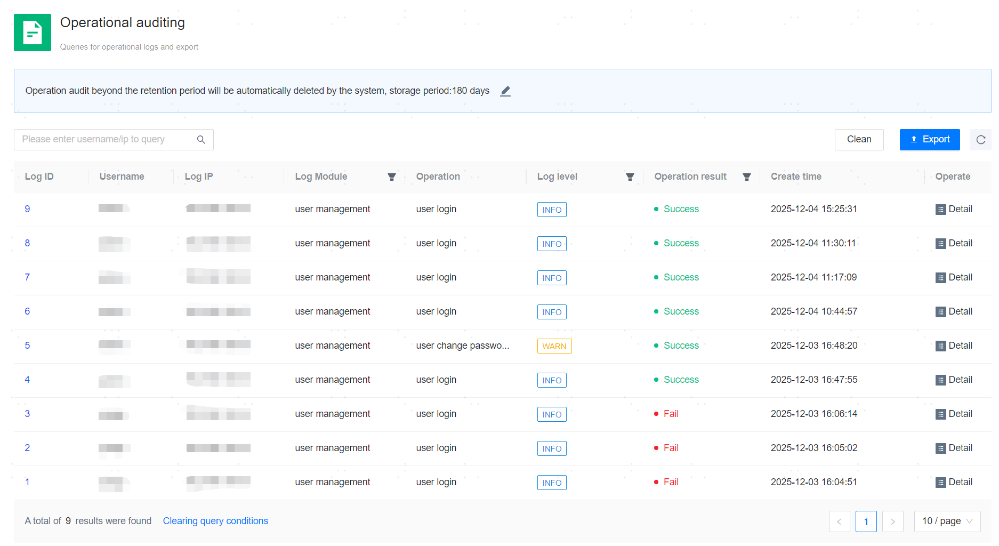

**Web Path**: **[ System setting ]**>**[ Operation Audit ]**

## Operation Audit List

**Functionality Introduction**

The system operation audit functionality records all operations performed on the management platform's Web page, including managed resource management, backup management, log collection, and platform user management. All operations are traceable, facilitating the viewing of records, locating, and reviewing issues when usage problems occur.

**Main Content Explanation**

**[ Retention period ]**: The duration for which operation records are retained, supporting 30 days, 60 days, 90 days, or 180 days. After the expiration period, the system will automatically delete the relevant records.

**[ Operator ]**: The platform user performing the operation.

**[ Operation IP ]**: The IP address from which the operation originated, specifically the terminal IP address used to access the management platform.

**[ Module ]**: The Log Module to which the operation belongs, allowing filtering to view all operation records of the corresponding Log Module.

**[ Operation ]**: The specific operation executed.

**[ Log level ]**: The Log level corresponding to the operation record, including info, warning, and error.

**[ Operation result ]**: The result of the operation, either success or failure.

**[ Creation Time ]**: The time when the operation was initiated.

## Operation Audit Details

**Web Path**: **[ Detail ]**

**Functionality Introduction**

On the details page, you can view detailed information about a specific operation record.

**[ Operation Index ]**: Characteristics related to the task.

**[ Index Content ]**: Key information about the task.

**[ Status Code ]**: The return status code after executing the operation, used to determine the success or failure of the operation, where 200 indicates success and 400 indicates failure.

**[ Request Parameters ]**: The detailed Request params for this operation.

**[ Response ]**: The detailed Response for this operation.