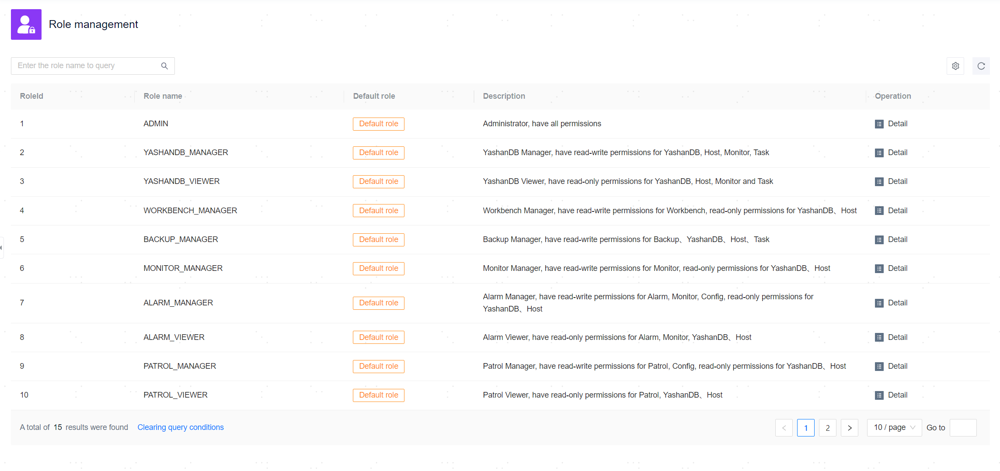

**Web Path**: **[ Permissions ]**>**[ Role Management ]**

**Functionality Introduction**

The management platform provides 15 default roles. You can view the relevant information of each role in the role list to understand its privilege scope and subsequently bind roles to [User Groups](User Group Management) and [Users](User Management) reasonably, thus appropriately restricting user operations in the management platform.

> **Note**：
>
> Non-admin roles cannot access the task management page and the network management page of host management.

**Main Content Explanation**

**[ Role name ]**: The name of the role, which is globally unique and serves as an identifier when binding roles to user groups or users.

**[ Description ]**: A summary description of the role that helps to understand the relationship between the role and its corresponding functions in the actual business system.

**[ Role Permissions ]**: Role authority divides the management platform into [YashanDB Module](../../Resource Management/00Resource Management), [Host Module](../../Resource Management/00Resource Management), [Monitoring Module](../../../Monitors and Alarms/Monitoring definition and display/00Monitoring definition and display), [Alert Module](../../../Monitors and Alarms/Alert definition and display/00Alert definition and display), [Inspection Module](../../../Database O&M Guide/Diagnosis Optimization/Inspection), [Log Module](../../../Database O&M Guide/Diagnosis Optimization/Log Analysis), [Scheduling Module](../Scheduling Management/00Scheduling Management), [Workstation Module](../../../Monitors and Alarms/Workstation), and [System Settings Module](../../Platform Setting/00Platform Setting). Different roles have different read/write privileges for each module.

**Privileges Unique to ADMIN Role**

- YashanDB
  - Deploy YashanDB
  - Host YashanDB
  - Remove hosted YashanDB
- Host Management
  - Add Host
  - Remove Host
  - Network Management
    - Network Plane
- Scheduling Management
  - Task Management
- Privilege Management
  - User Management
  - User Group Management
  - Role Management
- System Settings
  - Operation Audit
  - Default Settings
  - Notification Service Settings
  - Time Synchronization Settings