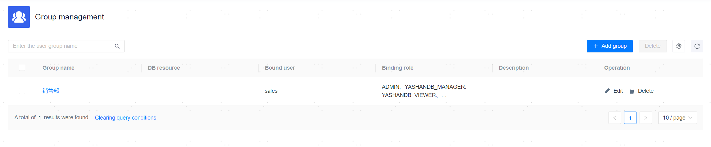

**Web Path**: **[ Permissions ]**>**[ UserGroup Management ]** 

**Functionality Introduction**

You can create different user groups to manage the scope and base roles of resources accessible to users within the group in bulk. It is recommended to map different business departments with user groups.

User groups without bound users can be deleted, while user groups with bound users cannot be deleted.

**Main Content Explanation**

**[ User Group Name ]**: The name of the user group, which will be used as an identifier when binding users to the group. This is a required parameter, with a length range of [1,24] characters.

**[ Database Resources ]**: The DB resources accessible to the user group. The resource privilege applies to all users within the user group. This is an optional parameter and can be left blank.

**[ Bind User ]**: When creating a user, it is required to bind the user to the Bound user group. This information displays all users within the user group.

**[ Bind Role ]**: The role privilege possessed by the user group. The role privilege applies to all users within the user group. This is an optional parameter and can be left blank.

**[ Description ]**: An additional description of the user group. This is an optional parameter, with a length range of [0,60] characters.