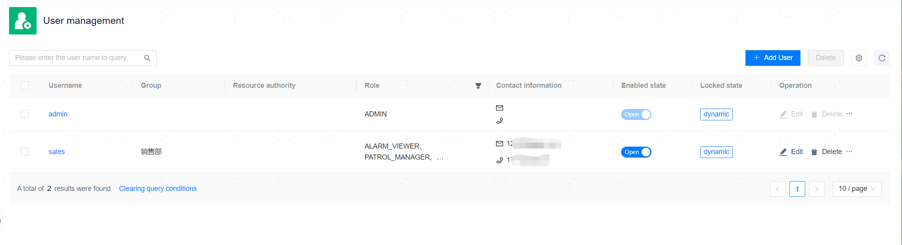

**Web Path**: **[ Permissions ]** > **[ User Management ]**

## Basic User Operations

**Functionality Introduction**

Super administrators can add different users and perform detailed management of resources and privileges by combining [User Groups](User Group Management) and [Roles](Role Management), allowing them to exercise corresponding functional privileges in the actual business system.

Each custom-added user must be bound to a user group; a [User Group](User Group Management) must be added before adding a user.

**Main Content Explanation**

**[ Username ]**: The Username used to log into the management platform. This is a required parameter and must be between [1,24] characters long. The Username cannot be modified after adding the user successfully.

**[ Password ]**: The Password used to log into the management platform. This is a required parameter, and the default password `MP@123` can be used directly. The password must be updated upon first login to access the management platform.

**[ User Group ]**: All custom-added users, apart from the built-in super administrator (admin), must be bound to a group.

**[ Resource Permissions ]**: The managed resources that the user can access cannot be designated and will directly inherit the database resource configuration associated with the bound user group. **Users with the ADMIN role are not subject to this restriction and can access all resources**.

**[ Roles ]**: The user's role, which can be categorized as follows:

- Inherited Role: Directly inherits the role configuration from the bound user group and cannot be removed directly. Adjustments can only be made by modifying the role configuration of the user group.
- Custom Bound Role: When binding a role, it is not restricted by the roles of the user group, allowing the same role to be bound multiple times. Custom bound roles of users are not affected when the roles of the user group change.

**[ Contact Information ]**: Contact information can be configured with a mobile number or email. This is an optional parameter. To maintain contact information, it can be edited from contacts or the user can maintain it themselves after logging into the platform under [Personal Information](../../Account Center/Personal Information).

- The mobile number should not include the country code (e.g., 86, +86); simply enter the 11-digit phone number.
- The email will only validate the email format, not the authenticity of the email.

**[ Active Status ]**: Only enabled users can log into the management platform and perform operations within their privilege scope.

**[ Lock Status ]**: Normally, a user's locked state is **[ Active ]**. If a user fails to login due to incorrect passwords exceeding the retry limit, that user will be locked, and the status will change to **[ Locked ]**. Users in a locked state cannot log into the management platform. After the lockout period expires, they will be automatically unlocked, but manual unlocking can also be done early. Both the retry limit and lockout duration can be adjusted as needed in the [Login Security Settings](../../Platform Setting/Platform Information Settings/Platform Secure Login Configuration).

## Reset Password

**Web Path**: **[ Reset Password ]**

**Functionality Introduction**

If a user forgets their password and cannot log into the management platform, their password can be reset. Resetting the password will disable TOTP token authentication; for re-enabling, please refer to [Login Security Settings](../../Platform Setting/Platform Information Settings/Platform Secure Login Configuration) to restore the relevant configuration.

**Main Content Explanation**

**[ Reset Password ]**: Reset the target user's password to `MP@123`. When the user logs in again, they must update their password to access the management platform.

## Unlock User

**Web Path**: **[ Unlock User ]**

**Functionality Introduction**

Users who are **[ Locked ]** can be manually unlocked before the lockout period expires, allowing normal usage of the user.

If a user accumulates 5 consecutive failed login attempts, the user will be frozen. Continuous freezing will increase the freeze duration, but the user will automatically be unfrozen after the default time, and the freeze time can be reset after a successful login.

**Main Content Explanation**

**[ Unlock User ]**: Manually unlock a user that is **[ Locked ]**.