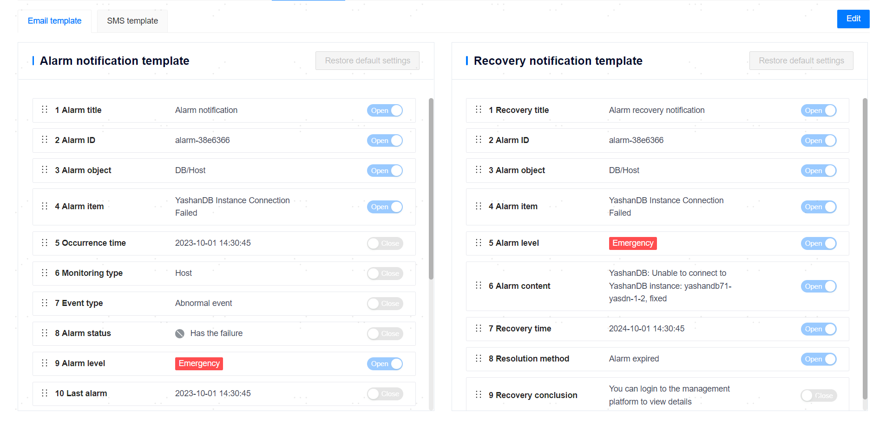
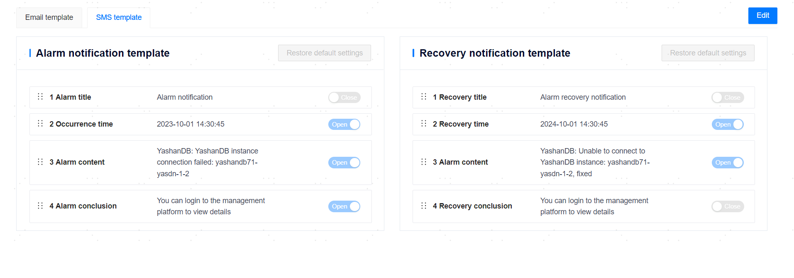

**Web Path**: **[ System setting ]** > **[ Notification Service Settings ]**


## Email Settings

**Web Path**: **[ Email Settings ]**

**Functionality Introduction**

The management platform supports real-time delivery of alarm information, inspection notifications, and more to relevant personnel, increasing response speed and improving operational efficiency. After configuring the necessary information and enabling the email service, the management platform can push alarm information and inspection notifications to the [System Contacts](System Contacts) email via email in real-time.

After configuring the email service information, only **[ Save ]** can store various parameter values, and it is necessary to complete verification and pass through **[ Validate and Save ]** to enable the email service.

**Main Content Explanation**

**Email server**: The domain address of the mail server, formatted as `smtp.example.com`.

**Port**: The port number of the mail server.

**Encryption**: The encryption method of the mail server. You can choose encryption or no encryption as needed. SSL or TLS protocols are supported for encryption.

**Account**: The sender's email for the email service.

**Password**: Optional parameter. The password for the sender's email.

<span id="sms" name="sms" class="yaslink"></span>

## SMS Settings

**Web Path**: **[ SMS Settings ]**

**Functionality Introduction**

By enabling the SMS service and configuring the receiving mobile number in [System Contacts](System Contacts), the management platform can push alarm information and inspection notifications to system contacts via SMS in real-time.

The management platform supports sending SMS through the Shenzhen Municipal Data Bureau SMS platform, Unicom SMS platform, IMSG SMS platform, or custom programs:
- To use the above SMS platforms, you must first enable SMS services through the official channels of the respective platforms and complete the corresponding basic configuration. You can refer to the official guides of each platform for specific operations.

- To use a custom program, its script file must be stored on the backend server of the management platform, and the platform installation user must possess the execution privilege for that file.

When adding a new SMS service, you can verify the SMS service and fill in the test SMS receiving mobile number for availability.

**Main Content Explanation**

**[ SMS service name ]**: The name of the SMS service, a required parameter with a length range of [1,32] characters.

**[ SMS platform ]**: Supports [Shenzhen Municipal Data Bureau SMS platform](#szzsj), [Unicom SMS platform](#UMS), [IMSG SMS platform](#IMSG), and [custom programs](#user-defined).

**[ URL ]**: The URL corresponding to the SMS platform application. This field is not available when using a custom program.

**[ Username ]** and **[ Password ]**: The authentication information for the SMS platform, including Username and Password. This field is not available when using a custom program.

**[ Verified ]**: The result status of verifying the SMS service. Only SMS services that have passed the verification can be used.

**[ Enabled ]**: The status of the SMS service. Only one SMS service will be effective at a time. When an SMS service is enabled, any already enabled SMS services will be automatically turned off.

<span id="szzsj" name="szzsj" class="yaslink"></span>
### Shenzhen Municipal Data Bureau SMS Platform

**[ Request Method ]**: The request mode of the HTTP protocol, which can only be POST.

**[ Encoding type ]**: The encoding type of the SMS text, supporting ASCII, GB2312, GBK, GB18030, UTF-8, and Unicode, with UTF-8 as the default.

<span id="UMS" name="UMS" class="yaslink"></span>
### Unicom SMS Platform

**[ Request Method ]**: The request mode of the HTTP protocol, which can only be POST.

**[ Enterprise number ]**: The number assigned to each enterprise when applying for/enabling the Unicom SMS platform services. The enterprise number is the unique identifier for each enterprise.

**[ Sub Extension Number ]**: Configure the corresponding subextension number (subPort), which is uniformly assigned by the SMS platform.

<span id="IMSG" name="IMSG" class="yaslink"></span>
### IMSG SMS Platform

**[ Custom Extension Number ]**: The custom extension of the sender's code number (ext), that is, the part extended after the 106 code, an optional parameter.

**[ Custom Message ID ]**: The custom message ID (seqid), an optional parameter. If not filled in, a unique number will be generated by the SMS platform.

**[ SMS signature ]**: The SMS signature applied for and approved on the IMSG SMS platform, an optional parameter. The SMS signature is usually located at the beginning of the SMS text **[  ]**, used to identify the subject or business of the enterprise or institution.

<span id="user-defined" name="user-defined" class="yaslink"></span>
### Custom Program

**Main Content Explanation**

**Push Program Command**: The storage path of the custom program's script file. Ensure that the management platform installation user has the execution privilege for this file.

Command examples:

```bash
# binary
$ send_sms --phone "13800000000" --msg "WUNNIGFsYXJtIG1lc3NhZ2U="

# python
$ python3 send_sms.py --phone "13800000000" --msg "WUNNIGFsYXJtIG1lc3NhZ2U="
```

The relevant parameters are listed in the following table.

|Parameter Name |Data Type |Description |
| -------- | -------- | ----------------------------------------------- |
| phone          | string    | The receiving mobile number, required parameter.  |
| msg            | string    | Alarm information, required parameter using base64 encoding (using standard base64 RFC 4648). The custom program needs to base64 decode the msg and then send the decoded information as an SMS to the receiving mobile number. |

Custom Python program example:

```python
#!/usr/bin/python
# -*- coding: UTF-8 -*-

import argparse
import base64
import hashlib
import requests
import json
import time

unicom_endpoint = "http://127.0.0.1:9090/sms/v2/api/ssend"
unicom_id = "<id>"
unicom_user = "<user>"
unicom_pwd = "<password>"
unicom_sub_port = "<sub_port>"

def parse_args():
    parser = argparse.ArgumentParser()
    parser.add_argument("-p", "--phone", type=str, help="phone number")
    parser.add_argument("-m", "--msg", type=str, help="send message, using base64 codec")
    args = parser.parse_args()
    if args.phone is None:
        print("argument 'phone' is none")
        exit(1)
    if args.msg is None:
        print("argument 'msg' is none")
        exit(1)
    return args

def sha256_encrypt(text):
    """
    SHA256 encrypt the string
    """
    sha256 = hashlib.sha256()
    sha256.update(text.encode('utf-8'))
    return sha256.hexdigest()

def gen_headers():
    """
    Generate request headers
    """
    now_milli_time = str(int(round(time.time() * 1000)))
    sign = sha256_encrypt(unicom_user + unicom_pwd + now_milli_time)
    headers = {
        'content-type': 'application/json;charset=utf-8',
        'accept': 'application/json',
        'timestamp': now_milli_time,
        'sign': sign,
    }
    return headers

def gen_req(args):
    """
    Generate request body
    """
    message = base64.b64decode(args.msg)
    req = {
        'spNum': unicom_id,
        'content': str(message),
        'mobiles': args.phone,
        'userMsgId': "",
        "atTime": "",
        'subPort': unicom_sub_port,
    }
    json_req = json.dumps(req)
    return json_req

def send_sms(args):
    """
    Initiate SMS request
    """
    hds = gen_headers()
    req = gen_req(args)

    resp = requests.post(unicom_endpoint, data=req, headers=hds)
    print(resp.status_code)
    print(resp.content)
    resp.close()

if __name__ == "__main__":
    args = parse_args()
    send_sms(args)
```

Example of return result:

```bash
python3 send_sms.py --phone "13800000000" --msg "c2VuZCBzbXMgdGVzdAo="
200
b'{"description":"send message success","result":"0000","taskid":"819396"}\n'
```

## Custom Script Settings

**Web Path**: **[ Custom Script Settings ]**

### View System Variables

**Web Path**: **[ Add Script ]** > **[ View system variables ]**

**Functionality Introduction**

Before writing a script file, you can first view all the system variables that can be referenced. The variable reference format is `${variable_name}`, and the alarm recipient name `${receiver_name}` is a required variable.

### Add Script

**Web Path**: **[ Add Script ]**

**Functionality Introduction**

The management platform supports building notification services through custom scripts, with notification methods including email or SMS.

Custom script files must meet the following requirements:

- The script file content must begin with `#!/bin/bash`.
- The script file suffix can only be `.sh` or `.bash`, and the file size must not exceed 10MB.
- The script file must be stored under `{management platform installation path}/notify_script/`, and the management platform installation user must possess the execution privilege for this file.

After uploading the script to the corresponding path, the script must be added to the management platform, tested, and enabled before it can be officially used for custom notifications.

In primary/standby deployment scenarios, it is important to note that when adding scripts on the primary node page, the script content will be saved in the backend database by default and synchronized to the standby node. After saving on the primary node, the standby node will also periodically synchronize the script content from the database. Therefore, if the user needs to modify the script, they should first modify the script content in the primary node installation directory, then go to the frontend view/edit script page and click the submit button. At this time, the file content will be updated in the database and eventually synchronized to the standby node. Directly modifying the script content on the standby node will be overwritten by synchronization, and will not take effect after promoting to primary.

**Main Content Explanation**

**[ Name ]**: The filename of the script (including the suffix), a required parameter that cannot be duplicated with the same script.

**[ Script Execution Parameters ]**: Parameters required to execute the script file, optional parameter.

**[ MD5 value ]**: The MD5 value of the script file, optional parameter.

### Test Script

**Web Path**: **[ Add Script ]** > **[ Test ]**

**Web Path**: **[ View ]** > **[ Test ]**

**Web Path**: **[ Test ]**

**Functionality Introduction**

All newly added or modified scripts must first complete **[ Test ]** to verify their availability. Only scripts that pass the verification can be enabled.

### Enable Script

**Web Path**: **[ Operation ]**

**Functionality Introduction**

You can enable the verified scripts as needed. Once the script is enabled, it is considered that the notification service configuration is completed. The management platform will use the specified methods in the script to push alarm information to [System Contacts](System Contacts) in real-time.

### Delete Script Addition Records

**Web Path**: **[ Delete ]**

**Functionality Introduction**

You can delete script addition records as needed; this operation will not delete the actual script files.

## Notification Template

**Web Path**: **[ Notification template ]**

**Functionality Introduction**

Notification templates are divided into email templates and SMS templates, supporting customizable configurations for the content format of alarm information in emails or SMS, including enabling and disabling specific message content and arranging the order of different items.

Each template must have at least one template item in an enabled state.




