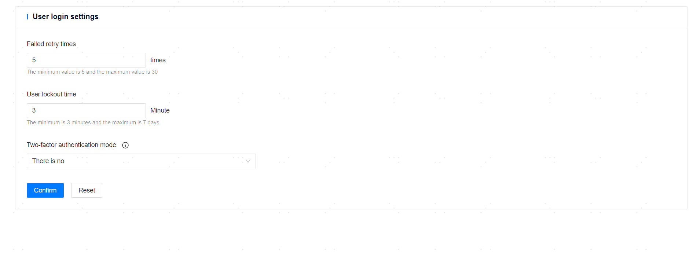

**Web Path**: **[ System setting ]** > **[ Default Settings ]** > **[ User Login Settings ]**

## Login Attempt Count

**Functionality Introduction**

When the number of continuous login failures due to incorrect passwords exceeds the set threshold, the platform will lock that user and temporarily prevent them from logging in. This effectively prevents malicious attacks through brute force password cracking, thereby enhancing the security of the platform.

**Main Content Explanation**

**[ Retry Attempts on Failure ]**: The number of allowed retry attempts for a user due to incorrect password failures. The value range is [5,30], with a default value of 5. After continuous failures and exceeding the retry count, the user will be locked. Users in a locked state cannot log in to the management platform. After the lockout period expires, they will be automatically unlocked, and they can also be manually [unlocked](../../Platform Operation/System Permission Management/User Management.html#unlock) in advance.

**[ User Lockout Duration ]**: The duration of time in minutes for which a user is locked out after exceeding the retry count due to incorrect password failures. The value range is [3,10080], with a default value of 3. After the lockout period expires, the user will be automatically unlocked.

## Login Authentication

**Functionality Introduction**

When users log in to the management platform, in addition to correctly entering the password, they can perform a second authentication through a dynamic password or SMS verification code, effectively increasing the security of user logins and reducing the risk of unauthorized access.

**Main Content Explanation**

**[ Two-factor Authentication Method ]**: After enabling two-factor authentication, users must go through secondary authentication to log in successfully. The following authentication methods are supported:

- [TOTP dynamic password authentication](#TOTP)

- [SMS verification code authentication](#SMSVerificationCode)

### TOTP Dynamic Password Authentication

When [resetting user passwords](../../Platform Operation/System Permission Management/User Management.html#resetpsd), the TOTP dynamic password authentication functionality will be disabled. After performing a password reset, it is recommended to promptly restore the related configurations of this authentication method to avoid unnecessary impacts.

**[ User 2FA QR Code ]**: After enabling TOTP dynamic password authentication, the TOTP dynamic password will be displayed on the login interface during the first login (after which it can only be viewed by clicking **[ View 2FA Code ]** in the **[ User Center ]** > **[ [Personal Information](../../Account Center/Personal Information) ]** page). After obtaining the QR code, it can be scanned and saved as a dynamic token through an authentication client. When logging into the management platform, after entering the account password, the password provided by the dynamic token can be entered for access.

**Dynamic password**: The dynamic password can be obtained by scanning the user dynamic password QR code with an authentication client tool, with a default length of 6 digits and a refresh cycle of 30 seconds.

>**Note**：
>
> - Common authentication client tools include mobile apps (Authenticator), browser plugins (authenticator 2fa client), and WeChat mini-programs (TOTP identity security authenticator), etc.
>
> - The authentication client tool must synchronize time with the management platform backend server (**the discrepancy must not exceed 30 seconds**).
>
> - After using a client tool to scan the QR code, it usually saves the QR code information and refreshes the password periodically, so that during the next login, the dynamic password can be obtained directly from the tool without rescan.

### SMS Verification Code Authentication

To use this authentication method, [SMS service](Notification Service Setting.html#sms) must be configured first.

**[ SMS sender ]**: Select the SMS service used for sending login verification codes.

**[ User Phone Number ]**: After enabling SMS verification code authentication, if a user has not bound a mobile phone number, they will be required to bind one during the first login. The phone number does not need to include the country code (e.g., 86, +86), and only the 11-digit number should be filled in.

**SMS verification code**: After binding the phone number, click **[ Get Code ]** to obtain the SMS verification code, which is valid for 5 minutes. After resending the verification code, the previous SMS verification code becomes invalid immediately.

>**Note**：
>
> The same user can only send one SMS verification code within one minute.