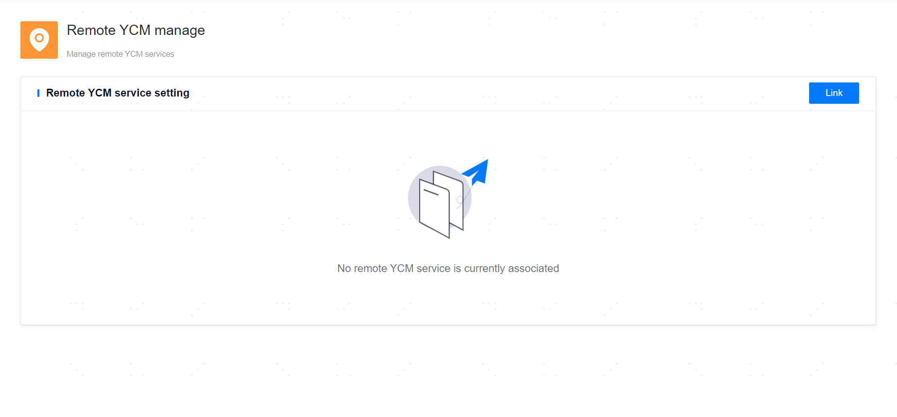

**Page Path**: **[ System setting ]**>**[ Remote YCM Management ]**

**Functionality Description**

The local YCM management platform (referred to as local YCM) supports linking to other YCM management platforms in different regions (referred to as remote YCM). Once linked, the YCMs in both locations will synchronize relevant metadata related to hosts and databases. The local YCM can view the available information of the remote database instance nodes and perform operations such as switching, backing up, and inspecting the remote database instances.

It should be noted that the local YCM will not collect monitoring metrics information or log information from remote hosts and database nodes. Therefore, some functionalities are limited when managing remote resource objects. The functionalities not supported by remote hosts include: updating and deleting, log analysis, monitoring alerts, adding database installation packages. The functionalities not supported by remote database nodes include: monitoring alerts, log analysis, deadlock diagnosis, alert logs, internal alarm message notifications, and changing the password for the operation management user YASOM.

## Link Remote YCM

**Page Path**: **[ Link ]**

**Functionality Description**

Link the local YCM to a remote YCM, and only one remote YCM is allowed to be linked. It should be noted that the linking is bidirectional; the same remote YCM will also be linked to the local YCM.

**Main Content Explanation**

**[ Remote Primary YCM Service Address ]**: The communication IP address of the remote YCM service.

**[ Remote Primary YCM Service Port ]**: The communication port of the remote YCM service.

**[ Remote YCM Service Username ]**: The login user name for the remote YCM service.

**[ Remote YCM service password ]**: The password for the remote YCM service user.

**[ Local YCM Service Address ]**: The elected IP address of the YCM high availability deployment instance.

## Update Remote YCM

**Page Path**: **[ Update ]**

**Functionality Description**

Update the information of the already linked remote YCM. It should be noted that the update is bidirectional; the same remote YCM will also be updated.

## Remove Remote YCM

**Page Path**: **[ Remove ]**

**Functionality Description**

Remove the already linked remote YCM. It should be noted that the removal is bidirectional; the same remote YCM will also remove the already linked local YCM.

> **Warn**:
>
> The two YCMs linked in different regions cannot host the same host.
>
> If the YCM is in a primary/standby deployment mode, it is necessary to ensure that all primary/standby YCM nodes are functioning properly during the remote linking.