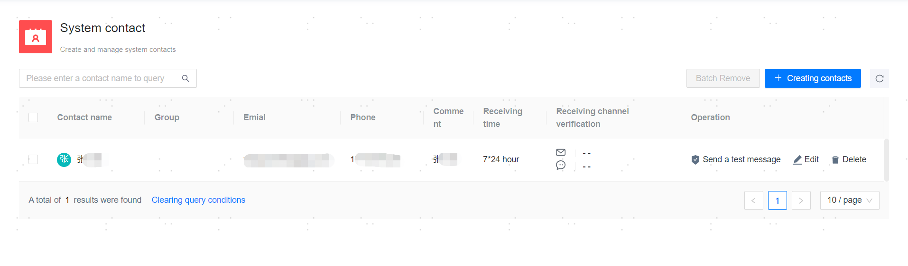

**Web Path**: **[ System setting ]**>**[ System Contacts ]**

**Functionality Introduction**

After creating a system contact and completing the [Notification Service Setting](Notification Service Setting), users can receive real-time alerts and inspection notifications from the management platform.

Depending on the receiving channel configuration for the contact, messages such as **[ Email Test ]** or **[ SMS Test ]** can be sent to verify the availability of the notification service and the reachability of the receiving channels.

Once an existing contact is deleted, it cannot be restored directly. To restore it, the contact must be recreated.

**Main Content Explanation**

**[ Contact name ]**: The name of the contact, required parameter, with a length range of [1,24] characters.

**[ User Group ]**: The group to which the contact belongs, optional parameter. When a user with adminPrivilege creates the contact, it supports assigning a group (a group must be created first via [Create Group](../../Platform Operation/System Permission Management/User Group Management)). When other users create the contact, this option is not available, and the contact is defaulted to the group of the user creating it.

**[ Comment ]**: Additional information about the contact, optional parameter, with a length range of [0,50] characters.

**[ receive email ]**: The email address for receiving alarm notifications (in email format), required parameter. The authenticity of the email is not verified, but it must not duplicate the receive email of existing contacts (case-sensitive check for duplicates).

**[ Receive Phone Number ]**: The phone number for receiving alarm notifications (in SMS format), optional parameter. There is no need to fill in the country code (e.g., 86, +86); simply enter the 11-digit number.

**[ Receipt Period ]**: The time period for receiving alarm notifications, fixed at 7*24 hours.

**[ Channel Verification ]**: Whether the received email or SMS has been verified.