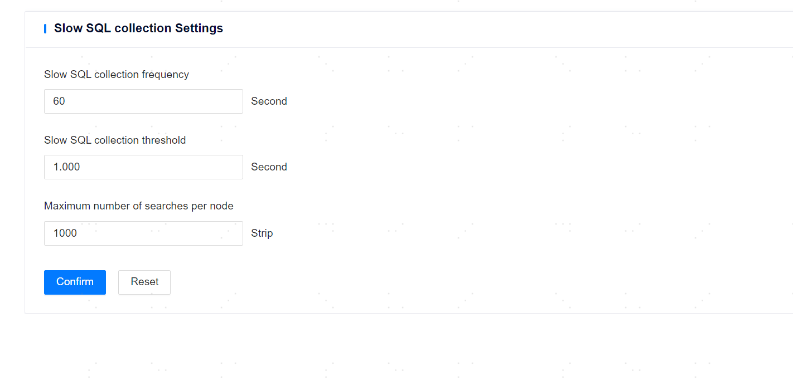

**Web Path**: **[ System setting ]**>**[ Default Settings ]**>**[ Slow SQL Collection ]** 

**Functionality Overview** 

The management platform will periodically collect slow SQL queries from the databases that have been added. Users can modify the configuration on the slow SQL collection settings page, and this collection configuration will apply to all databases that have been added.

**Main Content Explanation** 

**[ Slow SQL Collection Frequency ]**: The time interval for collecting slow SQL queries, with a default value of 60 seconds and a minimum value of 30 seconds.

**[ Slow SQL Collection Threshold ]**: The minimum execution time for collecting slow SQL queries, with a default value of 1 second.

**[ Max Search Results per Node ]**: The maximum number of records for each search per node, with a default value of 1000 records.