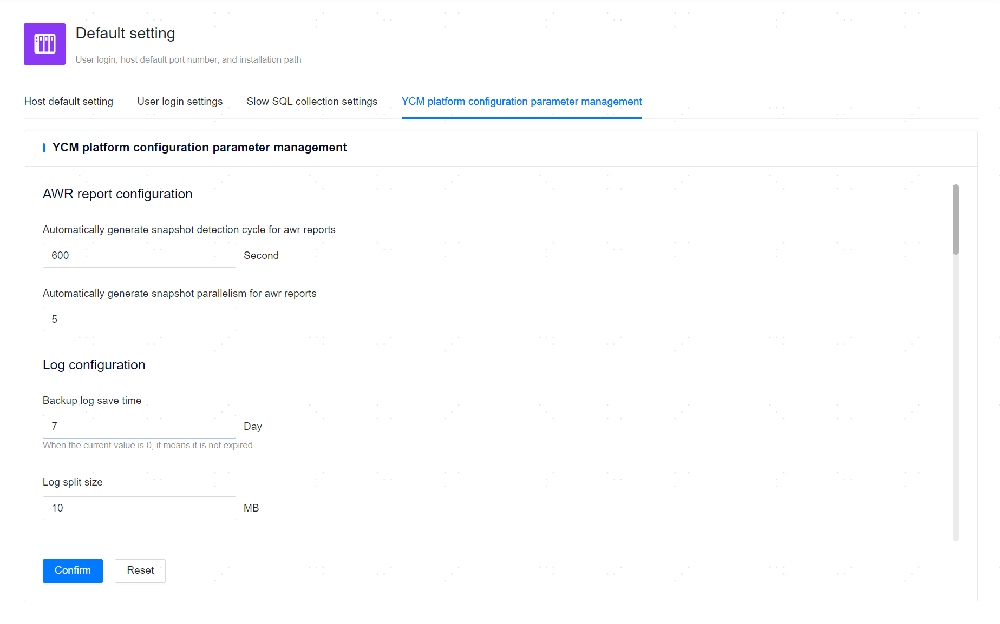

**Web Path**: **[ System setting ]**>**[ Default Settings ]**>**[ Platform Configuration Parameter ]**

**Functionality Introduction**

The management platform supports users to modify configuration parameters of the management platform. The modified configuration parameters will be applied to components such as the management platform, prometheus, loki, etc.

**Main Content Explanation**

**Performance Report Configuration**

**[ Snapshot Detection Cycle for Auto AWR Generation ]**: The time interval for the management platform to automatically generate performance report snapshot detection, default value is 600 seconds, minimum value is 60 seconds, maximum value is 86400 seconds.
**[ Parallelism for Auto AWR Generation Tasks ]**: The maximum parallel task count for the management platform to automatically generate performance reports, default value is 5, minimum value is 1.

**Log Configuration**

**[ Log Rotation Size ]**: The maximum size of the log file before splitting, default value is 10MB, minimum value is 10MB.

**[ Max Backup Log Count ]**: The maximum number of old files generated after log splitting, default value is 30, minimum value is 1, when set to 0, it means all will be saved.

**[ Backup Log Retention Period ]**: The retention time for old files generated after log splitting, default value is 7 days, minimum value is 1 day, when set to 0, it means all will be saved.

**[ Log Storage Path ]**: The path for saving the management platform logs, this path must exist, and the management platform must have read and write privileges. In the Primary/Standby deployment scenario, it should be noted that this parameter will only take effect on the primary node and will not be synchronized to the standby node.

**[ Max Lines Read from Slow Log Files ]**: The maximum number of lines that the management platform can read from slow log files, default value is 5000 lines, minimum value is 1 line, maximum value is 100000 lines.

**[ Loki Collected Log Retention Period ]**: The retention time for logs collected by the loki component from the managed database and added hosts, default value is 30 weeks, minimum value is 1 week, maximum value is 5217 weeks.

**Monitoring Alarm Configuration**

**[ Alert Cache Update Interval ]**: The update interval for the alarm information buffer on the management platform, default value is 10 seconds, minimum value is 1 second, maximum value is 3600 seconds.

**[ Custom SMS Push Program Execution Timeout ]**: The timeout period for the management platform to send alarms through a custom SMS push program, default value is 15 seconds, minimum value is 1 second, maximum value is 604800 seconds, when set to 0, it means no limit.

**[ Audit Alert Detection Interval ]**: The detection interval for audit alarms on the management platform, default value is 60 seconds, minimum value is 30 seconds, maximum value is 3600 seconds.

**[ Remote Alert Detection Interval ]**: The detection interval for remote alarms on the management platform, default value is 30 seconds, minimum value is 30 seconds, maximum value is 3600 seconds.

**[ Collection Interval ]**: The data collection interval for prometheus, default value is 20 seconds, minimum value is 1 second, maximum value is 3600 seconds. This parameter must be greater than or equal to the host's data collection timeout.

**[ Scrape Timeout ]**: The timeout period for data collection by prometheus, default value is 18 seconds, minimum value is 1 second, maximum value is 3600 seconds. The value of this parameter must be less than or equal to the data collection interval.

**[ Monitoring Data Retention Period ]**: The save time for MonitorData collected by prometheus, default value is 180 days, minimum value is 1 day.

**Authentication Configuration**

**[ Token validity period ]**: The token validity period of the management platform, default value is 30 minutes, minimum value is 1 minute, maximum value is 525600 minutes.

**[ User Password Expiry Period ]**: The user password expiration period of the management platform, default value is 60 days, maximum value is 3650 days, when set to 0, it means no limit.

**[ Max Login Attempts ]**: The maximum number of login attempts on the management platform after user login failure, default value is 5 attempts, maximum value is 30 attempts, minimum value is 5 attempts.

**[ Lockout Duration After Login Failure ]**: The lock period for users who continuously fail to log in due to incorrect passwords exceeding the maximum attempt count, in minutes, with a range of [3,10080], default value is 3. The user will be automatically unlocked after the lock period expires.

**Other Configurations**

**[ Node Info Update Interval ]**: The time interval for the management platform to update the Primary/Standby information of the managed database nodes, default value is 30 seconds, minimum value is 1 second.

**[ Host Configuration Sync Interval ]**: The time interval for the management platform to synchronize configuration files to the added host, default value is 5 seconds, minimum value is 1 second.

**[ Max Backend DB Connections ]**: The maximum number of connections to the backend database by the management platform. For the backend as yashandb, default value is 10 connections, minimum value is 1 connection, maximum value is 16384 connections, when set to 0, it means no limit on the number of connections. For the backend as sqlite3, default value is 1 connection and cannot be modified.

**[ Browser Ignore Saved Password ]**: Configuration to determine whether the browser should ignore saving passwords. When this configuration is enabled, the browser will not save passwords in the password input fields on the management platform page.

**[ Remote Data Sync Interval ]**: The time interval for synchronizing remote data after associating with remote management platforms, default value is 30 seconds, minimum value is 1 second, maximum value is 3600 seconds.

