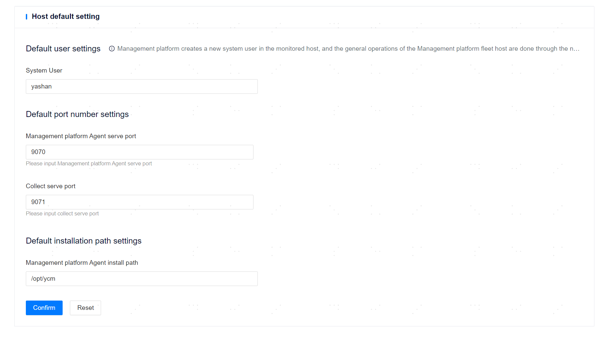

**Web Path**: **[ System setting ]**>**[ Default Settings ]**>**[ Host Default Settings ]**

**Functionality Introduction**

You can customize the installation user, port, and installation path of ycm-agent on the managed server. Modifying the configuration on the web page has the same effect as modifying the client information in the deploy.yml configuration file.

To customize such information, the configuration must be completed prior to the [managed server](../../Resource Management/Server Management). If the corresponding parameters are modified after the server has been hosted, the changes will only take effect for newly hosted servers.

**Main Content Explanation**

**[ Host System Username ]**: The user used to install and run ycm-agent related services on the managed server. The default value is ycm, with a length range of [1,49] characters and must comply with the requirements of the target server operating system. If set to a user that does not exist in the server operating system, the user and a user group with the same name will be silently created when hosting the server. This parameter corresponds to the system_user parameter in the client information section of the deploy.yml configuration file.

**[ Management platform Agent Service Port ]**: The port for communication between ycm-agent and the management platform, as well as between servers where ycm-agent is located. The value range is [1,65535], with a default of 9070. This parameter corresponds to the agent_port parameter in the client information section of the deploy.yml configuration file.

**[ Host Info Collection Port ]**: The port used by ycm-agent to collect information such as network status, disk usage, memory usage, and remaining memory capacity of the server. The value range is [1,65535], with a default of 9071. This parameter corresponds to the export_port parameter in the client information section of the deploy.yml configuration file.

**[ Management platform Agent Installation Path ]**: The installation path of ycm-agent related services on the managed server. The default value is /opt/ycm, with a length range of [1,99] characters and must comply with the requirements of the target server operating system. This parameter corresponds to the install_path parameter in the client information section of the deploy.yml configuration file.