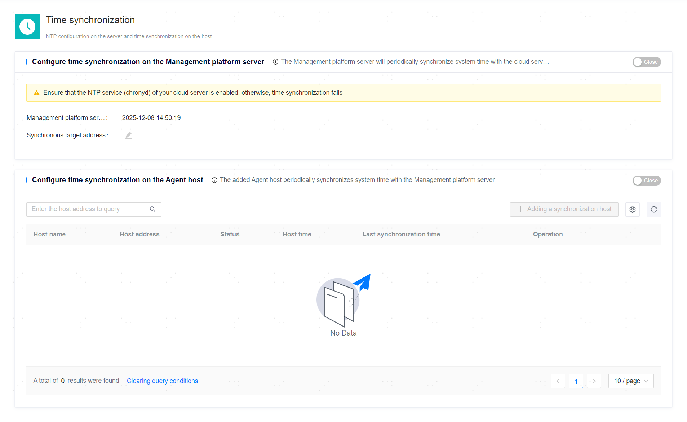

**Web Path**: **[ System setting ]**>**[ Time Synchronization Settings ]**



## Management Platform Server

### chrony Environment Preparation

The NTP service relies on the chrony command.

```bash
# Check if chrony exists
# chronyc --version

# If not, you can install it using the following commands
# yum install chrony  
# or
# apt update && apt-get -y install chrony 
```

**Functionality Introduction**

The management platform server can synchronize system time with specified cloud servers through the NTP service.

To use this functionality, ensure that:
- The NTP service (chronyd) on the cloud server is enabled.
- You have the root or sudo privilege user and their password for the platform backend server.

**Main Content Explanation**

**[ Management platform server time ]**: The current time of the management platform server.

**[ Sync Target Address''Sync target address ]**: The address of the cloud server that needs to be specified when starting time synchronization.

## ycm-agent Side

**Functionality Introduction**

The management platform server can synchronize time with the servers of managed resources, ensuring that the server and resource side (ycm-agent side) have consistent time.

If the server and resource side (ycm-agent side) have inconsistent times, the timestamps for alarms, events, and other records reported will be based on the resource side (ycm-agent side). If the server and resource side have ensured time consistency among all servers through other means (for example, all servers have established time synchronization mechanisms at the operating system level), this configuration may not be necessary.

To use this functionality, ensure that:
- [Server Management](../../Resource Management/Server Management) has been completed.
- You have the root or sudo privilege user and their password for the target server.
- You have the root or sudo privilege user and their password for the platform backend server.

**Main Content Explanation**

**Server Information**: After adding the server that needs time synchronization, the list will display the hostname, IP address, status of time synchronization configuration, host time, and last synchronization time of that server.

**[ Sync Now ]**: You can perform Immediate synchronization of system time for servers that have successfully configured time synchronization (status as "Success") at any time.