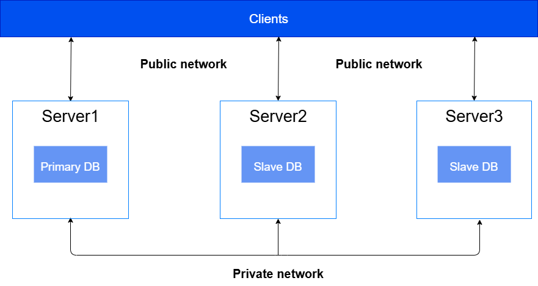
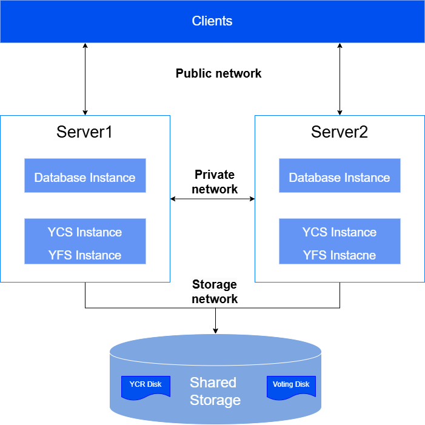
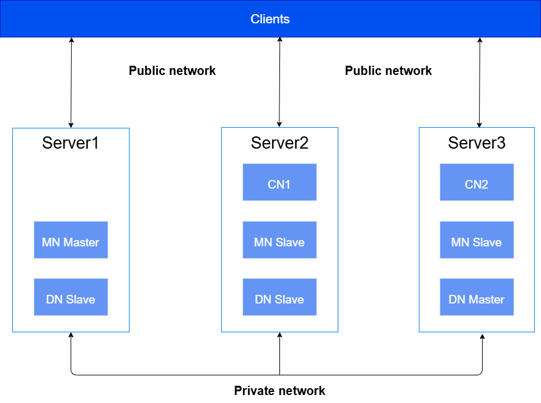

To ensure the security of application data and isolate illegal commands from the internet, it is recommended to divide the YashanDB network based on functionality into mutually independent and isolated networks.

- Public Network: Mainly used for external business access to YashanDB, DBA for database management, and database tools for database command invocation, etc.
- Private Network: Mainly used for internal communication within YashanDB.
- Storage Network (YAC exclusive): Mainly used for YAC instances access to shared storage.

## Standalone Deployment

The typical network configuration for Standalone Deployment is shown in the figure below. This network schema is based on one primary and two standby databases, and it is recommended that the primary database and each standby database be deployed on different servers.

|Address |Description |Suggested Network Segment |
|--------------------|-------------|-----------------|
| LISTEN_ADDR          | Used to connect to the database and provide database services externally | Public Network Segment |
| REPLICATION_ADDR (needed for primary/standby deployment) | Used for internal communication between primary and standby databases; database users cannot access it. This address needs to be planned only for primary/standby deployment | Private Network Segment |

## YAC Deployment

The typical network configuration for YAC Deployment is shown in the figure below. This network schema is based on 2 servers + 1 shared storage set up for dual-instance single database YAC Deployment, and the instances should be deployed on different servers.

|Address |Description |Suggested Network Segment |
|--------------------|-------------|-----------------|
| LISTEN_ADDR          | Used to connect to the database and provide database services externally | Public Network Segment |
| CLUSTER_INTERCONNECT INTER_URL REPLICATION_ADDR (needed for primary/standby deployment) | CLUSTER_INTERCONNECT is used for communication between database instances in the cluster, INTER_URL is used for internal communication between YCS instances in the cluster, REPLICATION_ADDR is used for communication between primary clusters in the same group; database users cannot access these addresses. The three types of addresses on the same server can use the same IP + different port numbers | Private Network Segment |

## Distributed Deployment

The typical network configuration for Distributed Deployment is shown in the figure below. This network schema is based on 1 MN group, 2 CNs, and 1 DN group (both DN and MN groups have 1 primary and 2 standby), and it is recommended to deploy the primary and standby nodes of each group on different servers.

  

|Address |Description |Suggested Network Segment |
|--------------------|-------------|-----------------|
| LISTEN_ADDR          | The listening address of the CN node is used to connect to the database and provide database services externally | Public Network Segment |
| REPLICATION_ADDR (needed for primary/standby deployment in MN/DN group) DIN_ADDR | REPLICATION_ADDR is used for communication between primary and standby nodes within the same group; DIN_ADDR is used for cross-group internal communication between MN, CN, and DN nodes; database users cannot access these addresses. The port numbers for each node group are different, and these two types of addresses on the same server can use the same IP | Private Network Segment |