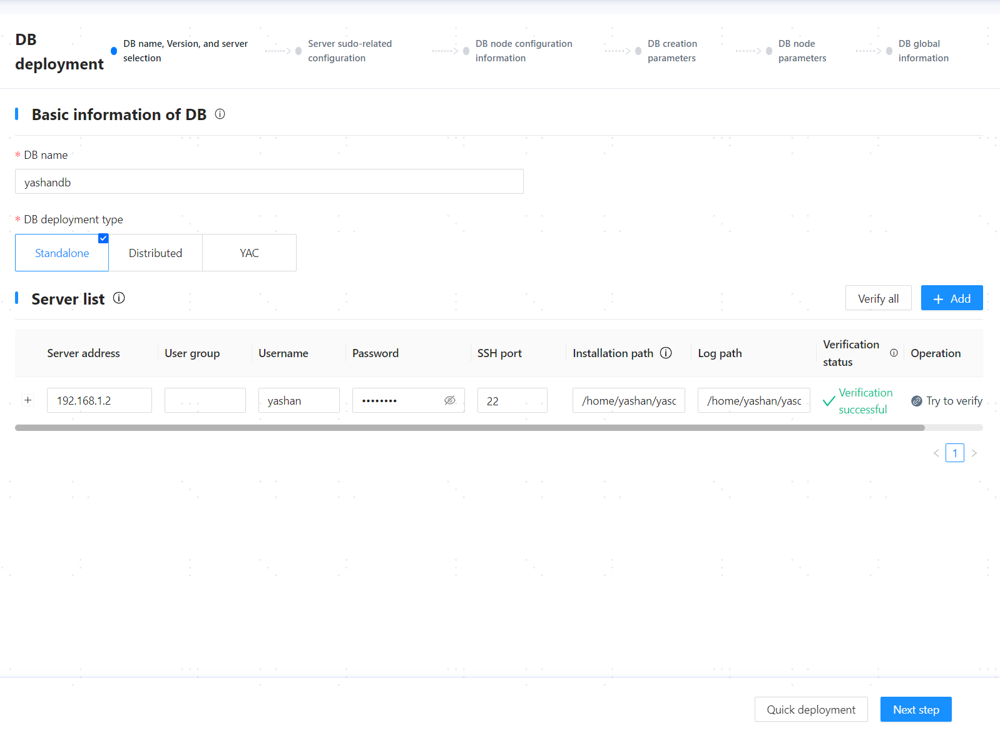
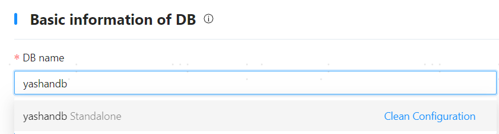
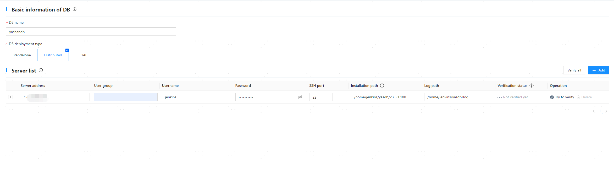
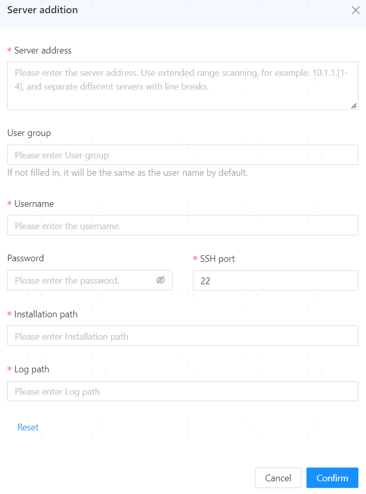
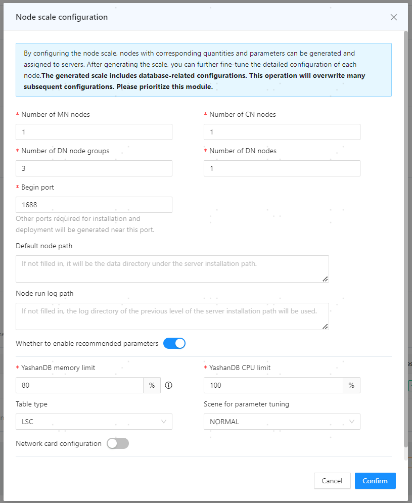
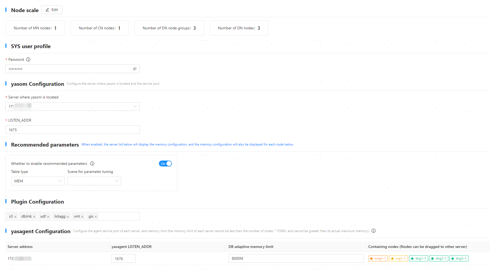
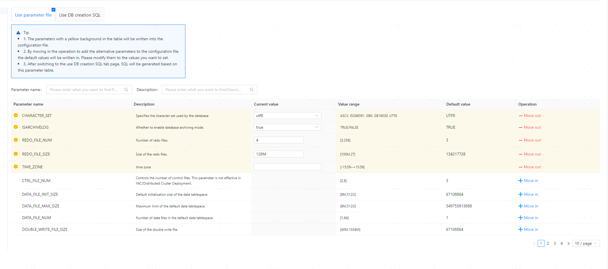
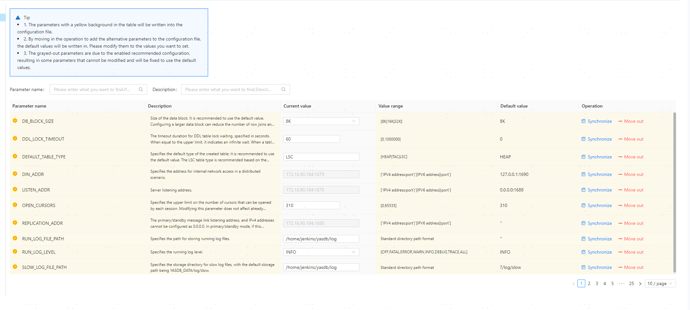
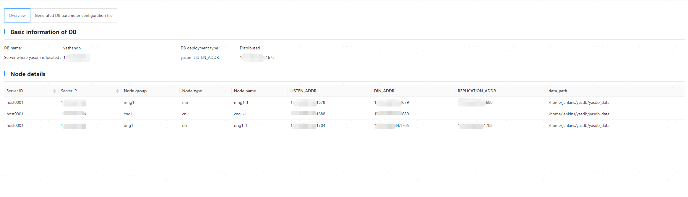

## Step 1: Enter the Deployment Page



## Step 2: Configure Database Basic Information and Server Information

1. Configure the basic database information according to actual conditions:
   
   - Database Name: Enter the database cluster name, which will also serve as the name of the initial database (database name). It must start with a letter and have a length of [1,63] characters, such as yashandb.

   - Database Deployment Type: Select the database deployment type, such as Distributed Deployment.

> **Note**:
>
> To reuse/clear the configuration records in the current environment (scenarios where configuration information may be retained: visual installation is successful and then the database is uninstalled, visual installation fails, etc.), you can click the **[Database Name]** input box and select/clear the corresponding configuration from the dropdown options.
> 
> 

2. In the server list, the server information where the web service is located is recognized by default. After verifying the installation path and other information, click **[Try Verification]** to check correctness.

**Note to select the database deployment type as Distributed Deployment.**

   

3. Click **[Add]** at the top of the server list.

4. In the pop-up dialog, add other server information and click **[OK]** to save the configuration.
   
   

5. Click **[Try All Verifications]** to check correctness.

6. Once the information is confirmed to be correct, click **[Next]**.

## Step 3: Configure Server Sudo

1. In the database configuration area, the following functionalities can be configured:

   - Create cgroup: Enable this to create a cgroup directory for YashanDB CPU resource management and fill in the cgroup directory in other server configuration areas. This parameter only needs to be configured when installing databases that can enable CPU resource management (not cascade backup).

   - Enable monit on boot: When enabled, the daemon will start automatically after the server boots and launch various YashanDB processes, indirectly achieving database auto-start on system boot.

   - Add user to YASDBA user group: When enabled, it means adding the installation user to the YASDBA group, allowing password-free login to the database.

   The above functionalities require the installation user to have sudo privileges when enabled. This example uses the default configuration, which only enables adding the user to the YASDBA user group.

   

2. Once the information is confirmed to be correct, click **[Next]**.

## Step 4: Configure Database Node Information

1. In the pop-up node scale configuration dialog, adjust the relevant configurations based on the [actual planning](../Database Install Preparation/Server Preparation) of the number of nodes and click **[OK]** to save the information.

   - MN Node Count: Select the MN node count.

   - CN Node Count: Select the CN node count.

   - DN Node Group Count: Select the DN node group count.

   - DN Node Count: Select the DN node count.

   - Starting Port: Enter the starting value of the database listening port. If there are multiple listening ports, the system will calculate according to the [port allocation rules](../Database Install Preparation/The Pre-Installation Environment Preparation), with a default value of 1688.

   - Node Default Path: Enter the data directory for YashanDB. If left empty, it defaults to the yasdb_data directory in the upper-level directory of the server installation path. **Modifications after installation will not take effect**, supporting numbers, letters (case-sensitive), and some symbols (`/`, `-`, `_`, `.`), with a maximum of 75 characters, for example /data/yashan/yasdb_data.

   - Node Running Log Path: Enter the running log path for YashanDB. If left empty, it defaults to the log directory in the upper-level directory of the server installation path, preferably consistent with the log path of the host list. For example, /data/yashan/log.

   - Enable Recommended Configuration: When enabled, yasom will call the DBMS_PARAM advanced package to generate recommended parameters that override the configuration parameters with the same name, defaulting to enabled. When enabled, the following parameters also need to be configured:

      - YashanDB Memory Usage: Set the percentage of available server memory for YashanDB. Yasom will calculate the specific memory limit based on this percentage.

      - YashanDB CPU Usage: Set the percentage of available server CPU for YashanDB. Yasom will calculate the specific CPU limit based on this percentage.

      - Table Type: Choose the table type commonly used in the main business, modifying database configuration parameters. The default table type for the distributed memory library is HEAP.

      - Usage Scenario: Parameter tuning scenario, first select the database type as MEM, choose the table type HEAP, then select AIM for the usage scenario, with the default memory table space percentage set to 80%.

   - NIC Configuration: The database listening address, primary-standby replication link address, and distributed network communication link address can be configured to different subnets, formatted as `192.168.1.0/24`.

**Note to verify that the database type is MEM, the table type is HEAP, and the usage scenario is AIM.**

   

2. In the SYS user configuration area, set the password for the database superuser SYS user with the following requirements:

    - Password length must be between 8 and 64 characters.
    
    - The password cannot contain the corresponding database user name.
    
    - The password must contain numbers, letters, and special characters.

    - Special characters related to Linux OS commands (for example, `@`, `/`, `.`, `!`, `$`, `'`, etc.) must be escaped.

3. In the yasom configuration area, it is possible to adjust the main server where yasom is located and its listening port according to actual conditions.

   - Yasom Server: Defaults to the current server IP.

   - LISTEN_ADDR: The listening port of yasom, with a default of 1675.

4. In the recommended configuration area, check the configuration information. This configuration will be taken from the corresponding configuration in the node scale.
   
   ```shell
   After enabling recommended configuration, some parameters will have fixed values and cannot be modified. The parameters are as follows:
   +--------------------------------+-------------+---------+
   |            name                |  recommend  | restart |
   +--------------------------------+-------------+---------+
   | DATA_BUFFER_SIZE               |       5498M |  True   |
   | VM_BUFFER_SIZE                 |        741M |  True   |
   | WORK_AREA_STACK_SIZE           |          1M |  True   |
   | WORK_AREA_POOL_SIZE            |         16M |  True   |
   | WORK_AREA_HEAP_SIZE            |       2048K |  True   |
   | SHARE_POOL_SIZE                |        741M |  True   |
   | LARGE_POOL_SIZE                |        112M |  True   |
   | MAX_PARALLEL_WORKERS           |          12 |  True   |
   | SCOL_DATA_BUFFER_SIZE          |        128M |  True   |
   | SCOL_DATA_PRELOADERS           |           2 |  True   |
   | COLUMNAR_WORK_AREA_HEAP_SIZE   |         32M |  True   |
   | COLUMNAR_VM_BUFFER_SIZE        |        128M |  True   |
   | COLUMNAR_BULK_SIZE             |        1024 |  True   |
   | COMPRESSION                    |         LZ4 |  True   |
   | PQ_POOL_SIZE                   |        128M |  True   |
   | MAX_SESSIONS                   |         128 |  True   |
   | MAX_WORKERS                    |           0 |  True   |
   | TAB_QUEUE_WINDOW_SIZE          |           8 |  True   |
   | BLOOM_FILTER_FACTOR            |         0.5 |  True   |
   | DEGREE_OF_PARALLEL             |           1 |  True   |
   | MMS_DATA_LOADERS               |           3 |  True   |
   | CHECKPOINT_INTERVAL            |        192M |  False  |
   | CHECKPOINT_TIMEOUT             |          60 |  False  |
   | REDOFILE_IO_MODE               |      DIRECT |  True   |
   | DATAFILE_IO_MODE               |     DEFAULT |  True   |
   | COMMIT_LOGGING                 |   IMMEDIATE |  False  |
   | RECOVERY_PARALLELISM           |           2 |  True   |
   | REDO_BUFFER_SIZE               |         16M |  True   |
   +--------------------------------+-------------+---------+
   ```

5. In the plugin configuration area, select the plugins that need to be installed as needed.

6. In the yasagent configuration area, you can adjust the following configurations as needed:

   - Yasagent LISTEN_ADDR: The listening port of yasagent, defaulting to 1676.

   - DB Adaptive Memory Limit: Must configure the memory limit only when enabling the recommended configuration, formatted as `number + space/K/M/G/T`, with a value range of [number of nodes * 1536M, maximum server memory].

   - Nodes Included: Display the corresponding deployment node information on each server. Nodes with a star are masters; others are backups. Nodes can be rearranged by dragging.

7. In the node configuration area, you can adjust the following configurations as needed:
   
   - Modify Node Scale: Add or remove nodes/node groups. For example, clicking **[Add Node Group]** can increase the DN node group; clicking the **[+]** next to a node group (as shown below mng1) can increase nodes for that MN group; clicking the delete icon next to a node name (as shown below mng1-1) can delete that node.

   - Expand the database node list, click on the node name (as shown below mng1-1) to view node information and adjust related configurations as needed.

**Note to verify that the recommended configuration is enabled, the table type is HEAP, and the usage scenario is AIM.**

   

8. Once the information is confirmed to be correct, click **[Next]**.

## Step 5: Set Database Creation Parameters

On the **[Database Creation Parameters]** page, confirm the information is correct and click **[Next]**.

**Note to verify that DB_TYPE current value is MEM.**



## Step 6: Set Configuration Parameters

**Note to verify that ENABLE_DSTB_DN_EXEC current value is ON.**

On the **[Database Node Parameters]** page, you can add/delete/modify parameters for each node as needed. Once confirmed to be correct, click **[Save and Next]**.



## Step 7: Deploy Database

1. On the **[Database Global Information]** page, confirm that all information is correct and click **[Deploy]**.

   

> **Note**:
>
> After the deployment is complete, yasom will generate the hosts.toml and yashandb.toml files in the `/home/yashan/install/conf/SE/yashandb` directory, where yashandb is the database name. This directory is the installation directory.

## Step 8: Configure Environment Variables

Log in to each server using the installation user and execute the following commands to activate the environment variables.
```shell
# After the deployment command successfully executes, a <<cluster name>>.bashrc environment variable file will be generated under the $YASDB_HOME directory in the conf folder.
$ cd /data/yashan/yasdb_home/{version}/conf
# If YashanDB related environment variables already exist in ~/.bashrc, clear them.

$ cat yashandb.bashrc >> ~/.bashrc
$ source ~/.bashrc
```

## Step 9: Check Installation Results
If a connection error or SQL statement execution error occurs, please check the installation steps according to the error message or consult our technical support.

1. Use the yasql tool to connect to the database and check the instance status.

    ```shell
    $ yasql sys/********@192.168.1.3:1688
    SQL> SELECT STATUS FROM v$instance;
    
    STATUS        
    ------------- 
    OPEN        
    
    SQL> SELECT database_name FROM v$database;
    
    DATABASE_NAME                                                    
    ---------------------------------------------------------------- 
    yashandb
    ```

2. (Optional) Create a database user and grant privileges. For more operations, please refer to user management.

    ```shell
    SQL> CREATE USER sales IDENTIFIED BY sales;
    
    SQL> GRANT CONNECT TO SALES;
    ```
