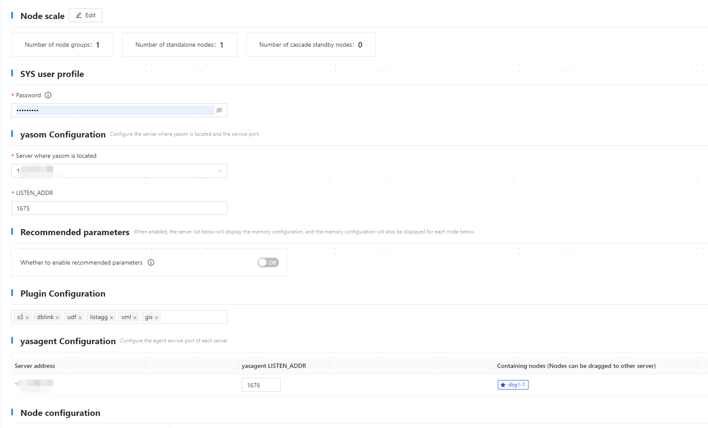
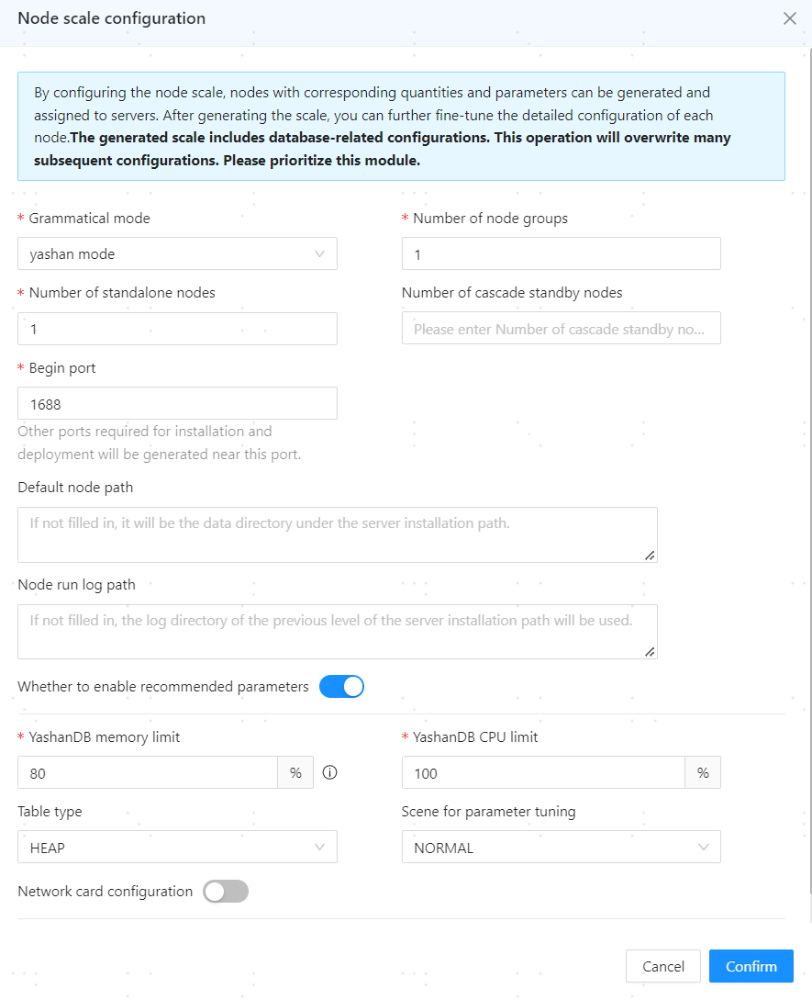
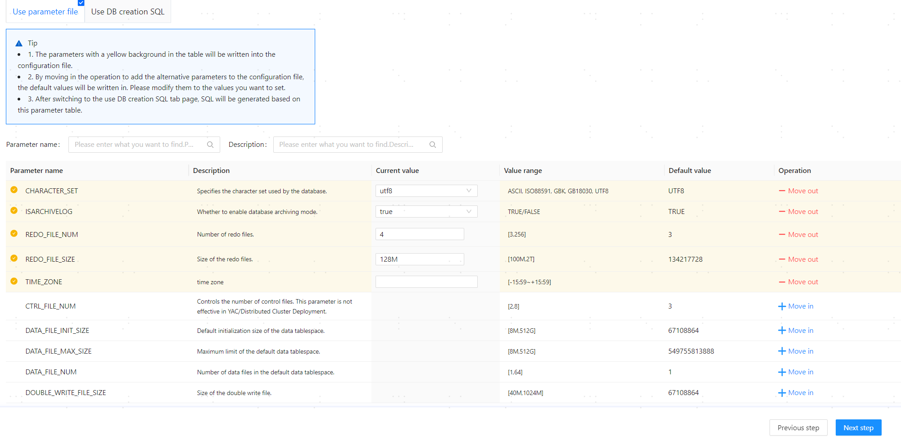
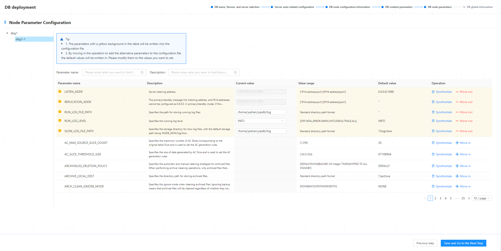
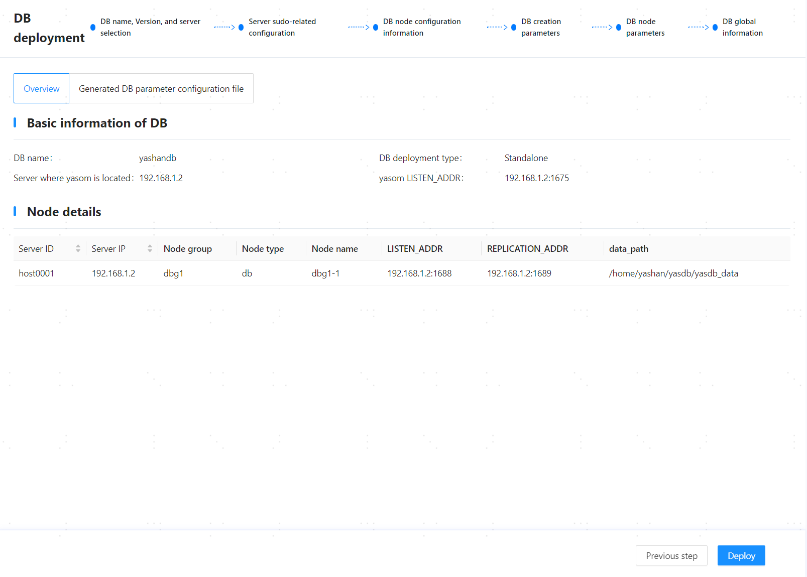

## Step 1: Start the Web Service

   

## Step 2: Configure Basic Database Information and Server Information

1. Configure the basic database information based on the actual situation:

   - Database Name: Fill in the database cluster name, which will also serve as the initial database name. It must start with a letter and can be [1,63] characters long, for example, yashandb.

   - Database Deployment Type: Choose the database deployment type, such as Standalone Deployment.

> **Note**:
>
> To reuse/cleanup the configuration records in the current environment (scenario where configuration information might be retained: successful installation followed by uninstallation, failed installation, etc.), click the **[Database Name]** input box and select/cleanup the corresponding configuration from the dropdown options.
> 
> 

2. In the server list, the system will default to recognizing the information of the server where the web service is located. After confirming that the installation path and other information are correct, click **[Try Verification]** to check correctness.

   

3. (Optional) If you need to deploy a primary/standby high availability environment, click **[Add]** in the upper right corner of the server list, add information for other servers, and then click **[OK]** to save the configuration. Click **[Try All Verification]** to check correctness.
   
   

4. After confirming that the information is correct, click **[Next]**.

## Step 3: Configure Server Sudo

1. In the database configuration area, the following functionality can be configured:

   - Create cgroup: Enable this option to create a cgroup directory for YashanDB CPU resource management, and you need to fill in the cgroup directory in other server configuration areas. This parameter is only required when installing a standalone database that can enable CPU resource management (not for cascade backup).

   - Enable Monit at Boot: When enabled, the daemon will automatically start and launch the various processes of YashanDB after the server boots, indirectly achieving the automatic startup of the database.

   - Add User to YASDBA Group: Enabling this means that the installed user will be added to the YASDBA group, allowing passwordless login to the database.

   The above functionality requires that the installing user has sudo privileges. This example uses the default configuration, which only adds the user to the YASDBA group.

   

2. After confirming that the information is correct, click **[Next]**.

## Step 4: Configure Cluster Node Information



1. If you need to adjust node-related configurations, click **[Edit]** in the node scale area, adjust the relevant configurations based on the actual situation, and click **[OK]** to save the information.

   - Syntax Mode: You can choose between Yashan mode or MySQL mode based on business needs. If you choose Yashan mode, it cannot be directly switched to MySQL mode after installation; reinstallation is required.

   - Number of Node Groups: The number of standalone node groups, defaulting to 1. If deploying a dual replication group with primary/standby, fill in 2.

   - Number of Standalone Nodes: Select the number of database instances on the server for primary/standby. If deploying a dual replication group with primary/standby, it refers to the nodes of the primary replication group. The default is 1, recommended to be 1 in a production environment.

   - Number of Cascade Backup Nodes: Select the number of cascade backup nodes on the server, defaulting to empty. This must be filled in when deploying cascade backups.

   - Index of Backup Nodes Bound to Cascade Backup: After filling in the number of cascade backup nodes, you need to specify the index of the backup nodes bound to cascade backup.

   - Number of Backup Node Group Nodes: The number of nodes in the backup replication group when deploying a dual replication group with primary/standby.

   - Starting Port: Fill in the starting value for the database listening port. If there are multiple listening ports, the system will calculate them based on the [Port Division Rules](../Database Install Preparation/The Pre-Installation Environment Preparation). The default value is 1688.

   - Default Node Path: Fill in the data directory for YashanDB. If left empty, it defaults to the yasdb_data directory at the parent level of the server installation path. **Changes after installation will not take effect.** It supports numbers, letters (case-sensitive), and some symbols (`/`, `-`, `_`, `.`), with a maximum of 75 characters, e.g., /data/yashan/yasdb_data.

   - Node Log Path: Fill in the running log path for YashanDB. If left empty, it defaults to the log directory at the parent level of the server installation path, recommended to be consistent with the log path in the host list, e.g., /data/yashan/log.

   - Whether to Enable Recommended Configuration: When enabling recommended configuration, yasom will call the DBMS_PARAM advanced package to generate recommended parameters that overwrite parameters with the same name, default is enabled. When enabled, the following parameters must also be set:

      - YashanDB Memory Usage: Set the percentage of available server memory for YashanDB. Yasom will calculate the specific memory limit based on this percentage.

      - YashanDB CPU Usage: Set the percentage of available server CPU for YashanDB. Yasom will calculate the specific CPU limit based on this percentage.

      - Table Type: Choose the main table type commonly used in business. Modify database configuration parameters to obtain maximize performance when using this table type in the database. The default is HEAP.

      - Usage Scenario: Parameter tuning scenario, default is NORMAL.

   - Network Card Configuration: You can set the database listening address and primary-standby replication link address to different subnets, formatted as `192.168.1.0/24`.

   

2. In the SYS user configuration area, set the password for the database superuser SYS. The configuration requirements are as follows:

    - Password length must be between 8 and 64 characters.
    
    - The password cannot include the corresponding database username.
    
    - The password must contain digits, letters, and special characters.

    - Special characters related to Linux OS commands (such as `@`, `/`, `.`, `!`, `$`, `'`, etc.) must be escaped.

3. In the yasom configuration area, adjust the server where the main yasom is located and the listening port based on actual circumstances.

   - Server where yasom is located: Default to the current server IP.

   - LISTEN_ADDR: The listening port of yasom, default is 1675.

4. In the recommended configuration area, check the configuration information, which takes the corresponding configuration from the node scale.
   
   ```shell
   After enabling recommended configuration, some parameters will have fixed values and cannot be modified. The parameters are as follows:
   +--------------------------------+-------------+---------+
   |            name                |  recommend  | restart |
   +--------------------------------+-------------+---------+
   | DATA_BUFFER_SIZE               |       5498M |  True   |
   | VM_BUFFER_SIZE                 |        741M |  True   |
   | WORK_AREA_STACK_SIZE           |          1M |  True   |
   | WORK_AREA_POOL_SIZE            |         16M |  True   |
   | WORK_AREA_HEAP_SIZE            |       2048K |  True   |
   | SHARE_POOL_SIZE                |        741M |  True   |
   | LARGE_POOL_SIZE                |        112M |  True   |
   | MAX_PARALLEL_WORKERS           |          12 |  True   |
   | SCOL_DATA_BUFFER_SIZE          |        128M |  True   |
   | SCOL_DATA_PRELOADERS           |           2 |  True   |
   | COLUMNAR_WORK_AREA_HEAP_SIZE   |         32M |  True   |
   | COLUMNAR_VM_BUFFER_SIZE        |        128M |  True   |
   | COLUMNAR_BULK_SIZE             |        1024 |  True   |
   | COMPRESSION                    |         LZ4 |  True   |
   | PQ_POOL_SIZE                   |        128M |  True   |
   | MAX_SESSIONS                   |         128 |  True   |
   | MAX_WORKERS                    |           0 |  True   |
   | TAB_QUEUE_WINDOW_SIZE          |           8 |  True   |
   | BLOOM_FILTER_FACTOR            |         0.5 |  True   |
   | DEGREE_OF_PARALLEL             |           1 |  True   |
   | MMS_DATA_LOADERS               |           3 |  True   |
   | CHECKPOINT_INTERVAL            |        192M |  False  |
   | CHECKPOINT_TIMEOUT             |          60 |  False  |
   | REDOFILE_IO_MODE               |      DIRECT |  True   |
   | DATAFILE_IO_MODE               |     DEFAULT |  True   |
   | COMMIT_LOGGING                 |   IMMEDIATE |  False  |
   | RECOVERY_PARALLELISM           |           2 |  True   |
   | REDO_BUFFER_SIZE               |         16M |  True   |
   +--------------------------------+-------------+---------+
   ```

5. In the plugin configuration area, select the plugins that need to be installed as needed.

6. In the yasagent configuration area, adjust the following configurations as needed:

   - yasagent LISTEN_ADDR: The listening port of yasagent, default is 1676.

   - DB Adaptive Memory Limit: Only when the recommended configuration is enabled, the memory limit must be configured, formatted as `number + space/K/M/G/T`, with a range of [number of instances * 1536M, maximum server memory].

   - Included Nodes: Display the information of the database instances deployed on each server. The starred instance role is primary, and others are backup. When there are multiple servers, instances can be dragged to adjust their distribution.

7. In the node configuration area, expand the database instance list and click on the instance name to view instance information and adjust part of the configuration as needed.
   
   - Modify node scale, add/delete nodes/groups. For example, clicking **[Add Node Group]** will add a node group; clicking **[+]** next to the node group (as shown in figure dbg1) will add nodes to this group.

   - Expand the database instance list, clicking on the instance name (as shown in figure dbg1-1) will reveal instance information, and configurations can be adjusted as needed.

8. After confirming that the information is correct, click **[Next]**.

## Step 5: Set Database Creation Parameters

After confirming that the information is correct, click **[Next]**.



## Step 6: Set Configuration Parameters

In the **[Database Node Parameters]** page, you can add/delete/modify parameters for each database instance as needed. After confirming that the information is correct, click **[Save and Next]**.



## Step 7: Deploy Database

1. In the **[Database Global Information]** page, confirm that the information is correct and click **[Deploy]**.

   

> **Note**:
>
> After deployment is complete, yasom will generate hosts.toml and yashandb.toml files in the installation directory `/home/yashan/install/conf/SE/yashandb`, where yashandb is the database name.

## Step 8: Configure Environment Variables

Log in to each server with the installation user and execute the following commands to activate the environment variables.

```shell
# After the deployment command is successfully executed, a <<Cluster Name>>.bashrc environment variable file will be generated in the $YASDB_HOME directory under the conf folder
$ cd $YASDB_HOME/{version_number}/conf
# If YashanDB-related environment variables already exist in ~/.bashrc, remove them

$ cat yashandb.bashrc >> ~/.bashrc
$ source ~/.bashrc
```

## Step 9: Check Installation Result

If there are connection errors or SQL statement execution errors, please check the installation steps based on the error message or consult our technical support.

1. Use the yasql tool to connect to the database and check the instance status.

    ```shell
    $ yasql sys/********@192.168.1.2:1688
    SQL> SELECT STATUS FROM v$instance;
    
    STATUS        
    ------------- 
    OPEN        
    
    SQL> SELECT database_name FROM v$database;
    
    DATABASE_NAME                                                    
    ---------------------------------------------------------------- 
    yashandb
    ```

2. (Optional) Create a database user and grant permissions. For more operations, please refer to user management.

   ```shell
   SQL> CREATE USER sales IDENTIFIED BY sales;
      
   SQL> GRANT CONNECT TO SALES;
   ```
