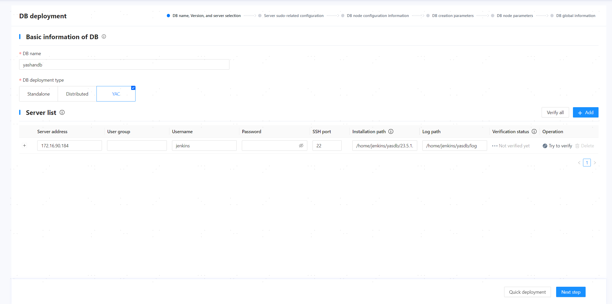
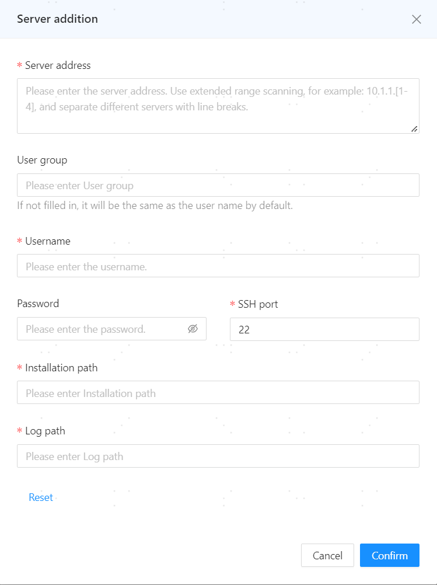
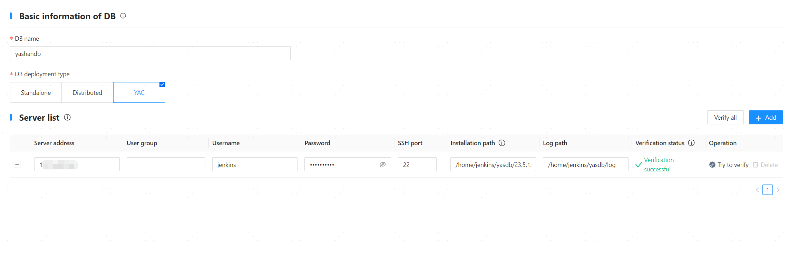
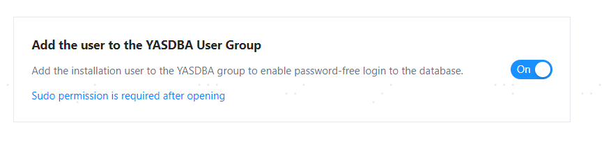
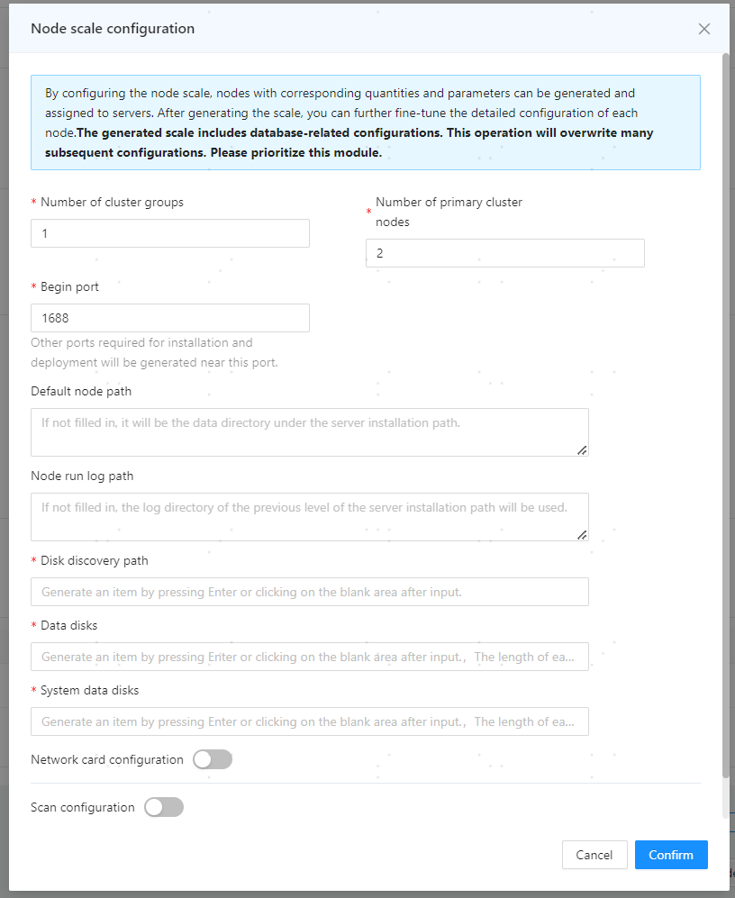
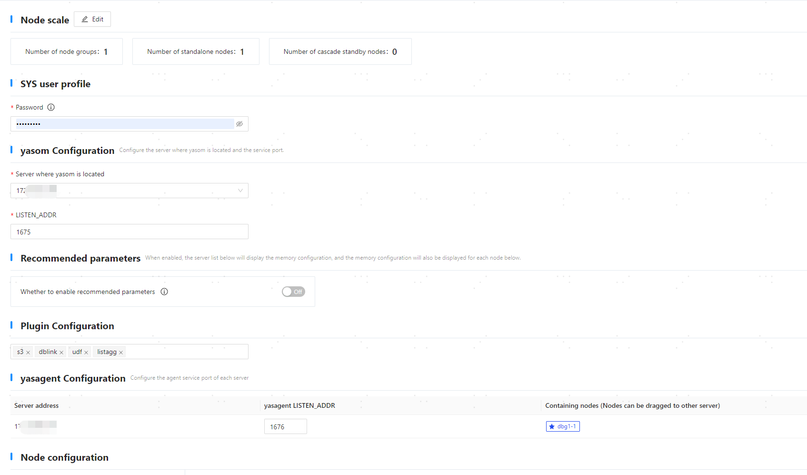
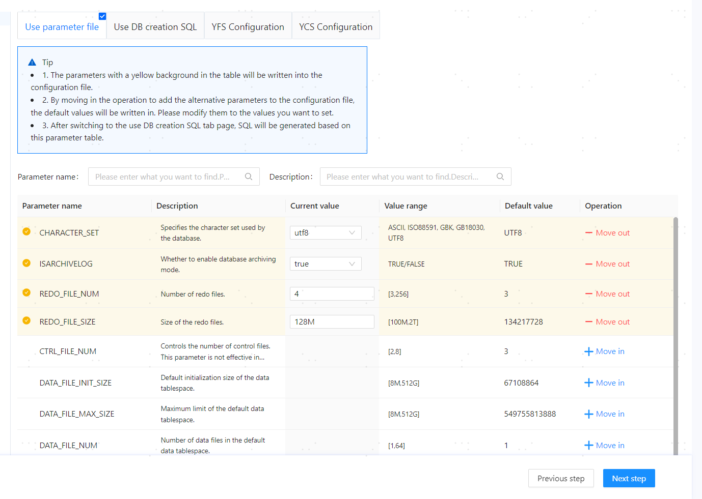
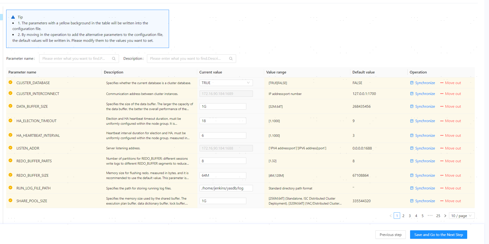
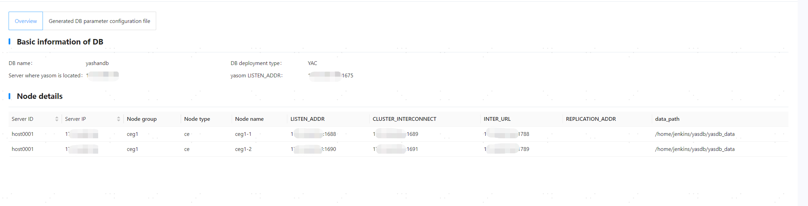

## Step 1: Access the Deployment Page

   

## Step 2: Configure Basic Database Information and Server Information

1. Configure the basic database information based on actual conditions:
   
   - Database Name: Enter the database cluster name, which will also serve as the name for the initial database (database name). It must start with a letter, supporting letters (case-sensitive), numbers, and underscores, with a length of [4,64] characters, for example, yashandb.

   - Database Type: Select the deployment form of the database, such as cluster.

> **Note**:
>
> If you need to reuse/clear the configuration records in the current environment (possible scenarios for retaining configuration information: visualization installation success followed by database uninstallation, visualization installation failure, etc.), you can click on the **[Database Name]** input box and select/clear the corresponding configuration from the dropdown options.
> 
> 

2. In the server list, the system will automatically recognize the information of the server where the Web service is located. Check and confirm that the installation path and other information are correct, then click **[Try Verification]** to check for accuracy.

   

3. Click **[Add]** in the upper right corner of the server list.

4. In the pop-up dialog, add the information of other servers and click **[OK]** to save the configuration.

   

1. Click **[Verify All]** to check for accuracy.

   

2. Once you confirm the information is correct, click **[Next]**.

## Step 3: Configure Server Sudo

1. In the database configuration area, the following functionalities can be configured:

   - Enable automatic startup of monit: When enabled, the daemon will start automatically after the server boots up and launch various YashanDB processes, indirectly achieving database auto-start on boot.

   - Add user to YASDBA user group: When enabled, it indicates that the installing user will be added to the YASDBA group for password-free login to the database.

   The above functionalities require that the installing user has sudo privilege. This example uses the default configuration, which only enables adding the user to the YASDBA user group.

   

2. Once you confirm the information is correct, click **[Next]**.

## Step 4: Configure Cluster Node Information

1. In the pop-up node scale configuration dialog, adjust the related configurations based on the [actual planning](../Database Install Preparation/Server Preparation) of the number of instances, and click **[OK]** to save the information.

   - Number of Cluster Groups: The number of YAC groups. For example, 1 for setting up 1 YAC, 2 for setting up one-primary/one-standby YACs, 3 for setting up one primary and two standby YACs, and so on. This example shows setting up 1 YAC.

   - Number of Primary Cluster Nodes: Select the number of database instances in the primary cluster.

   - Number of Standby Cluster Nodes: Select the number of database instances in the standby cluster. This input box will appear if the number of cluster groups is greater than 1.

   - Starting Port: Enter the starting value of the database listener port. If there are multiple listener ports, the system will calculate based on the [port division rule](../Database Install Preparation/The Pre-Installation Environment Preparation), with a default value of 1688.

   - Default Node Path: Enter the data directory for YashanDB. If left empty, it will default to the yasdb_data directory in the parent directory of the server installation path. **Changes after installation will not take effect**. It supports numbers, letters (case-sensitive), and some symbols (`/`, `-`, `_`, `.`), with a maximum of 71 characters, for example, /data/yashan/yasdb_data.

   - Node Running Log Path: Enter the running log path for YashanDB. If left empty, it will default to the log directory in the parent directory of the server installation path. It is recommended to be consistent with the log path in the host list. For example, /data/yashan/log.

   - Shared Storage Data Disk Path: Enter the shared storage LUN path planned for the data disk, for example, /dev/yfs/data0.

   - Disk Discovery Path: Enter the path for disk discovery, used to discover the disk path of the cluster shared storage. This path is the parent directory of both the shared storage data disk path and system data disk path, for example, /dev/yfs.

   - System Data Disk: Enter the shared storage LUN path planned for the system data disk, for example, /dev/yfs/sys0, /dev/yfs/sys1, and /dev/yfs/sys2.

   - Network Card Configuration: The database listener address, primary-standby replication link address, and YAC network communication link address can be configured to different subnets, formatted as `192.168.1.0/24`.

   

2. In the SYS User Configuration area, set the password for the database super administrator SYS user, with the following requirements:

    - Password length must be between 8 and 64 characters.
    
    - Password cannot contain the corresponding database user name.
    
    - Password must contain numbers, letters, and special characters.

    - Special characters related to Linux OS commands (such as `@`, `/`, `.`, `!`, `$`, `'`, etc.) must be escaped.

3. In the yasom configuration area, you can adjust the server where yasom is located and the listener port based on actual conditions.

   - Server where yasom is located: Defaults to the current server IP.

   - LISTEN_ADDR: The listening port for yasom, defaults to 1675.

4. In the plugin configuration area, select the plugins to be installed as needed.

5. In the yasagent configuration area, you can adjust the following configurations as needed:

   - yasagent LISTEN_ADDR: The listening port for yasagent, defaults to 1676.

   - Included Nodes: Displays the database instance information corresponding to each server deployed. Instances marked with a star are primary, while others are standby. You can drag instances to adjust their distribution.

6. In the node configuration area, you can adjust the following configurations as needed:
   
   - Click on the node group (as shown in the figure ceg1) to modify the disk-related configurations for that node group.

   - Modify node scale: Add or delete nodes/node groups. For example, click **[Add Node Group]** to add a standby cluster; click the **[+]** next to the node group (as shown in the figure ceg1) to add instances to that cluster; click the delete icon next to the instance name (as shown in the figure ceg1-1) to delete that instance from the cluster.

   - Expand the database instance list, click on the instance name (as shown in the figure ceg1-1) to view instance information, and adjust related configurations as needed.

     
7. Once you confirm the information is correct, click **[Next]**.

## Step 5: Set Database Creation Parameters

Once you confirm the information is correct, click **[Next]**.



## Step 6: Set Configuration Parameters

On the **[Database Node Parameters]** page, you can add/delete/modify parameters for each database instance as needed. Once you confirm the information is correct, click **[Save and Next]**.



## Step 7: Deploy Database

1. On the **[Global Database Information]** page, once you confirm the information is correct, click **[Deploy]**.

   

> **Note**:
>
> After deployment is complete, yasom will generate hosts.toml and yashandb.toml files in the `/home/yashan/install/conf/CE/yashandb` directory, where yashandb is the database name, and this directory is the installation directory.

## Step 8: Configure Environment Variables

Log in to each server with the installing user and execute the commands below to activate the environment variables.

```shell
# After the deployment command is successfully executed, a <<cluster name>>.bashrc environment variable file will be created in the $YASDB_HOME directory under the conf folder
$ cd /data/yashan/yasdb_home/{version}/conf
# If YashanDB-related environment variables already exist in ~/.bashrc, remove them

$ cat yashandb.bashrc >> ~/.bashrc
$ source ~/.bashrc
```

## Step 9: Check Installation Results

If there are connection errors or SQL statement execution errors, please check the installation steps based on the error message or consult our technical support.

1. Use the yasql tool to connect to the database and check the instance status.

    ```shell
    $ yasql sys/********@192.168.1.2:1688
    SQL> SELECT STATUS FROM v$instance;

    STATUS        
    ------------- 
    OPEN        

    SQL> SELECT database_name FROM v$database;

    DATABASE_NAME                                                    
    ---------------------------------------------------------------- 
    yashandb
    ```

2. (Optional) Create a database user and grant permissions. For more operations, please refer to user management.

    ```shell
    SQL> CREATE USER sales IDENTIFIED BY sales;
    
    SQL> GRANT CONNECT TO SALES;
    ```
