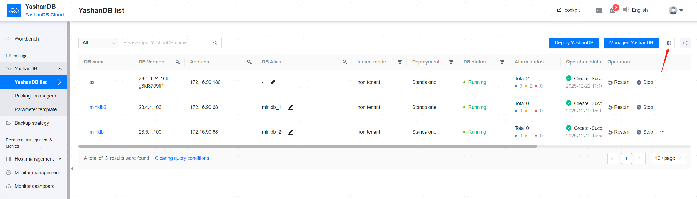
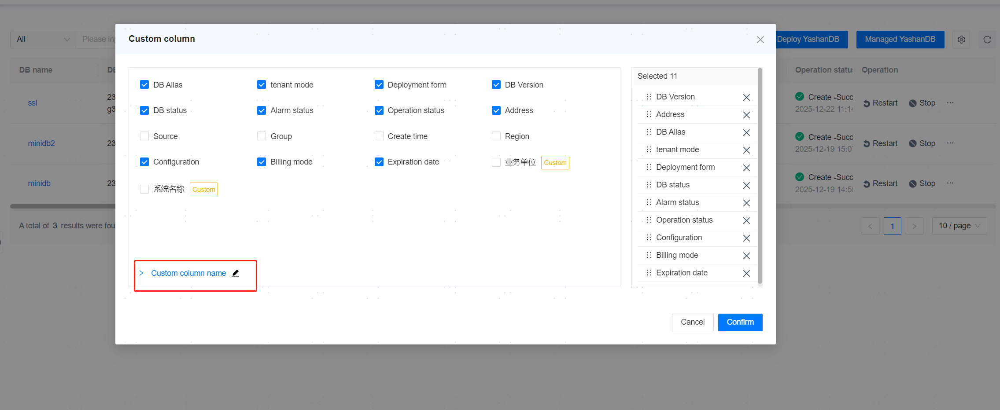
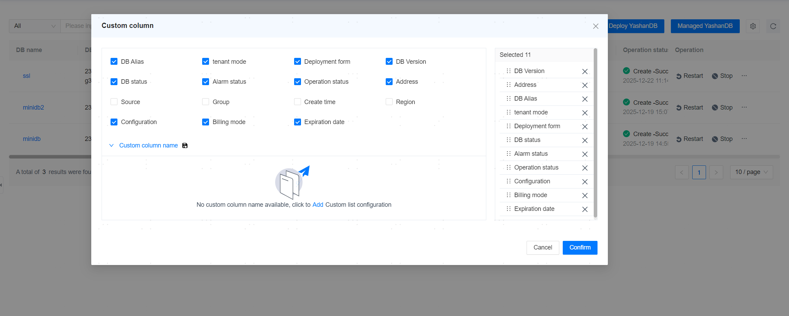
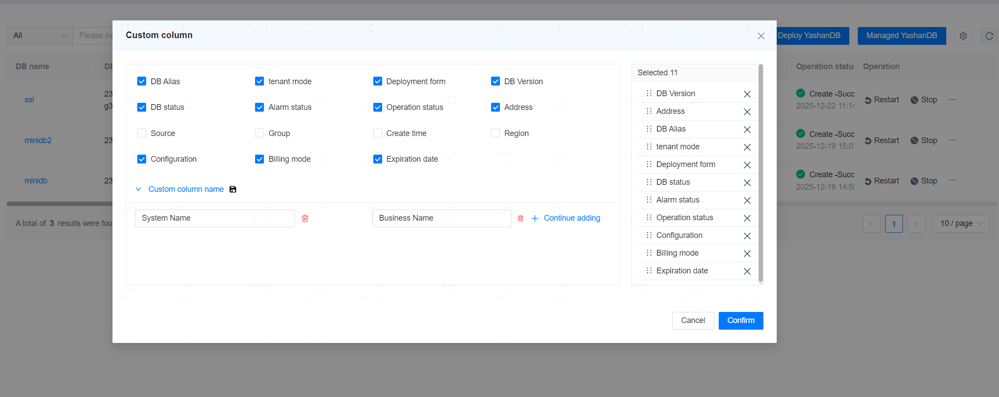
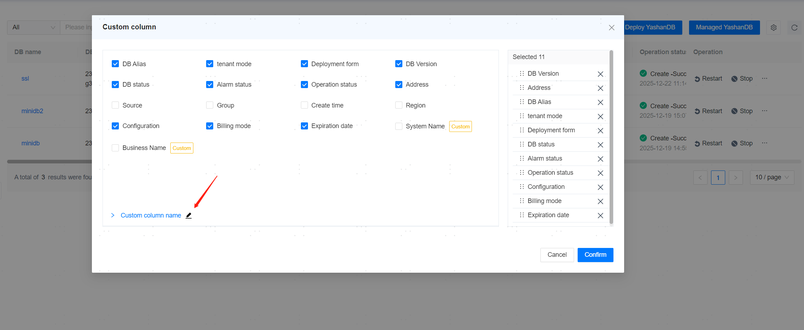
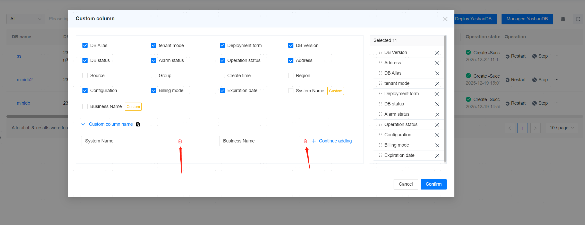
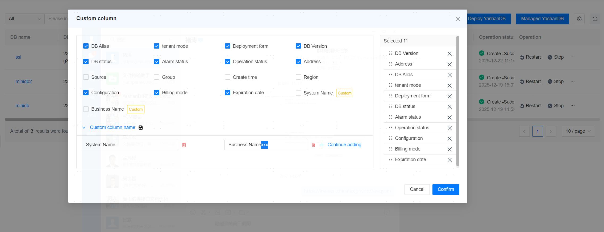
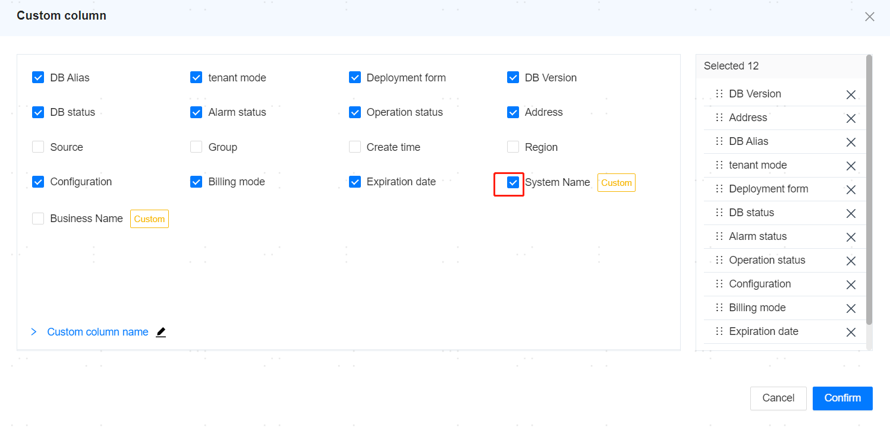
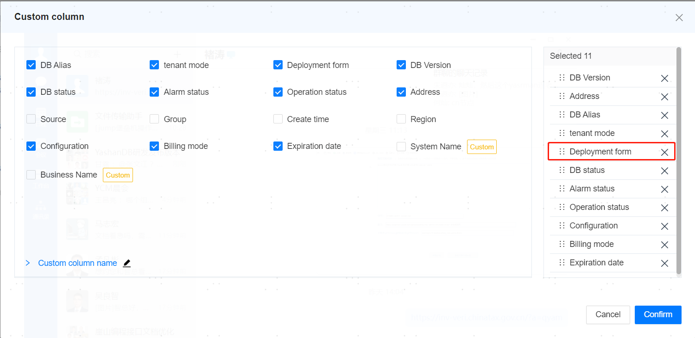
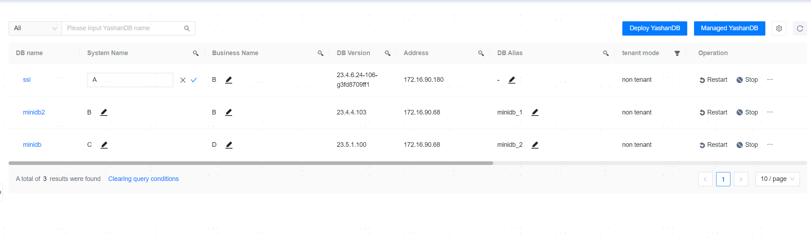

**Web Path**: **[ YashanDB ]**

**Prerequisites**

The database must be in an OPEN state for hosting.

Before hosting the database, relevant servers must be added to the management platform, ensuring that the [management platform system user](../Resource Management/Server Management.html#user) matches the server user on which the database is located.

 A maximum of 10 databases can be hosted. There are no restrictions on the deployment specifications and forms of the databases. 

## Hosting Database

**Web Path**: **[ YashanDB List ]** > **[ Managed YashanDB ]**

**Functionality Overview**

Supports hosting databases deployed with yasboot to the management platform. 

1. Fill the basic information of the YashanDB and database instance information, click **[ Check ]**.

**Main Content Explanation**

**[ OM Host IP ]**: Required parameter; the IP address of the host where yasom is located in the database.

**[ Database Host User ]**: Required parameter; the installation user on the host where yasom is located in the database.

**[ DB Name ]**: Required parameter; if left blank, the host will automatically scan for any deployed databases. Hosting can proceed if there is exactly one database.

**[ Database User ]**: Required parameter; a DB user with DBAPrivilege, the management platform will automatically create a YASOM user.

**[ Database Password ]**: Required parameter; the password for the database user.

**[ Identifier Name ]**: Optional parameter; when multiple databases have the same name, a Unique name can be used for hosting. The Unique name must be unique in the management platform.

**[ Database Alias ]**: Optional parameter; a Chinese alias can be given to the database, and there is no requirement for uniqueness.

**[ User Group ]**: Optional parameter; binds the database to a [management platform Group](../Platform Operation/System Permission Management/User Group Management), multiple groups can be bound.

**[ O&M Username ]**: The Ops user name for the backend database of the management platform, default is the YASOM user.

To monitor operational management of the hosted database, the default privileges granted to the database operation user YASOM are as follows:

|Type |Privilege Name |Purpose |
| -------- | -------------------------------- | -------------------------------------------------------------------- |
| Role     | CONNECT                            | Has CREATE SESSION privilege, users with CONNECT role can log in.    |
| Role     | SELECT_CATALOG_ROLE                | Has privilege to access V$, DV$, and GV$ views.                       |
| Role     | SYSDBA                           | Has privilege to execute SHUTDOWN, backup, BUILD (including yasrman, yasbak backup tools). |
| Object Privilege | Read privilege on view dba_backup_set | Query information in dba_backup_set view.                            |
| Object Privilege | Read privilege on view dba_data_files | Query information in dba_data_files view.                            |
| Object Privilege | Read privilege on view dba_tablespaces | Query information in dba_tablespaces view.                           |
| Object Privilege | Read privilege on view wrm$_database_instance | Query information in wrm$_database_instance view.                    |
| Object Privilege | Read privilege on view wrm$_snapshot | Query information in wrm$_snapshot view.                               |
| Object Privilege | Read privilege on view unified_audi_trail | Query information in unified_audi_trail view.                         |
| Object Privilege | Read privilege on view auditable_system_actions | Query information in auditable_system_actions view.                  |

**[ O&M User Password ]**: Optional parameter; the password for the backend database Ops user of the management platform. If the YASOM user already exists and the password is different from the default, this field is required.

2. (Optional) Add the CA root certificate and fill in the certificate path. If everything is correct, click **[ Managed YashanDB ]** to proceed.

> **Note**:
> 
> - If the backend database of the management platform is YashanDB and it is hosted on the management platform, certain functionalities of this database are restricted, including stopping, restarting, upgrading, uninstalling, backup recovery, deleting tablespaces, primary/standby switching, and scaling.
>
> - How to generate the CA root certificate file root.crt can be referred to the YashanDB documentation: [https://doc.yashandb.com/yashandb/23.4/zh/All-Manuals/Product-Security/Encryption/Trusted-Channel/Managing-Certificates.html#getSSLCert](https://doc.yashandb.com/yashandb/23.4/zh/All-Manuals/Product-Security/Encryption/Trusted-Channel/Managing-Certificates.html#getSSLCert)
>
> How to generate the CA root certificate file root.crt can be referred to the YashanDB documentation: [https://doc.yashandb.com/yashandb/23.4/zh/All-Manuals/Product-Security/Encryption/Trusted-Channel/Managing-Certificates.html#getSSLCert](https://doc.yashandb.com/yashandb/23.4/zh/All-Manuals/Product-Security/Encryption/Trusted-Channel/Managing-Certificates.html#getSSLCert)
>
> - After associating with remote YCM, both local and remote YCM must be running correctly to host or remove the database.
> 
> Removing the association with remote YCM will lift the above restrictions. If the remote YCM cannot be removed normally, it can be forcibly removed via yasadm on the local YCM.
>

## Deploying Database

### Package Deployment

**Web Path**: **[ Installation Package ]** > **[ Deploy ]**

**Prerequisites**

1. Prepare the [database installation preparation](Database Install Preparation/00Database Install Preparation) to ensure the operating system has the environment for installing and deploying YashanDB.

2. Add the host [added](Server Management) to the management platform.

Only installation packages of YashanDB with version numbers greater than or equal to **23.2.4.100** are supported.

You can edit the `etc/ycm.yaml` file in the management platform installation path to configure the minimum deployable version in the `supportPkgDeployMinVersion` field. After configuration, you must log back into the management platform. This action may cause deployment failures; please proceed with caution.

**Functionality Description**

Click **[ Deploy ]**, fill in the port, and start the OMWeb service on the machine where the management platform is located.

After switching to the embedded OMWeb page, select the added host from the management platform for deployment.

Taking distributed database deployment as an example, perform [database installation](Database Installation/Distributed Deployment) on the OMWeb page.

After successful deployment, the database will be automatically hosted on the management platform.

> **Note**:
> 
> Starting from version 23.2.3.100, YashanDB supports primary/standby YAC Deployment; please refer to the database version documentation. After primary/standby YAC Deployment, the standby node of the backup cluster being in started status is a normal occurrence. From version 23.4.0.0 onward, after the deployment of the backup cluster, the standby node will be opened to the open status.
>
> The installation package deployment functionality of the management platform is not adapted for database versions requiring plugin package paths to be filled in. Deploying with such versions will result in the plugin package being ineffective. In version 23.2, the deployment of installation packages after 23.2.9.100 does not require the plugin package path to be filled in. The installation packages after 23.4.0.0 also do not require the plugin package path.
>

## Database Operations

**Web Path**: **[ YashanDB List ]** > **[ Operation ]**

**Functionality Overview**

After successfully adding the database, you can view basic information and running status of the database on the YashanDB list page and perform a series of operations on the entire database:

- **Restart**: Restart all instances of the database.
- **Stop**: Stop all instances of the database.
  
- **Remove Hosting**: Unbind the database from the management platform, which will not uninstall it .
- **Update Instance**: Update the scale of the database instance: If the user has not scaled the database via the management platform, causing changes in the instance scale, they can click the update instance button to update the new instance scale to the management platform (does not support updating the scale of remote database instances).
- **Uninstall**: Uninstall the database and remove it from the management platform.
- **Subscribe**: After subscribing to the database, resource-related alarm messages, resource changes, and task messages will be sent to the current user as site messages.

### Database Upgrade
**Web Path**: **[ YashanDB List ]** > **[ Operation ]** > **[ Upgrade ]**

**Functionality Overview**

Supports upgrading the managed database to a higher version, and the steps for upgrading the database are as follows:

1. Fill in basic information, including Upgrade method, Upgrade version, and backing up before Upgrade, then click **[ Upgrade ]**.
2. Confirm that the target version information for the upgrade is correct, then click **[ Next ]**.
3. Perform a pre-check for the database upgrade; if the check passes, click **[ Upgrade ]**.

**Main Content Explanation**

**[ Upgrade Method ]**: Required parameter; supports offline upgrade and rolling upgrade.

**[ Upgrade Version ]**: Required parameter; the target version for the upgrade can be added in the package management module. The Upgraded version must be greater than the current version, and for rolling upgrades, the first three version numbers must be the same; upgrading to version 22.2 is not supported.

**[ Perform Full Checkpoint ]**: Whether to perform a full checkpoint on the database before upgrading. Performing a full checkpoint can speed up the upgrade process.

**[ Perform Full Backup ]**: Whether to perform a full backup of the database before upgrading. If full backup is selected, the following parameters need to be filled in.

- Storage Type: Supports both local and remote storage; local storage saves it to the host where the management platform is deployed, while remote storage saves it to the host added to the management platform.
- Storage Host IP: The remote host that saves the backup set; this field is required for remote storage.
- Storage Path: Required parameter; the path where the database backup set is saved.
- Compression Algorithm: Optional parameter; the compression algorithm for the database backup.
- Compression Level: Optional parameter; the compression level for the database backup's compression algorithm.

**[ SSH Password of Database Deployment Hosts ]**: The SSH password for the user on the host where the database is deployed; all hosts where the database is deployed must have the same user password. If the yasom host has SSH passwordless configuration to all database hosts, this parameter can be left blank.

**[ SSH Port of Database Deployment Hosts ]**: Required parameter; the SSH port for the user on the host where the database is deployed.

**[ Database SYS User Password ]**: The password for the database SYS user. If the installation users on all nodes of the database are configured with YASDBA group passwordless access (the host users are in the YASDBA group), this parameter is optional; otherwise, it is required.

**[ Upgrade Pre-Check ]**: The following checks will be conducted before upgrading the database; the upgrade command can only be issued if all checks pass.

- Database Instance State Check: It must be ensured that the database instance is in OPEN state prior to upgrading. If the check fails, the instance state can be modified on the page to OPEN.
- Server Daemon Process Check: The daemon processes on the servers where the instances reside need to be terminated before upgrading. If the check fails, the node daemon can be closed via the page, and will automatically restart after a successful upgrade.
- Database Arbitration Mode Check: Arbitration must be temporarily disabled before upgrading. If the check fails, arbitration services can be turned off via the page, and will automatically restart after a successful upgrade.

> **Note**:
>
> - There are two methods for database upgrade, offline upgrade and rolling upgrade. For the scope of support for offline upgrades, please refer to the YashanDB documentation: [https://doc.yashandb.com/yashandb/23.4/zh/All-Manuals/Installation-and-Upgrade/Upgrade/Upgrade-Procedure/Offline-Upgrade.html](https://doc.yashandb.com/yashandb/23.4/zh/All-Manuals/Installation-and-Upgrade/Upgrade/Upgrade-Procedure/Offline-Upgrade.html)
>
> Please refer to the YashanDB documentation for the scope of support for rolling upgrades:[https://doc.yashandb.com/yashandb/23.4/zh/All-Manuals/Installation-and-Upgrade/Upgrade/Upgrade-Procedure/Rolling-Upgrade.html](https://doc.yashandb.com/yashandb/23.4/zh/All-Manuals/Installation-and-Upgrade/Upgrade/Upgrade-Procedure/Rolling-Upgrade.html)
>
> - If the managed database is upgraded without the management platform's permission, the backend of the management platform will automatically update the database version number, installation path, >and other relevant metadata upon detection.
>

### Database Rollback
**Web Path**: **[ YashanDB List ]** > **[ Operation ]** > **[ Rollback ]**

**Functionality Overview**

If the upgrade fails, it supports rolling back the database to the pre-upgrade version.

### Database Custom Column Configuration

**Web Path**: **[ YashanDB List ]** > 

**Functionality Overview**

The custom fields configured in the YashanDB list allow you to select and display the corresponding columns in the host list, alert list.

**Main Operations**

**Add**: Add custom columns.

1. Click the  icon to the right of the custom name.

2. Prompt no custom column names exist yet, Click to add.

3. Enter the custom column name, click **[ Confirm ]**.

**Delete**: Delete custom columns.

1. Uncheck the columns you want to delete, then click the  icon next to the custom column name.

2. Click the  icon.

**Update**: Update custom columns.

1. Click the  icon to the right of the custom column name.

2. Update the custom column name, click **[ Confirm ]**.

**Display**: Display custom columns.

1. Select the check boxes for the column names you want to display.

**Sort**: Sort custom columns.

1. Select the column name with your mouse and move it up or down to reorder the columns.

**Input**: Input values for custom columns.

1. Click the  icon, enter the value for the custom column, then click the checkmark to confirm.

