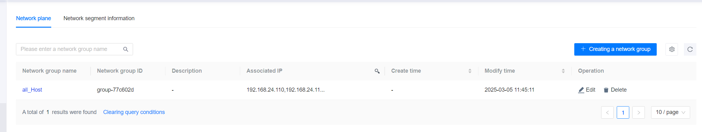

**Web Path**: **[ Host Management ]**>**[ Network ]**

## Network Plane

### Create Network Group

**Web Path**: **[ Network plane ]**>**[ Create Network Group ]**

**Functionality Overview**

The network plane provides the functionality to create and manage network groups. Users can use the network plane to perform connectivity tests between IPs.

**Main Content Explanation**

**[ Network group name ]**: Required parameter, supports only numbers, Chinese characters, English letters, and underscores (cannot start with _), length range is [0,60].

**[ Associated IP Selection ]**: Required parameter, at least 2 IPs must be selected. Click **[ Test Connectivity ]** to verify if the IPs are connected.

## Network Segment Information

**Web Path**: **[ Network Segment ]**

**Functionality Overview**

Network segment information allows you to view the instance information and subnet information corresponding to the network segment.

To delete network segment information, you must first go to **[ Host Management ]** and delete all hosts under that network segment; otherwise, deletion of network segment information is not supported.

**Main Content Explanation**

**[ Union Network Segment ]**: Indicates whether the segment is merged from two or more adjacent subnets or IP address ranges.