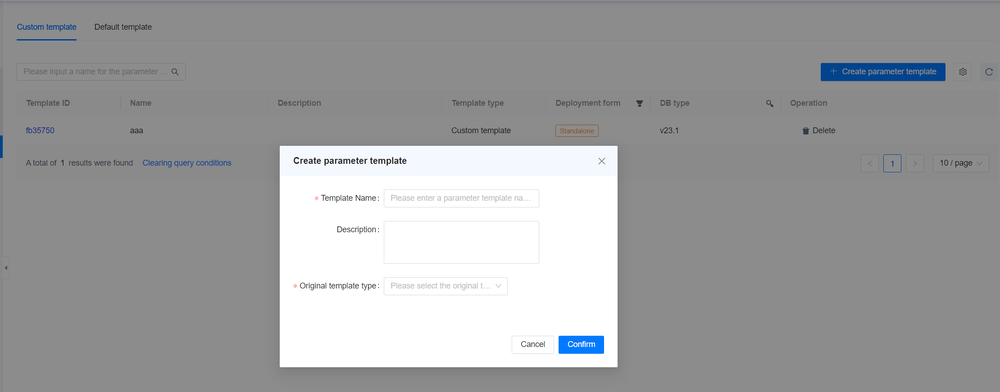

**Web Path**: **[ YashanDB ]**>**[ YashanDB List ]**>**[ Parameter template ]**

## Default Template

**Web Path**: **[ Default template ]**

**Functionality Introduction**

The parameter template is an aggregation of a series of database configuration items. The management platform supports the use of parameter templates to simplify database parameter configuration.

The default template only supports Standalone Deployment mode. It supports viewing, applying, but cannot be edited or deleted. It also supports template comparison and can be saved as a custom template for further editing.

## Custom Template

### Create Parameter Template

**Web Path**: **[ Custom template ]**> **[ Create parameter template ]**

**Functionality Introduction**

Custom parameter templates can be configured as needed based on the default template. Custom templates support viewing, applying, editing, and deleting. They also support template comparison and can be saved as templates.

### Parameter Template Details

**Web Path**: **[ Custom template ]**> **[ Template ID ]**

**Functionality Introduction**

The parameter template details interface displays the primary/standby configuration information under each group, including database creation parameters and database instance configuration parameters.

Template comparison allows for viewing the differences between two templates.