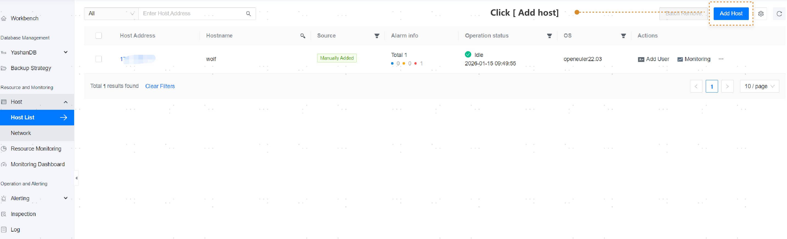
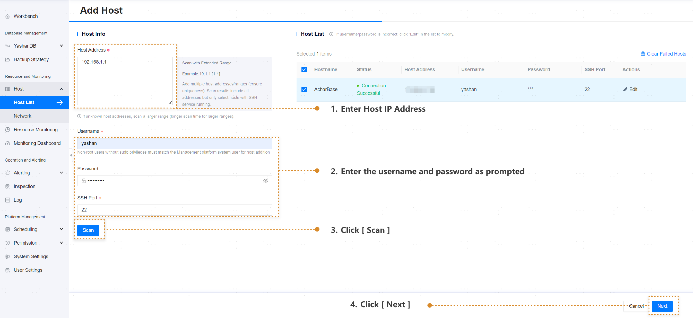
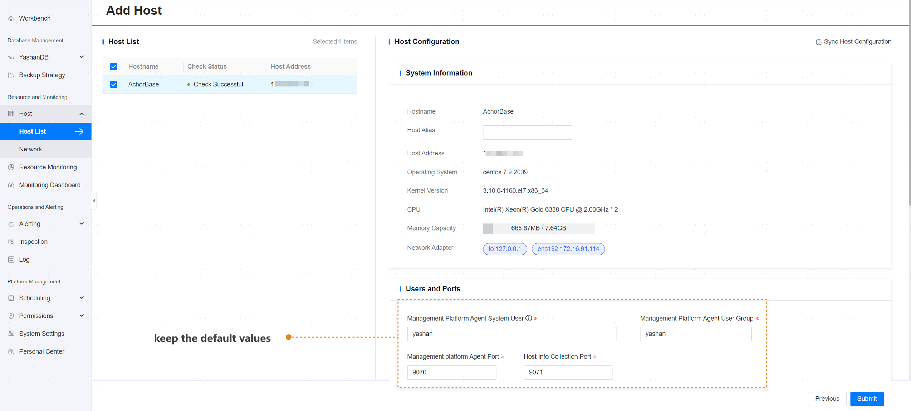
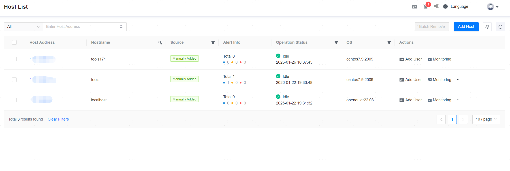

## Add Host

**Web Path**: **[ Host ]** > **[ Host list ]** > **[ Add host ]**

**Functionality Introduction**

The management platform supports the unified management and monitoring of YashanDB hosts. The steps to add a host are as follows:

1. Click the **[ Add host ]** button on the Host List page

2. After filling in the host information, click **[ Scan ]** to display whether the host is connected successfully. If the connection fails, you can click **[ Edit ]** to modify the username and password, or **[ Clear Failed Hosts ]**.

3. Click **[ Next ]**. 

4. Click **[ Submit ]** to successfully add the host.

